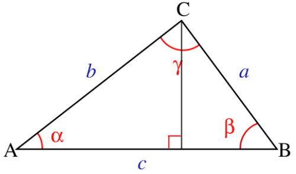
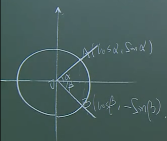

## 基础
### 同角关系式
$$\sin^{2}\alpha+\cos^{2}\beta=1$$
 

$$\tan\alpha=\dfrac{\sin\alpha}{\cos\alpha}$$
 

$$\cot\alpha=\dfrac{\cos\alpha}{\sin\alpha}$$
### 例题一
$$求\sqrt{\dfrac{1+\sin\alpha}{1-\sin\alpha}}-\sqrt{\dfrac{1-\sin\alpha}{1+\sin\alpha}}=-2\tan\alpha$$
>$\sqrt{\dfrac{(1+\sin\alpha)^2}{(1-\sin\alpha)(1+\sin\alpha)}}-\sqrt{\dfrac{(1-\sin\alpha)^2}{(1+\sin\alpha)(1-\sin\alpha)}}=-2\tan\alpha$
>
>$\dfrac{1+\sin\alpha}{|\cos\alpha|}-\dfrac{1-\sin\alpha}{|\cos\alpha|}=-2\tan\alpha$
>
>$\dfrac{2\sin\alpha}{|\cos\alpha|}=-\dfrac{2\sin\alpha}{\cos\alpha}$
>
>$2\sin\alpha(\dfrac{\cos\alpha+|\cos\alpha|}{\cos\alpha|\cos\alpha|})=0$
>
>$则\sin\alpha=0或者\cos\alpha+|\cos\alpha|=0$
>
>$则\{\alpha|\alpha=k\pi或\dfrac{1}{2}\pi+2k\pi<\alpha<\dfrac{3}{2}\pi+2k\pi\}$
### 平面向量
$向量:\overrightarrow{a},\overrightarrow{AB},\overrightarrow{a}=(x,y),\overrightarrow{AB}=(x_2-x_1,y_2-y_1)$

$模:|\overrightarrow{a}|=\sqrt{x^2+y^2},|\overrightarrow{AB}|=\sqrt{(x_2-x_1)^2+(y_2-y_1)^2}$

$零向量:\overrightarrow0$

$单位向量:|\overrightarrow{a}|=1$

$\overrightarrow{a}=(x_1,y_1),\overrightarrow{b}=(x_2,y_2)$

$\overrightarrow{a}\pm\overrightarrow{b}=(x_1\pm x_2,y_1\pm y_2)$

$\overrightarrow{a}\cdot\overrightarrow{b}=x_1x_2+y_1y_2$

$\overrightarrow{a}\times\overrightarrow{b}$

$\overrightarrow{a}\parallel\overrightarrow{b} \Leftrightarrow \overrightarrow{a}= \lambda\overrightarrow{b} \Leftrightarrow x_1y_2=x_2y_1$

$\overrightarrow{a}\perp\overrightarrow{b} \Leftrightarrow \overrightarrow{a}\cdot\overrightarrow{b}=0$

$$夹角公式:\cos <\vec {a},\vec {b}>=\dfrac{\vec{a}\cdot\vec{b}}{|\vec{a}|\cdot |\vec{b}|}=\dfrac{x_1x_2+y_1y_2}{\sqrt{(x_1^2+y_1^2)(x_2^2+y_2^2)}}$$

>证明如下:
>
>$c=b\cos{\alpha}+a\cos{\beta}$
>
>$c^2=bc\cos\alpha+ac\cos\beta$
>
>$同理可以得到$
>
>$式一:a^2=ac\cos\beta+ab\cos\gamma$
>
>$式二:b^2=bc\cos\alpha+ab\cos\gamma$
>
>$式一式二相加得到$
>
>$a^2+b^2=\color{green}{ac\cos\beta}+\color{white}{ab\cos\gamma}+ \color{green}{bc\cos\alpha} \color{white}{+ab\cos\gamma}$
>
>$a^2+b^2=c^2+2ab\cos\gamma$
>
>$\color{green}{\cos\gamma=\dfrac{a^2+b^2-c^2}{2ab}}$
>
>$\cos\gamma=\dfrac{(x_1^2+y_1^2)+(x_2^2+y_2^2)-((x_1-x_2)^2+(y_1-y_2)^2)}{2\sqrt{x_1^2+y_1^2}\sqrt{x_2^2+y_2^2}}=\dfrac{2x_1x_2+2y_1y_2}{2\sqrt{x_1^2+y_1^2}\sqrt{x_2^2+y_2^2}}=\dfrac{x_1x_2+y_1y_2}{\sqrt{x_1^2+y_1^2}\sqrt{x_2^2+y_2^2}}=\dfrac{\vec{a}\cdot\vec{b}}{|\vec{a}|\cdot |\vec{b}|}$
>
>$\color{green}{\cos <\vec {a},\vec {b}>=\dfrac{\vec{a}\cdot\vec{b}}{|\vec{a}|\cdot |\vec{b}|}=\dfrac{x_1x_2+y_1y_2}{\sqrt{(x_1^2+y_1^2)(x_2^2+y_2^2)}}}$

## 三角恒等变换
### 和角公式
$$\cos(\alpha\pm\beta)=\cos\alpha\cos\beta\mp\sin\alpha\sin\beta$$

>证明如下
>
>$A(\cos\alpha,\sin\alpha),B(\cos\beta,-\sin\beta)$
>
>$\cos(\alpha+\beta)=\dfrac{\overrightarrow{OA}\cdot\overrightarrow{OB}}{|\overrightarrow{OA}|\cdot|\overrightarrow{OB}|}=\dfrac{\cos\alpha\cos\beta-\sin\alpha\sin\beta}{1\cdot 1}=\cos\alpha\cos\beta-\sin\alpha\sin\beta$
>
>$\cos(\alpha-\beta)=\cos(\alpha+(-\beta))=\cos\alpha\cos(-\beta)-\sin\alpha\sin(-\beta)=\cos\alpha\cos\beta+\sin\alpha\sin\beta$

$$\sin(\alpha\pm\beta)=\sin\alpha\cos\beta\pm\cos\alpha\sin\beta$$
>证明如下
>
>$\sin(\alpha+\beta)=\cos(\dfrac{\pi}{2}-(\alpha+\beta))=\cos((\dfrac{\pi}{2}-\alpha)-\beta)=\cos(\dfrac{\pi}{2}-\alpha)\cos\beta+\sin(\dfrac{\pi}{2}-\alpha)\sin\beta$
>
>$=\sin\alpha\cos\beta+\cos\alpha\sin\beta$
>
>$\sin(\alpha-\beta)=\sin(\alpha+(-\beta))=\sin\alpha\cos(-\beta)+\cos\alpha\sin(-\beta)=\sin\alpha\cos\beta-\cos\alpha\sin\beta$

$$\tan(\alpha\pm\beta)=\dfrac{\tan\alpha\pm\tan\beta}{1\mp\tan\alpha\tan\beta}$$
>证明如下
>
>$\tan(\alpha+\beta)=\dfrac{\sin(\alpha+\beta)}{\cos(\alpha+\beta)}=\dfrac{\sin\alpha\cos\beta+\cos\alpha\sin\beta}{\cos\alpha\cos\beta-\sin\alpha\sin\beta}=\dfrac{(\sin\alpha\cos\beta+\cos\alpha\sin\beta)/\cos\alpha\cos\beta}{(\cos\alpha\cos\beta-\sin\alpha\sin\beta)/\cos\alpha\cos\beta}=\dfrac{\tan\alpha+\tan\beta}{1-\tan\alpha\tan\beta}$
>
>$\tan(\alpha-\beta)=\tan(\alpha+(-\beta))=\dfrac{\tan\alpha+\tan(-\beta)}{1-\tan\alpha\tan(-\beta)}=\dfrac{\tan\alpha-\tan\beta}{1+\tan\alpha\tan\beta}$

### 积化和差
+ $\sin{\alpha}\cos{\beta}=\dfrac{1}{2}[\sin(\alpha+\beta)+\sin(\alpha-\beta)]$
  
+ $\cos{\alpha}\sin{\beta}=\dfrac{1}{2}[\sin(\alpha+\beta)-\sin(\alpha-\beta)]$
  
+ $\cos{\alpha}\cos{\beta}=\dfrac{1}{2}[\cos(\alpha+\beta)+\cos(\alpha-\beta)]$
  
+ $\sin{\alpha}\sin{\beta}=\dfrac{1}{2}[\cos(\alpha+\beta)-\cos(\alpha-\beta)]$

### 和差化积
+ $\sin\alpha + \sin\beta=2\sin\dfrac{\alpha+\beta}{2}\cos\dfrac{\alpha-\beta}{2}$
  
+ $\sin\alpha - \sin\beta=2\cos\dfrac{\alpha+\beta}{2}\sin\dfrac{\alpha-\beta}{2}$
  
+ $\cos\alpha + \cos\beta=2\cos\dfrac{\alpha+\beta}{2}\cos\dfrac{\alpha-\beta}{2}$
  
+ $\cos\alpha - \cos\beta=-2\sin\dfrac{\alpha+\beta}{2}\sin\dfrac{\alpha-\beta}{2}$
  

### 倍角公式
$$\sin2\alpha=2\sin\alpha\cos\alpha$$
$$\cos2\alpha=(\cos\alpha)^2-(\sin\alpha)^2=1-2(\sin\alpha)^2=2(\cos\alpha)^2-1$$
$$\tan2\alpha=\dfrac{2\tan\alpha}{1-(\tan\alpha)^2}$$

### 降幂公式
$$(\sin\alpha)^2=\dfrac{1}{2}(1-\cos2\alpha)$$
$$(\cos\alpha)^2=\dfrac{1}{2}(1+\cos2\alpha)$$
$$(\tan\alpha)^2=\dfrac{1-\cos2\alpha}{1+\cos2\alpha}$$