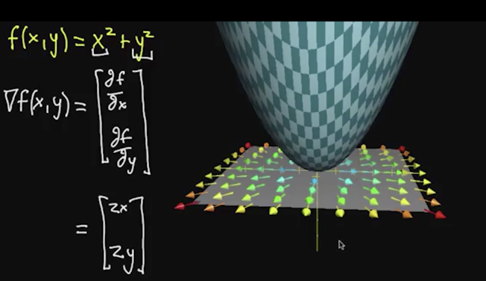

## 概念
$$输入空间的微小移动如何影响输出空间的变化\\\quad\\\dfrac{\partial{f}}{\partial{x}}(a,b)=\lim_{h\rightarrow 0}\dfrac{f(a+h,b)-f(a,b)}{h}$$
>$f(x,y)=x^2y+\sin{(y)}\\\quad\\\dfrac{\partial{f}}{\partial{x}}(1,2)=\dfrac{\partial}{\partial{x}}(x^2\cdot 2+\sin(2))|_{x=1}=4x|_{x=1}=4\\\quad\\\dfrac{\partial{f}}{\partial{y}}(1,2)=\dfrac{\partial}{\partial{y}}(1^2y+\sin(y))|_{y=2}=1+\cos{y}|_{y=2}=1+\cos{2}\\\quad\\\dfrac{\partial{f}}{\partial{x}}=\dfrac{\partial}{\partial{x}}(y\cdot x^2 + \sin(y))=2yx\\\quad\\\dfrac{\partial{f}}{\partial{y}}=\dfrac{\partial}{\partial{y}}(x^2y + \sin(y))=x^2+\cos(y)$

## 二阶偏导
$$f(x,y)=\sin(x)y^2\begin{cases}f_x=\dfrac{\partial{f}}{\partial{x}}=\cos(x)y^2\begin{cases}f_{xx}=\dfrac{\partial^2f}{\partial{x^2}}=\dfrac{\partial}{\partial{x}}(\dfrac{\partial{f}}{\partial{x}})=-\sin(x)y^2\\\quad\\f_{xy}=\dfrac{\partial^2f}{\partial{y}\partial{x}}=\dfrac{\partial}{\partial{y}}(\dfrac{\partial{f}}{\partial{x}})=\cos(x)(2y)\end{cases}\\\quad\\f_y=\dfrac{\partial{f}}{\partial{y}}=\sin(x)(2y)\begin{cases}f_{yy}=\dfrac{\partial^2f}{\partial{y^2}}=\dfrac{\partial}{\partial{x}}(\dfrac{\partial{f}}{\partial{y}})=\cos(x)(2y)\\\quad\\f_{yx}=\dfrac{\partial^2f}{\partial{x}\partial{y}}=\dfrac{\partial}{\partial{y}}(\dfrac{\partial{f}}{\partial{y}})=2\sin(x)\end{cases}\end{cases}$$

$f_{xy}=f_{yx}$

## 梯度
$假设f(x,y)=x^2\sin(y),梯度是一种打包一个函数所有偏导信息的方式\\\quad\\f_x=2x\sin(y),f_y=x^2\cos(y)\\\quad\\梯度\nabla f(x,y)=\begin{bmatrix}f_x\\f_y\end{bmatrix}=\begin{bmatrix}2x\sin(y)\\x^2\cos(y)\end{bmatrix}$

>$记忆技巧\\\nabla=\begin{bmatrix}\dfrac{\partial}{\partial{x}}\\\\\dfrac{\partial}{\partial{y}}\\\\...\end{bmatrix}所以\nabla f=\begin{bmatrix}\dfrac{\partial}{\partial{x}}\\\\\dfrac{\partial}{\partial{y}}\\\\...\end{bmatrix}f=\begin{bmatrix}\dfrac{\partial{f}}{\partial{x}}\\\\\dfrac{\partial{f}}{\partial{y}}\\\\...\end{bmatrix}$

$梯度的几何学意义:梯度指向最快上升的方向 \color{red}{Why}$

## 方向导数
$假设f(x,y)=x^2y\\\quad\\那么\begin{cases}\dfrac{\partial{f}}{\partial{x}}表示任意(x,y)在方向x轴上移动无限小的h距离,函数值变化多少\\\\\dfrac{\partial{f}}{\partial{y}}表示任意(x,y)在方向y轴上移动无限小的h距离,函数值变化多少\\\end{cases}\\\quad\\请问,任意(x,y)在方向\vec{V}=\begin{bmatrix}1\\2\end{bmatrix}上移动无限小的h距离,函数值变化多少呢?\\\quad\\设\vec{V}=\begin{bmatrix}a\\b\end{bmatrix},\nabla_{\vec{V}}f(x,y)=a\dfrac{\partial{f}}{\partial{x}}+b\dfrac{\partial{f}}{\partial{y}}=\begin{bmatrix}a\\b\end{bmatrix}\cdot\begin{bmatrix}\dfrac{\partial{f}}{\partial{x}}\\\\\dfrac{\partial{f}}{\partial{y}}\end{bmatrix}=\vec{V}\cdot\nabla{f}$

$$\nabla_{\vec{V}}f(\vec{a})=\lim_{h\rightarrow 0}\dfrac{f(\vec{a}+h\vec{V})-f(\vec{a})}{h}$$

$$如果把\nabla_{\vec{V}}f(\vec{a})想像成斜率=\dfrac{\nabla_{\vec{V}}f(\vec{a})}{|\vec{V}|}$$

$求f(x,y)=x^2y,在点(-1,-1)位置上,方向\vec{V}\begin{bmatrix}
    1\\2
\end{bmatrix}上的斜率是多少?$
>$解:\\\dfrac{\nabla_{\vec{V}}f(x,y)}{|\vec{V}|}=\dfrac{\sqrt{5}}{5}\nabla{f(x,y)}\cdot\vec{V}=\dfrac{\sqrt{5}}{5}\begin{bmatrix}f_x\\f_y\end{bmatrix}\cdot\begin{bmatrix}1\\2\end{bmatrix}=\dfrac{\sqrt{5}}{5}\begin{bmatrix}2xy\\x^2\end{bmatrix}\cdot\begin{bmatrix}1\\2\end{bmatrix}\\\quad\\\therefore\dfrac{\nabla_{\vec{V}}f(-1,-1)}{|\vec{V}|}=\dfrac{\sqrt{5}}{5}\begin{bmatrix}2(-1)(-1)\\(-1)^2\end{bmatrix}\cdot\begin{bmatrix}1\\2\end{bmatrix}=\dfrac{\sqrt{5}}{5}\begin{bmatrix}2\\1\end{bmatrix}\cdot\begin{bmatrix}1\\2\end{bmatrix}=\dfrac{4\sqrt{5}}{5}$

## 雅可比矩阵
$假设f(x,y)=\begin{bmatrix}f_1(x,y)\\f_2(x,y)\end{bmatrix}=\begin{bmatrix}x+\sin(y)\\y+\sin(x)\end{bmatrix}代表了原二维空间向新的二维空间的转换\\\quad\\Jacobian \quad Matrix=\begin{bmatrix}\dfrac{\partial{f_1}}{\partial{x}} &\dfrac{\partial{f_1}}{\partial{y}}\\\\ \dfrac{\partial{f_2}}{\partial{x}} &\dfrac{\partial{f_2}}{\partial{x}}\end{bmatrix}=\begin{bmatrix}1&\cos(y)\\\cos(x)&1\end{bmatrix}记录了二维空间每个点的线性变换$

## 雅可比矩阵的行列式
### 行列式
>$\det(\begin{bmatrix}3 &1\\0 &2\end{bmatrix})=3\cdot 2-1\cdot 0=\color{green}6\color{#EEEEEE}\\\quad\\可以把这个矩阵理解成对原二维空间的伸缩挤压的大小\\\quad\\原来的x轴上的单位向量\begin{bmatrix}1\\0\end{bmatrix}变成了\begin{bmatrix}3\\0\end{bmatrix}\\\quad\\原来的y轴上的单位向量\begin{bmatrix}1\\0\end{bmatrix}变成了\begin{bmatrix}1\\2\end{bmatrix}\\\quad\\原来的单位面积变成了原来的\color{green}6\color{#EEEEEE}倍$

### 雅可比矩阵的行列式
>$\det(\begin{bmatrix}\dfrac{\partial{f_1}}{\partial{x}} &\dfrac{\partial{f_1}}{\partial{y}}\\\\ \dfrac{\partial{f_2}}{\partial{x}} &\dfrac{\partial{f_2}}{\partial{x}}\end{bmatrix})=\det(\begin{bmatrix}1&\cos(y)\\\cos(x)&1\end{bmatrix})=1\cdot 1-\cos(x)\cos(y)\\\quad\\在(-2,1)这个点附近空间，转换后的伸缩倍数为1-\cos(-2)\cos(1)\approx1.227\\\quad\\在(0,1)这个点附近空间，转换后的伸缩倍数为1-\cos(0)\cos(1)\approx0.46$