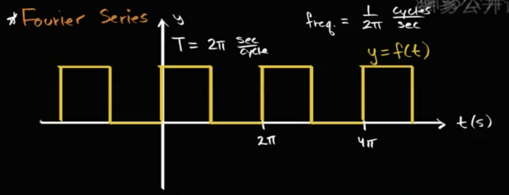
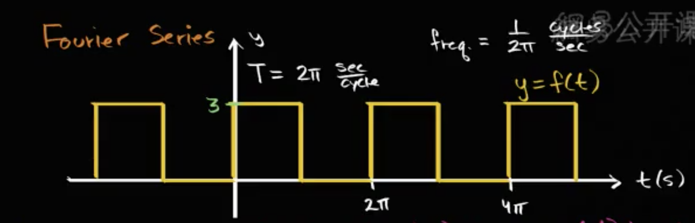

## 基础
$$\int^{2\pi}_{0}\sin{(mt)}dt=0,(m \in 任意整数)$$
$$\int^{2\pi}_{0}\cos{(mt)}dt=0,(m \in 任意非零整数)$$
$$\int^{2\pi}_{0}\sin{(mt)}\cos{(nt)}dt=0,(m,n \in 任意整数)$$
>证明如下
>
>$\int^{2\pi}_{0}\sin(mt)\cos(nt)dt\\=\int^{2\pi}_{0}\dfrac{1}{2}\sin(mt+nt)+\sin(mt-nt)dt\\=\dfrac{1}{2}(\int^{2\pi}_{0}\sin(m+n)tdt + \int^{2\pi}_{0}\sin(m-n)tdt)\\=0$

$$\int^{2\pi}_{0}\sin{(mt)}\sin{(nt)}dt=0,(m,n \in 任意整数, m \neq n 或者m \neq -n)$$
$$\int^{2\pi}_{0}(\sin(mt))^2dt=\pi,(m \in 任意非零整数)$$
> 证明如下
> 
> $\int^{2\pi}_{0}\sin{(mt)}\sin{(nt)}dt\\=\int^{2\pi}_{0}\dfrac{1}{2}(\cos(mt-nt)-\cos(mt+nt))dt\\=\dfrac{1}{2}(\int^{2\pi}_{0}\cos(mt-nt)dt-\int^{2\pi}_{0}\cos(mt+nt)dt)$
> 
> $原式=\begin{cases}\dfrac{1}{2}\int^{2\pi}_{0}\cos(0)dt=\pi&m=n且m\neq 0\\-\dfrac{1}{2}\int^{2\pi}_{0}\cos(0)dt=-\pi&m=-n且m\neq 0\\ 0&m\neq\pm n\end{cases}$

$$\int^{2\pi}_{0}\cos(mt)\cos(nt)dt=0,(m,n \in 任意整数, m \neq n 或者m \neq -n)$$
$$\int^{2\pi}_{0}(\cos(mt))^2dt=\pi,(m \in 任意非零整数)$$
> 证明如下
> 
> $\int^{2\pi}_{0}\cos(mt)\cos(nt)dt\\=\int^{2\pi}_{0}\dfrac{1}{2}(\cos(mt+nt)+\cos(mt-nt)dt)\\=\dfrac{1}{2}(\int^{2\pi}_{0}\cos(m+n)tdt+\int^{2\pi}_{0}\cos(m-n)tdt)$
>
> $原式=\begin{cases}\dfrac{1}{2}\int^{2\pi}_{0}\cos(0)dt = \pi & m=-n且m \neq 0\\\dfrac{1}{2}\int^{2\pi}_{0}\cos(0)dt = \pi & m=n且m \neq 0\\0 & m\neq \pm n\end{cases}$

## Fourier Series
$任何周期函数可以写成\\f(t)=a_0 \\+a_1\cos(t)+a_2\cos(2t)+a_3\cos(3t)+...+a_n\cos(nt)\\+b_1\sin(t)+b_2\sin(2t)+b_3\sin(3t)+...+b_n\sin(nt)$

>$对等号左右两边对dt做[0,2\pi]的积分,得到$
>
>$\int^{2\pi}_{0}f(t)dt=\int^{2\pi}_{0}a_0dt\\+\int^{2\pi}_{0}a_1\cos(t)dt+\int^{2\pi}_{0}a_2\cos(2t)dt+\int^{2\pi}_{0}a_3\cos(3t)dt+...+\int^{2\pi}_{0}a_n\cos(nt)dt\\+\int^{2\pi}_{0}b_1\sin(t)dt+\int^{2\pi}_{0}b_2\sin(2t)dt+\int^{2\pi}_{0}b_3\sin(3t)dt+...+\int^{2\pi}_{0}b_n\sin(nt)dt\\=2\pi a_0\\\therefore \color{green}{a_0=\dfrac{1}{2\pi}\int^{2\pi}_{0}f(t)dt}$

>$对等号左右两边乘以\cos(nt),再对dt做[0,2\pi]的积分$
>
>$\int^{2\pi}_{0}f(t)\cos(nt)dt=\int^{2\pi}_{0}a_0\cos(nt)dt\\+\int^{2\pi}_{0}a_1\cos(t)\cos(nt)dt+\int^{2\pi}_{0}a_2\cos(2t)\cos(nt)dt+\int^{2\pi}_{0}a_3\cos(3t)\cos(nt)dt+...+\int^{2\pi}_{0}a_n\cos(nt)\cos(nt)dt\\+\int^{2\pi}_{0}b_1\sin(t)\cos(nt)dt+\int^{2\pi}_{0}b_2\sin(2t)\cos(nt)dt+\int^{2\pi}_{0}b_3\sin(3t)\cos(nt)dt+...+\int^{2\pi}_{0}b_n\sin(nt)\cos(nt)dt\\=\int^{2\pi}_{0}a_n\cos(nt)\cos(nt)dt=a_n\pi\\\therefore \color{green}{a_n=\dfrac{1}{\pi}\int^{2\pi}_{0}f(t)\cos(nt)dt}$

>$对等号左右两边乘以\sin(nt),再对dt做[0,2\pi]的积分$
>
>$\int^{2\pi}_{0}f(t)\sin(nt)dt=\int^{2\pi}_{0}a_0\sin(nt)dt\\+\int^{2\pi}_{0}a_1\cos(t)\sin(nt)dt+\int^{2\pi}_{0}a_2\cos(2t)\sin(nt)dt+\int^{2\pi}_{0}a_3\cos(3t)\sin(nt)dt+...+\int^{2\pi}_{0}a_n\cos(nt)\sin(nt)dt\\+\int^{2\pi}_{0}b_1\sin(t)\sin(nt)dt+\int^{2\pi}_{0}b_2\sin(2t)\sin(nt)dt+\int^{2\pi}_{0}b_3\sin(3t)\sin(nt)dt+...+\int^{2\pi}_{0}b_n\sin(nt)\sin(nt)dt\\=\int^{2\pi}_{0}b_n\sin(nt)\sin(nt)dt=a_n\pi\\\therefore \color{green}{b_n=\dfrac{1}{\pi}\int^{2\pi}_{0}f(t)\sin(nt)dt}$

## 求解方波

>$a_0=\dfrac{1}{2\pi}\int^{2\pi}_{0}f(t)dt=\dfrac{1}{2\pi}(\int^{\pi}_{0}f(t)dt + \int^{2\pi}_{\pi}f(t)dt)=\dfrac{1}{2\pi}(\int^{\pi}_{0}3dt+\int^{2\pi}_{\pi}0dt)=\dfrac{1}{2\pi}(3\pi+0)=\dfrac{3}{2}\\\therefore \color{green}{a_0=\dfrac{3}{2}}\color{#EEEEEE}\\a_n=\dfrac{1}{\pi}\int^{2\pi}_{0}f(t)\cos(nt)dt=\dfrac{1}{\pi}(\int^{\pi}_{0}f(t)\cos(nt)dt + \int^{2\pi}_{\pi}f(t)\cos(nt)dt)=\dfrac{1}{\pi}(\int^{\pi}_{0}3\cos(nt)dt + \int^{2\pi}_{\pi}0\cos(nt)dt)=\dfrac{1}{\pi}3\dfrac{1}{n}\sin(nt)|^{\pi}_{0}=0\\\therefore \color{green}{a_n=0}\color{#EEEEEE}\\b_n=\dfrac{1}{\pi}\int^{2\pi}_{0}f(t)\sin(nt)dt=\dfrac{1}{\pi}(\int^{\pi}_{0}f(t)\sin(nt)dt + \int^{2\pi}_{\pi}f(t)\sin(nt)dt)=\dfrac{1}{\pi}(\int^{\pi}_{0}3\sin(nt)dt + \int^{2\pi}_{\pi}0\sin(nt)dt)=\dfrac{3}{n\pi}(-\cos(nt))|^{\pi}_{0}=\dfrac{3}{n\pi}(1+1)=-\dfrac{3}{n\pi}(\cos(n\pi)-1)\\\therefore \color{green}{b_n=\begin{cases} -\dfrac{3}{n\pi}(1-1)=0 & n为偶数\\-\dfrac{3}{n\pi}(-1-1)=\dfrac{6}{n\pi} & n为奇数\\\end{cases}}\color{#EEEEEE}\\f(t)=\dfrac{3}{2}+\dfrac{6}{\pi}\sin(t)+\dfrac{6}{3\pi}\sin(3t)+\dfrac{6}{5\pi}\sin(5t)+...$

$$f(t)=\dfrac{3}{2}+\sum^{\infty}_{k=0} \dfrac{6}{(2k+1)\pi } \sin((2k+1)t)$$