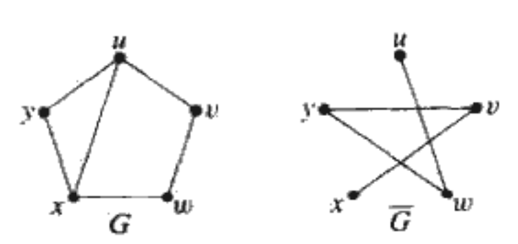
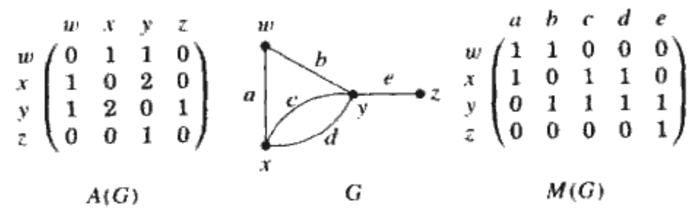
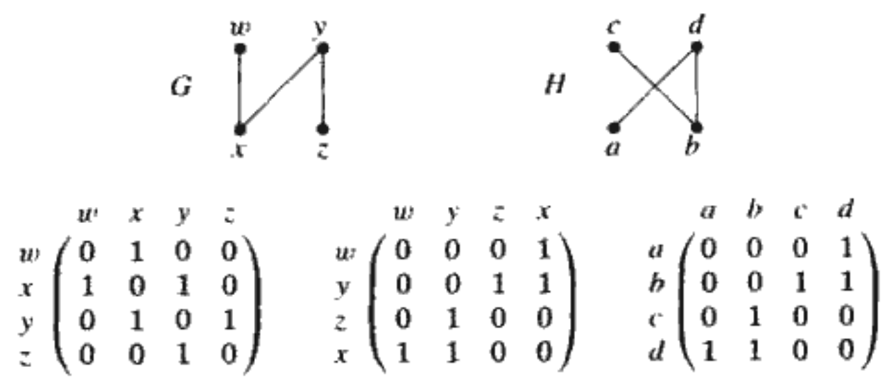
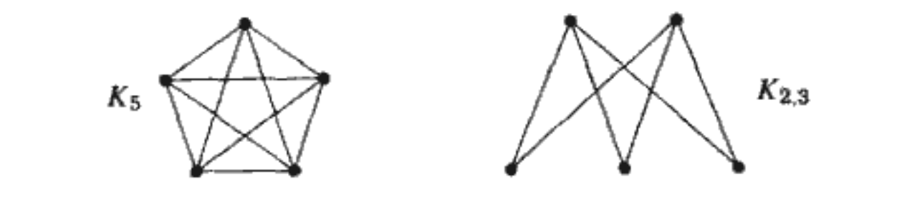
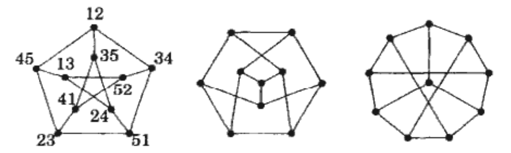

## 基本概念
### 定义
+ 一个**图**$G$是一个三元组,这个三元组包括一个**顶点集**$V(G)$,一个**边集**$E(G)$和一个关系,该关系使得每条边和两个顶点(不一定是不同的点)相关联,并将两个顶点称为这条边的**端点**
+ 一个**圈**是两个端点相同的一条边
+ **重边**是具有同一对端点的多条边
+ 一个**简单图**不含圈和重边的图.我们用点的集合和边的集合来确定一个简单图,边的集合被表示一组无序点对的集合,我们用$e=uv$(或$e=vu$)来表示一条以$u、v$为端点的边$e$
+ 当$u和v$是一条边的两个端点时,那么它们是**邻接**的且互为**邻居**.我们用$u\leftrightarrow v$来表示$u和v$是邻接的
+ 一个简单图$G$的**补图**$\bar{G}$也是一个简单图,其顶点集为$V(G)$,且$uv\in E(\bar{G})$当且仅当$uv\not\in E(G)$
  + **团**是图中两两相邻的顶点组成的集合
  + **独立集**(或**稳定集**)是图中两两互不相邻的顶点组成的集合
  + 在图$G$中,$\{u,x,y\}$是一个大小为3的团,$\{u,w\}$是一个大小为2的独立集
  + 这两个值在$\bar{G}$中正好调换
+ 图$G$称为**二部图**,如果$V(G)$是两个互不相交的独立的集(可以是空集)的并集,这两个集合称为图$G$的**部集**
+ 图$G$的**色数**,记作$\chi(G)$是使邻接点获得不同颜色所需颜色的最小数目
+ 图$G$是$k$-分的,如果$V(G)$可以表示为$k$(可以为空)个独立集的并
+ 一条**路径**是一个简单图,其顶点可以排序使得两个顶点是邻接的当且仅当它们的顶点是前后相继的
+ 一个**环**是一个顶点数和边数相等的图,其顶点可以放置在一个圆周上,使得两个顶点是相邻的当且仅当它们在圆周上相继出现
+ 图$G$的**子图**是一个图$H$,它满足$V(H)\subseteq V(G),E(H)\subseteq E(G)$且$H$中边的端点的分配与$G$一样.我们用$H\subseteq G$来表示**G包含H**
+ 如果$G$中的每一对顶点都属于某一条路径,图$G$是**连通**的,否则图$G$是**非连通**的
+ 一个图是**无圈**的是指该图允许出现重边但不允许出现圈
+ 令$G$图是一个无圈图,其顶点集为$V(G)=\{v_1,v_2,...,v_n\}$,边集是$E(G)=\{e_1,e_2,...,e_m\}$
  + $G$的**邻接矩阵**,记作$A(G)$,是一个$n\times n$的矩阵,元素$a_{i\cdot j}$是以$v_i$和$v_j$为端点的边的数目
  + $G$的**关联矩阵**,记作$M(G)$,是一个$n\times m$的矩阵,如果$v_i$是$e_j$的端点,则$m_{i\cdot j}$是$1$,否则为$0$
  + 如果顶点$v$是边$e$的端点,则称$v$和$e$是**关联**的
  + 顶点$v$的**度**(在无圈图中)是其关联边的数目

+ 从一个简单图$G$到简单图$H$的**同构**是一个双射$f$:$V(G)\rightarrow V(H)$,使得$uv\in E(G)$当且仅当$f(u)f(v)\in E(H)$.如果存在从$G$到$H$的同构,我们说**G同构于H**,记作$G\cong H$
  + 定义$f:V(G)\rightarrow V(H)$,其中$f(w)=a, f(x)=d, f(y)=b,f(z)=c$
+ 将含$n$个顶点的(无标记)路径和环分别记为$P_n$和$C_n$
+ 一个**完全图**是简单图,其任意两个顶点是邻接的;将含$n$个顶点的(无标记)完全图记作$K_n$
+ **完全二部图**(或**二部团**)是简单的二部图,它的两个顶点是邻接的当且仅当它们在不同的部集里.如果两个部集的大小是$r$和$s$,则将二部团记作$K_{r,s}$
+ 一个图是**自补**的,如果它同构于其补图
+ 图$G$的一个**分解**是其一系列子图且$G$的每条边出现且只出现在一个子图内
+ 一个$n$顶点图$H$是自补的,当且仅当$K_n$的某个分解包含了$H$的两个拷贝
+ **Peterson图**是一个简单图,其顶点集是一个5-元素集合的所有2-元素子集构成的集族,其边是互不相交的2-元素子集对
  + 用$[5]=\{1,2,3,4,5\}$来表示5-元素集,因为$12$和$34$互不相交,当我们构成图时,它们可以是邻接点;$12$和$23$就不可以是邻接点
  + 在Peterson图中,如果两顶点不是邻接的,则它们恰好有一个公共的相邻顶点
+ 含环的图的**围长**是该图中最短环的长度.无环图的围长是无穷大
  + Peterson图的围长是5
+ 图$G$的一个**自同构**是一个从$G$到$G$的同构.如果对于任意一对顶点$u,v\in V(G)$都存在$G$的一个自同构将$u$映射到$v$.图$G$是**顶点传递**的
  + $G$的自同构是$V(G)$的一些排列,这些排列可以应用到$A(G)$中的行和列上而无需改变$A(G)$
  + 令$G$是顶点集为$\{1,2,3,4\}$边集为$\{12,23,34\}$的路径.该图有两个自同构:恒等排列,以及将1与4对换,2与3对换的排列
  + 在$K_{r,s}$中,排列一个部集的顶点,并不改变邻接矩阵;这就产生了$r!s!$个自同构.当$r=s$时,我们还可以交换部集,$K_{t,t}$就有$2(t!)^2$个自同构