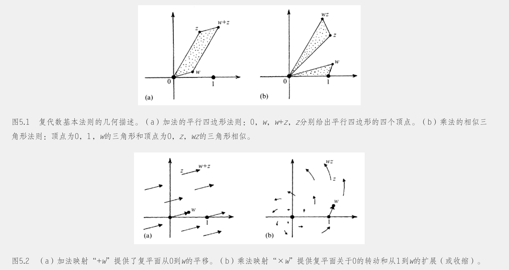
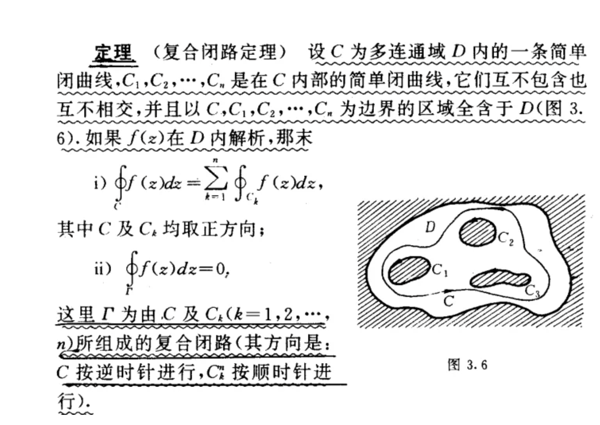

## 复代数几何
### 复数的加法与乘法

$z=|z|(\cos{\theta} + i\sin{\theta})$

$\bar{z}=|z|(\cos{\theta} - i\sin{\theta})$

$z_1z_2=|z_1z_2|(\cos(\theta_1 + \theta_2) + i\sin(\theta_1+\theta_2))$

### 复数的对数
$$e^{i\theta}=\cos\theta + i\sin\theta$$见【如何理解泰勒展开-练习题2】
设$w=r\cos\theta+ir\sin\theta=re^{i\theta}$

则$\ln{w}=\ln{(re^{i\theta})}=\ln{r} + \ln{e^{i\theta}}=\ln{r}+i\theta$

$\begin{aligned}
    \ln(x+iy)&=\ln{r(\cos\theta + i\sin\theta)}\\
    &=\ln{re^{i\theta}}\\
    &=\ln{r} + \ln{e^{i\theta}}\\
    &=\ln{r}+i\theta
\end{aligned}$

此处的$\theta$具有多值性,可以加减任意整数个$2\pi$

$\begin{aligned}
    \ln{i}=\ln{1}+i(\dfrac{\pi}{2} + 2n\pi) =i(\dfrac{\pi}{2} + 2n\pi)  
\end{aligned}$

### $e^{i\theta}=\cos{\theta}+i\sin{\theta}的一个有趣应用$
$\begin{aligned}
    e^{i(a+b)}&=e^{ia}e^{ib}\\
    \cos(a+b)+i\sin(a+b)&=(\cos{a}+i\sin{a})(\cos{b}+i\sin{b})\\
    \cos(a+b)+i\sin(a+b)&=\cos{a}\cos{b}-\sin{a}\sin{b}+i({\sin{a}\cos{b}+\cos{a}\sin{b})}\\
    \therefore\cos(a+b)&=\cos{a}\cos{b}-\sin{a}\sin{b}\\
    \sin(a+b)&=\sin{a}\cos{b}+\cos{a}\sin{b}
\end{aligned}$

同理，由$e^{3i\theta}=(e^{i\theta})^3$分解可得

$\begin{aligned}
    \cos{3\theta}=\cos^3{\theta}-3\cos{\theta}\sin^2{\theta}\\
    \sin{3\theta}=3\sin\theta\cos^2\theta-\sin^3\theta
\end{aligned}$

### 复数幂$w^z$
取$\ln{i}=\dfrac{1}{2}\pi i$

$i^{i}=e^{i\ln{i}}=e^{i\frac{1}{2}\pi i}=e^{-\frac{1}{2}\pi}=0.207879576...$

同理，因为$\ln{i}$具有多值性,所以$i^i$也具有多值性

#### 求$1^{\frac{1}{5}}$
$1=e^{0}=e^{2\pi i}=e^{4\pi i}=e^{6\pi i}=e^{8\pi i}$

$1^{\frac{1}{5}}=e^{0}, e^{\frac{2\pi i}{5}},e^{\frac{4\pi i}{5}},e^{\frac{6\pi i}{5}},e^{\frac{8\pi i}{5}}$

#### 求$2^{\frac{1}{2}}$
$2=2e^{0}=2e^{2\pi i}$

$\begin{aligned}
    2^{\frac{1}{2}}&=\sqrt{2}e^{0}, \sqrt{2}e^{\frac{2\pi i}{2}}\\
    &=\sqrt{2},-\sqrt{2}\\
    &=\pm\sqrt{2}
\end{aligned}$

#### 求$i^{\frac{1}{2}}$
$i=e^{\frac{1}{2}\pi i}=e^{\frac{5}{2}\pi i}$

$\begin{aligned}
    i^{\frac{1}{2}}=e^{\frac{1}{4}\pi i}, e^{\frac{5}{4}\pi i}
\end{aligned}$

#### 求$(1-i)^{\frac{1}{3}}$
$1-i=\sqrt{2}e^{\frac{7}{4}\pi i}= \sqrt{2}e^{\frac{15}{4}\pi i} = \sqrt{2}e^{\frac{23}{4}\pi i}$

$\begin{aligned}
    (1-i)^{\frac{1}{3}}=\sqrt{2}e^{\frac{7}{12}\pi i},\sqrt{2}e^{\frac{15}{12}\pi i},\sqrt{2}e^{\frac{23}{12}\pi i}
\end{aligned}$

#### 求$(1+i)^{1-i}$
取$1+i=\sqrt{2}e^{\frac{1}{4}\pi i}=e^{\ln{\sqrt{2}} + \frac{1}{4}\pi i}$

$\begin{aligned}
    (1+i)^{1-i}&=(e^{\ln{\sqrt{2}} + \frac{1}{4}\pi i})^{1-i}\\
    &=e^{\ln\sqrt{2}+\frac{1}{4}\pi+(\frac{1}{4}\pi-\ln\sqrt{2})i}\\
    &=\ln\sqrt{2}e^{\frac{\pi}{4}}e^{i(\frac{\pi}{4}-\ln\sqrt{2})}\\
    &=\ln\sqrt{2}e^{\frac{\pi}{4}}(\cos\theta+i\sin\theta),其中\theta=\frac{\pi}{4}-\ln\sqrt{2}
\end{aligned}$

## 微分
+ $d(x^n)=nx^{n-1}dx$
+ $d[f(x)+g(x)]=df(x)+dg(x)$
+ $d[af(x)]=adf(x)$
+ $da= 0$

上述都是莱布尼茨法则的特殊形式
$$d[f(x)g(x)]=f(x)dg(x)+g(x)df(x)$$

另一个有用的公式
$$d[f(g(x))]=f^{'}(g(x))g^{'}(x)dx$$

实例

$\begin{aligned}
    d(\dfrac{f(x)}{g(x)})&=f(x)dg^{-1}(x)+g^{-1}(x)df(x)\\
    &=f(x)(-g^{2}(x)dg(x)) + g^{-1}(x)df(x)\\
    &=\dfrac{-f(x)dg(x)+g(x)df(x)}{g^{2}(x)}
\end{aligned}$

### 常用函数的导数
+ $d(e^x)=e^xdx$
  
+ $d(\ln{x})=\dfrac{dx}{x}$
  
+ $d(\sin{x})=\cos{x}dx$
  
+ $d(\cos{x})=-\sin{x}dx$
  
+ $d(\tan{x})=\dfrac{dx}{\cos^{2}x}$
  
+ $d(\sin^{-1}x)=\dfrac{dx}{\sqrt{1-x^2}}$
  
+ $d(\cos^{-1}x)=\dfrac{-dx}{\sqrt{1-x^2}}$
  
+ $d(\tan^{-1}x)=\dfrac{dx}{\sqrt{1+x^2}}$

### 例题一：求$d(x^{\ln{x}})$
> 设$y=x^{\ln{x}}$
> 
> 则$\ln{y}=\ln{x^{\ln{x}}}=(\ln{x})^2$
> 
> $等号左右两边对x求导得到\Rightarrow\dfrac{1}{y}\dfrac{dy}{dx}=\dfrac{1}{x}2\ln{x}$
> 
> $\dfrac{dy}{dx}=\dfrac{y}{x}2\ln{x}=2x^{\ln{x}-1}\ln{x}$

### 例题二：求$d(x^{\sin{x}})$
> 设$y=x^{\sin{x}}$
> 
> 则$\ln{y}=\sin{x}\ln{x}$
> 
> $等号左右两边对x求导\Rightarrow\dfrac{1}{y}\dfrac{dy}{dx}=\cos{x}\ln{x}+\sin{x}\dfrac{1}{x}$
> 
> $\dfrac{dy}{dx}=y(\cos{x}\ln{x}+\sin{x}\dfrac{1}{x})=x^{\sin{x}}\cos{x}\ln{x}+x^{\sin{x}-1}\sin{x}$

### 例题三：求$d((x-1)^{\sin{x}})$
> 设$y=(x-1)^{\sin{x}}$
> 
> 则$\ln{y}=\sin{x}\ln{(x-1)}$
> 
> $等号左右两边对x求导得到\Rightarrow\dfrac{1}{y}\dfrac{dy}{dx}=\cos{x}\ln{(x-1)}+\sin{x}\dfrac{d[\ln(x-1)]}{dx}=\cos{x}\ln{(x-1)}+\sin{x}\dfrac{1}{x-1}$
> 
> $\dfrac{dy}{dx}=y(\cos{x}\ln{(x-1)}+\sin{x}\dfrac{1}{x-1})=(x-1)^{\sin{x}}\cos{x}\ln{(x-1)}+(x-1)^{\sin{x}-1}\sin{x}$

### 例题四：求$\dfrac{1-e^x}{1+e^x}的导数$
> $\begin{aligned}
    d(\dfrac{1-e^x}{1+e^x})&=(1-e^x)(-1)(1+e^x)^{-2}e^xdx+(1+e^x)^{-1}(-e^x)dx\\
    &=(\dfrac{(e^x-1)e^x}{(1+e^x)^2}-\dfrac{e^x}{1+e^x})dx\\
    &=\dfrac{e^{2x}-e^x-e^x-e^{2x}}{(1+e^x)^2}dx\\
    &=\dfrac{-2e^x}{(1+e^x)^2}dx
\end{aligned}$

### 例题五：求$d(\ln{\ln{\ln{x}}})$
> $\begin{aligned}
    d(\ln{\ln{\ln{x}}})=\dfrac{1}{\ln{\ln{x}}}\times\dfrac{1}{\ln{x}}\times\dfrac{1}{x}
\end{aligned}$

## 复数微积分
### 极限
$$\lim_{\Delta{z}\rightarrow{0}}\dfrac{f(z+\Delta{z})-f(z)}{\Delta{z}}$$
#### 例题一 $f(z)=z^2$
$\begin{aligned}
    \lim_{\Delta{z}\rightarrow{0}}\dfrac{(z+\Delta{z})^2-z^2}{\Delta{z}}&=\dfrac{2z\Delta{z}-\Delta{z}^2}{\Delta{z}}\\
&=2z
\end{aligned}$

#### 例题二 $f(z)=x+2yi$
$\begin{aligned}
\lim_{\Delta{z}\rightarrow{0}}\dfrac{f(z+\Delta{z})-f(z)}{\Delta{z}}&=\dfrac{x+\Delta{x}+2(y+\Delta{y})i-(x+2yi)}{\Delta{x}+\Delta{y}i}\\
&=\dfrac{\Delta{x}+2\Delta{y}i}{\Delta{x}+\Delta{y}i}
\end{aligned}$

设$\Delta{y}=k\Delta{x}$

则原式$=\dfrac{\Delta{x}+2k\Delta{x}i}{\Delta{x}+k\Delta{x}i}=\dfrac{1+2ki}{1+ki} 随k值不同极限也不同,所以不可导$

### 复变函数在某点处可导的充要条件：$C-R方程$
$f(z)在区域D内有定义，f(z)=u+vi在点(x,y)处可导\Leftrightarrow u,v可微，且满足C-R方程(柯西黎曼方程)\begin{cases}
\dfrac{\partial{u}}{\partial{x}}=\dfrac{\partial{v}}{\partial{y}}\\\\
\dfrac{\partial{u}}{\partial{y}}=-\dfrac{\partial{v}}{\partial{x}}
\end{cases}$

$$f^{'}(z)=a+ib=\dfrac{\partial{u}}{\partial{x}}+i\dfrac{\partial{v}}{\partial{x}}$$
> $\begin{aligned}
&f^{'}(z)=\lim_{\Delta{z}\rightarrow{0}}\dfrac{f(z+\Delta{z})-f(z)}{\Delta{z}}存在\\
&\Rightarrow f(z+\Delta{z})-f(z)=f^{'}(z)\cdot\Delta{z}+o(|\Delta{z}|)\\
&\Rightarrow \Delta{u}+i\Delta{v}=(a+bi)\cdot(\Delta{x}+i\Delta{y})+o(|\Delta{z}|)\\
&\Rightarrow \Delta{u}+i\Delta{v}=(a\Delta{x}-b\Delta{y})+i(b\Delta{x}+a\Delta{y})+o(|\Delta{z}|)\\
&\Rightarrow \begin{cases}
\Delta{u}=a\Delta{x}-b\Delta{y}+o(|\Delta{z}|)\Rightarrow\begin{cases}
a=\dfrac{\partial{u}}{\partial{x}}\\\\b=-\dfrac{\partial{u}}{\partial{y}}\end{cases}\\\\
\Delta{v}=b\Delta{x}+a\Delta{y}+o(|\Delta{z}|)\Rightarrow\begin{cases}
a=\dfrac{\partial{v}}{\partial{y}}\\\\b=\dfrac{\partial{v}}{\partial{x}}\end{cases}
\end{cases}
\end{aligned}$

#### 例题一 判断$f(z)=z^2$在区域D内解析
> $z^2=(x+yi)^2=x^2-y^2+2xyi$
>
> $\dfrac{\partial{u}}{\partial{x}}=\dfrac{\partial(x^2-y^2)}{\partial{x}}=2x, \dfrac{\partial{v}}{\partial{x}}=\dfrac{\partial(2xy)}{\partial{x}}=2y$
>
> $\dfrac{\partial{u}}{\partial{y}}=\dfrac{\partial(x^2-y^2)}{\partial{y}}=-2y, \dfrac{\partial{v}}{\partial{y}}=\dfrac{\partial(2xy)}{\partial{y}}=2x$
>
> 恒满足C-R方程,处处可导,处处可解析

#### 例题二 判断$f(z)=|z|^2$在区域D内解析
> $|z|^2=x^2+y^2$
>
> $\dfrac{\partial{u}}{\partial{x}}=\dfrac{\partial(x^2+y^2)}{\partial{x}}=2x, \dfrac{\partial{v}}{\partial{x}}=0$
>
> $\dfrac{\partial{u}}{\partial{y}}=\dfrac{\partial(x^2+y^2)}{\partial{y}}=2y, \dfrac{\partial{v}}{\partial{y}}=0$
>
> 仅在$(0,0)$满足C-R方程,既仅在$(0,0)$可导,故处处不可解析

#### 例题三 判断$f(z)=x^3-y^3+2x^2y^2i$在哪些点可导，导数是多少
> $\dfrac{\partial{u}}{\partial{x}}=\dfrac{\partial(x^3-y^3)}{\partial{x}}=3x^2, \dfrac{\partial{v}}{\partial{x}}=\dfrac{\partial(2x^2y^2)}{\partial{x}}=4xy^2$
>
> $\dfrac{\partial{u}}{\partial{y}}=\dfrac{\partial(x^3-y^3)}{\partial{y}}=-3y^2, \dfrac{\partial{v}}{\partial{y}}=\dfrac{\partial(2x^2y^2)}{\partial{y}}=4x^2y$
>
> $\begin{cases}
3x^2=4x^2y\\\\
4xy^2=-(-3y^2)
\end{cases}$
>
> 得$x=0,y=0$或$x=\dfrac{3}{4},y=\dfrac{3}{4}$
>
> 仅在$(0,0)和(\dfrac{3}{4},\dfrac{3}{4})$满足C-R方程,既仅在$(0,0)$可导,故处处不可解析
>
> $\begin{cases}
f^{'}(0)=\dfrac{\partial{u}}{\partial{x}} + i\dfrac{\partial{v}}{\partial{y}}=3x^2 -3y^2i=0\\\\
f^{'}(\dfrac{3}{4}+\dfrac{3}{4}i)=\dfrac{\partial{u}}{\partial{x}} + i\dfrac{\partial{v}}{\partial{y}}=3x^2 -3y^2i=\dfrac{27}{16}+\dfrac{27}{16}i
\end{cases}$

#### 例题四 $f(z)=x^2+axy+by^2+i(cx^2+dxy+y^2),求a,b,c,d使f(z)构成解析函数$

> $\dfrac{\partial{u}}{\partial{x}}=\dfrac{\partial(x^2+axy+by^2)}{\partial{x}}=2x+ay, \dfrac{\partial{v}}{\partial{x}}=\dfrac{\partial(cx^2+dxy+y^2)}{\partial{x}}=2cx+dy$
>
> $\dfrac{\partial{u}}{\partial{y}}=\dfrac{\partial(x^2+axy+by^2)}{\partial{y}}=ax+2by, \dfrac{\partial{v}}{\partial{y}}=\dfrac{\partial(cx^2+dxy+y^2)}{\partial{y}}=dx+2y$
> 
> $\begin{cases}
    2x+ay=dx+2y\\
    ax+2by = -2cx-dy
\end{cases}$
>
> $\therefore\begin{cases}
    a=2\\
    b=-1\\
    c=-1\\
    d=2
\end{cases}$

### 判断$f(z)$解析的另一个方法：$\bar{z}$
$\because z=x+iy,\bar{z}=x-iy\Rightarrow x=\dfrac{z+\bar{z}}{2},y=\dfrac{z-\bar{z}}{2i}$

$\therefore f(z)=u+iv=u(x,y)+iv(x,y)=u(\dfrac{z+\bar{z}}{2},\dfrac{z-\bar{z}}{2i})+iv(\dfrac{z+\bar{z}}{2},\dfrac{z-\bar{z}}{2i})$

$f(z)解析\Leftrightarrow f(z)表达式不含\bar{z}$

$\begin{cases}
f(z)=z^2不含\bar{z}\Rightarrow f(z)解析\\\\
f(z)=|z|^2=z\bar{z}含\bar{z}\Rightarrow f(z)不解析\\\\
f(z)=x+2yi=\dfrac{z+\bar{z}}{2}+2i\dfrac{z-\bar{z}}{2i}=\dfrac{3z}{2}-\dfrac{\bar{z}}{2}含\bar{z}\Rightarrow f(z)不解析
\end{cases}$

#### 证明$\dfrac{\partial{f}}{\partial{\bar{z}}}\Leftrightarrow{C-R方程}$
> $\begin{aligned}
\dfrac{\partial{f}}{\partial{\bar{z}}}=\dfrac{\partial{u}}{\partial{\bar{z}}} + i\dfrac{\partial{v}}{\partial{\bar{z}}}&=[\dfrac{\partial{u}}{\partial{x}}\times\dfrac{\partial{x}}{\partial{\bar{z}}} + \dfrac{\partial{u}}{\partial{y}}\times\dfrac{\partial{y}}{\partial{\bar{z}}}]+i[\dfrac{\partial{v}}{\partial{x}}\times\dfrac{\partial{x}}{\partial{\bar{z}}} + \dfrac{\partial{v}}{\partial{y}}\times\dfrac{\partial{y}}{\partial{\bar{z}}}]\\\\
&=[\dfrac{\partial{u}}{\partial{x}}\times\dfrac{1}{2} + \dfrac{\partial{u}}{\partial{y}}\times(-\dfrac{1}{2i})]+i[\dfrac{\partial{v}}{\partial{x}}\times\dfrac{1}{2} + \dfrac{\partial{v}}{\partial{y}}\times(-\dfrac{1}{2i})]\\\\
&=\dfrac{1}{2}(\dfrac{\partial{u}}{\partial{x}}-\dfrac{\partial{v}}{\partial{y}})+\dfrac{i}{2}(\dfrac{\partial{v}}{\partial{x}}+\dfrac{\partial{u}}{\partial{y}})
\end{aligned}$

$\because\dfrac{\partial{f}}{\partial{\bar{z}}}=0$

$\therefore\begin{cases}
\dfrac{\partial{u}}{\partial{x}}=\dfrac{\partial{v}}{\partial{y}}\\\\
\dfrac{\partial{v}}{\partial{x}}=-\dfrac{\partial{u}}{\partial{y}}
\end{cases}$

### 指数函数
研究函数$f(z)=e^x(\cos{y}+i\sin{y})$

性质一
> $\dfrac{\partial{u}}{\partial{x}}=e^x\cos{y}\qquad\dfrac{\partial{v}}{\partial{y}}=e^x\cos{y}$
>
> $\dfrac{\partial{u}}{\partial{y}}=-e^x\sin{y}\qquad\dfrac{\partial{v}}{\partial{x}}=e^x\sin{y}$
>
> $\therefore f(z)处处解析$

性质二
> $f^{'}(z)=\dfrac{\partial{u}}{\partial{x}}+i\dfrac{\partial{v}}{\partial{x}}=e^x\cos{y}+ie^x\sin{y}=f(z)$

性质三
> $当y=0时,f(z)=e^x$

性质四
> $f(z)=e^x(\cos{y}+i\sin{y})定义为e^z$
>
> $那么f(z)=e^x(\cos{y}+i\sin{y})=e^xe^{iy}=e^{x+iy}=e^z$

性质五
> $e^z是一个周期函数，周期为2k\pi{i}$
>
>$e^{z+2k\pi{i}}=e^ze^{2k\pi{i}}=e^ze^{0}(\cos{2k\pi{i}} + i\sin{2k\pi{i}})=e^z$

### 对数函数
$如果z=e^w,则定义w=Ln(z)(大写的Ln表示一个集合)$
> $\begin{aligned}
    e^w=z&=re^{i(\theta+2k\pi)}\\
    &=e^{\ln{r}}e^{i(\theta+2k\pi)}\\
    &=e^{\ln{r}+i(\theta+2k\pi)}
\end{aligned}\\
\therefore w=\ln{r}+i(\theta+2k\pi)\\
其中\ln{r} +i\theta称为对数主值$

#### 求$f(z)=\dfrac{1}{1+e^z}的导数和奇点$
> $f^{'}(z)=\dfrac{-1}{(1+e^z)^2}e^z\\
求奇点即求(1+e^z)^2=0对应的z\\
1+e^z=0\\
e^z=-1=e^{i(\pi + 2k\pi)}\\
z=Ln(-1)=\ln(-1)+2k\pi{i}=i(\pi+2k\pi)$

#### $Ln(z)$的可导性
> $Ln(z)=\ln{z}+2k\pi{i} = \ln{r} + i\theta + 2k\pi{i},-\pi\lt\theta\le\pi\\
\therefore Ln(z)在除了0和\theta=-\pi处处解析$
>
> $w=Ln(z)\Rightarrow z=e^w\\
(Ln(z))^{'}=\dfrac{dw}{dz}=\dfrac{1}{\dfrac{dz}{dw}}=\dfrac{1}{e^w}=\dfrac{1}{z}$

### 幂函数
$a^b=e^{bLn(a)}$
> $\begin{aligned}
    z^n=e^{n\times Ln(z)}&=e^{Ln(z)+Ln(z)+...+Ln(z)}\\
    &=e^{Ln(z)}\times e^{Ln(z)}\times ... \times e^{Ln(z)}\\
    &=z\times{z}\times{...}\times{z}
\end{aligned}$
>
> $\begin{aligned}
    z^{\frac{1}{n}}=e^{\frac{1}{n}Ln(z)}&=e^{\frac{1}{n}(\ln{z}+2k\pi i)}\\
    &=e^{\frac{1}{n}(\ln{r}+i\theta+2k\pi i)}\\
    &=e^{\frac{1}{n}\ln{r}}\times e^{\frac{i\theta+2k\pi i}{n}}\\
    &=\sqrt[n]{r}(\cos{\dfrac{\theta+2k\pi}{n}} + i\sin{\dfrac{\theta+2k\pi}{n}})\\
    &=\sqrt[n]{z}
\end{aligned}$
>
> $\begin{aligned}
    z^{\frac{m}{n}}=(z^{\frac{1}{n}})^{m}
\end{aligned}$
>
> $\begin{aligned}
    1^{\sqrt{2}}=e^{\sqrt{2}Ln(1)}&=e^{\sqrt{2}(\ln{1}+2k\pi i))}=e^{2\sqrt{2}k\pi i}\\
    &=\cos{2\sqrt{2}k\pi}+i\sin{2\sqrt{2}k\pi}
\end{aligned}$
>
> $\begin{aligned}
    (1+\sqrt{3}i)^{i}&=e^{iLn(1+\sqrt{3}i)}=e^{i(\ln(1+\sqrt{3}i) + 2k\pi{i})}\\
    &=e^{i(\ln{2}+i\frac{\pi}{3}+2k\pi{i})}\\
    &=e^{i\ln{2}-\frac{\pi}{3}-2k\pi}\\
    &=e^{-\frac{\pi}{3}-2k\pi}(\cos(\ln{2})+i\sin(\ln{2}))
\end{aligned}$
>
> $\begin{aligned}
    (-3)^{i}&=e^{i(Ln(-3))}=e^{i(\ln(-3)+2k\pi{i})}\\
    &=e^{i(\ln3+i\pi+2k\pi{i})}\\
    &=e^{-\pi-2k\pi}(\cos\ln(3)+i\sin\ln(3))
\end{aligned}$

#### 可导性
+ $z^n(n为正整数),(z^n)^{'}=nz^{n-1}处处可导$
+ $z^{-n}=\dfrac{1}{z^n}除0外处处可导$
+ $z^{\alpha}=e^{\alpha\cdot{Ln(z)}}除0和负实轴外处处可导$
+ $z^{\alpha}=\alpha{z^{\alpha-1}}$
> $\begin{aligned}
    (z^{\alpha})^{'}&=(e^{\alpha\cdot{Ln(z)}})^{'}=e^{\alpha\cdot{Ln(z)}}\cdot(\alpha\cdot{Ln(z)})^{'}\\
    &=z^{\alpha}\cdot\alpha\cdot\dfrac{1}{z}\\
    &=\alpha{z^{\alpha-1}}
\end{aligned}$

### 三角函数
$\begin{cases}
    e^{iz}=\cos{z}+i\sin{z}\\
    e^{-iz}=\cos{z}-i\sin{z}
\end{cases}$

$\therefore\begin{cases}
    \cos{z}=\dfrac{e^{iz}+e^{-iz}}{2}\\
    \sin{z}=\dfrac{e^{iz}-e^{-iz}}{2i}
\end{cases}$

+ $\sin{z},\cos{z}周期2\pi$
+ $\sin^{2}{z}+\cos^2{z}=1$
+ $\sin(z_1+z_2)=\sin{z_1}\cos{z_2}+\cos{z_1}\sin{z_2}$
+ $\sin{z}=0\Rightarrow{z=k\pi}$
+ $\cos{z}=0\Rightarrow{z=k\pi+\dfrac{\pi}{2}}$
+ $(\sin{z})^{'}=\cos{z}$
+ $(\cos{z})^{'}=-\sin{z}$
+ $\sin{z},\cos{z}是无界的$
  > 设$z=iy$,则$\cos{z}=\dfrac{e^{-y}+e^{y}}{2}$,当$y\rightarrow{\infty}$时,$\cos{z}\rightarrow{\infty}$

### 反三角函数
$z=\sin{w}$则$w=Arcsin(z)$
> $z=\dfrac{e^{iw}-e^{-iw}}{2i}$
> 
> $2iz=e^{iw}-e^{-iw}$
> 
> $(e^{iw})^{2}-2ize^{iw}-1=0$
> 
> $e^{iw}=\dfrac{2iz\pm\sqrt{(-2iz)^{2}+4}}{2}=iz\pm\sqrt{1-z^2}$
> 
> $iw=Ln(iz\pm\sqrt{1-z^2})$
> 
> $w=-iLn(iz\pm\sqrt{1-z^2})=-iLn(iz+\sqrt{1-z^2})$

$z=\cos{w}$则$w=Arccos(z)=-iLn(z+\sqrt{z^2-1})$

### 复变与实变不同点总结
+ $e^z是周期,T=2k\pi{i}$
+ $\ln(-1)=i\pi$
+ $Ln(z)=\ln{z}+2k\pi{i}$
+ $Ln(z^2)\ne{2\cdot{Ln(z)}}$
+ $1^{\sqrt{2}}\ne{1},有无数个值$
+ $\sin{z},\cos{z}无界$
+ $\sqrt[3]{-27}有三个值$

## 积分$\begin{aligned}\int_{C}f(z)dz\end{aligned}$
#### 定义
+ 分割
+ 近似代替$f(z)\cdot\Delta{z}$
+ 求和$\sum{f(z)}\Delta{z}$
+ 取极限$\int_{C}f(z)dz$

#### 性质
+ 因为是由求和转换过来的积分,所以线性
  + $\begin{aligned}\int_{C}[f(z)+g(z)]dz=\int_{C}f(z)dz+\int_{C}g(z)dz\end{aligned}$
  + $\begin{aligned}\int_{C}kf(z)dz=k\int_{C}f(z)dz\end{aligned}$
+ 可加性
  + $\begin{aligned}\int_{C}=\int_{C_1}+\int_{C_2}\end{aligned}$
+ $\begin{aligned}
    \left|\int_{C}f(z)dz\right|&\le\int_{C}|f(z)|ds,(ds为z\rightarrow{z+\Delta{z}的一段弧})\\
    &\le{M\int_{C}1ds},(M为|f(z)|在曲线C上模长的最大值)\\
    &=M\cdot{L},(L为曲线C的的弧长)
\end{aligned}$
+ $\begin{aligned}\int_{C^{-}}f(z)dz=-\int_{C}f(z)dz,(C^{-}表示曲线C的反向)\\
如果C是封闭的,则可以表示为\oint_{C}f(z)dz\end{aligned}$
+ 与实积分的关系，假设$f(z)=u+iv,z=x+iy\\
则dz=\dfrac{\partial{z}}{\partial{x}}dx+\dfrac{\partial{z}}{\partial{y}}dy=dx+idy\\
\begin{aligned}\therefore\int_{C}f(z)dz&=\int_{C}(u+iv)(dx+idy)\\
&=\int_{C}(udx-vdy)+i\int_{C}(vdx+udy)\qquad 类似于实变中第二类曲线积分\int(Pdx+Qdy))\end{aligned}$

#### 计算
$点z在曲线C上，会满足曲线C的方程$

设曲线C的方程为$\begin{cases}
    x=x(t)\\
    y=y(t)
\end{cases},t从起点\alpha到终点\beta$

则$z=z(t)=x(t)+iy(t)\\
dz=[x^{'}(t)+iy^{'}(t)]dt=z^{'}(t)dt$

则$\begin{aligned}
    \int_{C}f(z)dz=\int_{\alpha}^{\beta}f[z(t)]z^{'}(t)dt
\end{aligned}$

#### 例子1
求$\begin{aligned}\int_{C}z^{2}dz\end{aligned}$
+ $如果C为从(0,0)到(2,1)的直线段$

$c:y=\dfrac{1}{2}x,x从0到2\\
z=x+iy=x+i\dfrac{x}{2}=(1+\dfrac{i}{2})x\\
dz=(1+\dfrac{i}{2})dx\\
\begin{aligned}
\int_{C}z^2dz&=\int_{0}^{2}[(1+\dfrac{i}{2})x]^2(1+\dfrac{i}{2})dx\\
&=(1+\dfrac{i}{2})^{3}\int_{0}^{2}x^2dx\\
&=\dfrac{1}{3}(2+11i)
\end{aligned}$

+ $如果C为从(0,0)到(2,0)再到(2,1)的折线段$

$c=\begin{cases}
    y=0,x从0到2\\
    x=2,y从0,1
\end{cases}\\
\begin{cases}
z_1=x+iy=x\Rightarrow dz_1=dx\\
z_2=x+iy=2+iy\Rightarrow dz_2=idy
\end{cases}\\
\begin{aligned}
\int_{C}z^2dz&=\int_{0}^{2}x^2dx+\int_{0}^{1}(2+iy)^2idy\\
&=\int_{0}^{2}x^2dx+\int_{0}^{1}(4i-iy^2-4y)dy\\
&=\dfrac{1}{3}x^3|_{0}^{2}+(4iy-\dfrac{i}{3}y^3-2y^2)|_{0}^{1}\\
&=\dfrac{8}{3}+4i-\dfrac{i}{3}-2\\
&=\dfrac{1}{3}(2+11i)
\end{aligned}$

+ 直接算

$\begin{aligned}
\int_{C}z^2dz=\left.\dfrac{1}{3}z^3\right|_{z=0}^{z=2+i}=\dfrac{1}{3}(2+i)^3=\dfrac{1}{3}(2+11i)
\end{aligned}$

#### 例子2
求$\begin{aligned}从A=-i到B=i的积分\int_{C}|z|dz\end{aligned}$
+ 如果C为线段AB

$C:方程x\equiv{0},y从-1到1\\
z=x+iy=iy\\
|z|=|y|\\
dz=idy\\
\begin{aligned}\int_{C}|z|dz&=\int_{-1}^{1}|y|idy=i2\int_{0}^{1}ydy\\
&=i\end{aligned}$
+ 如果C为右半平面中以原点为中心的右半单位圆

$C:方程z=1\cdot{e^{i\theta}}=\cos\theta+i\sin\theta,\theta从-\dfrac{\pi}{2}到\dfrac{\pi}{2}\\
|z|=1\\
dz=(-\sin\theta+i\cos\theta)d\theta\\
\begin{aligned}
\int_{C}|z|dz&=\int_{-\frac{\pi}{2}}^{\frac{\pi}{2}}1(-\sin\theta+i\cos\theta)d\theta=-\int_{-\frac{\pi}{2}}^{\frac{\pi}{2}}\sin\theta d\theta+i\int_{-\frac{\pi}{2}}^{\frac{\pi}{2}}\cos\theta d\theta\\
&=2i
\end{aligned}$

#### 例子3
$$\oint_{C}\dfrac{1}{(z-z_0)^{n+1}}dz=\begin{cases}
    2\pi{i}&\qquad n=0\\
    0&\qquad n\ne{0},n\in{Z}
\end{cases},其中C为|z-z_0|=r(r任意)$$

> $C的方程为z-z_0=r\cdot{e^{i\theta}},其中\theta\in(0,2\pi)\\
\\\dfrac{1}{(z-z_0)^{n+1}}=\dfrac{1}{(r\cdot{e^{i\theta}})^{n+1}}\\
dz=re^{i\theta}id\theta\\
\begin{aligned}
\oint_{C}\dfrac{1}{(z-z_0)^{n+1}}dz&=\int_{0}^{2\pi}\dfrac{1}{(re^{i\theta})^{n+1}}re^{i\theta}id\theta\\
&=\int_{0}^{2\pi}\dfrac{i}{(re^{i\theta})^{n}}d\theta\\
&=\dfrac{i}{r^n}\int_{0}^{2\pi}e^{-in\theta}d\theta
\end{aligned}$
>
> 原式=$\begin{cases}
   \begin{aligned}\oint_{C}\dfrac{1}{z-z_0}dz=2\pi{i}\end{aligned}&\qquad{n=0} \\
   0&\qquad{n\ne{0}}
\end{cases}$

+ $\begin{aligned}
    \oint_{|z|=2}\dfrac{1}{z}dz=2\pi{i}
\end{aligned}$
+ $\begin{aligned}
    \oint_{|z|=\frac{1}{2}}\dfrac{1}{z^2}dz=0
\end{aligned}$
+ $\begin{aligned}
    \oint_{|z|=2}\dfrac{\bar{z}}{|z|}dz=\oint_{|z|=2}\dfrac{|z|^2}{z\cdot|z|}dz=\oint_{|z|=2}\dfrac{|z|}{z}dz=4\pi{i}
\end{aligned}$
> $z\cdot\bar{z}=(x+iy)(x-iy)=x^2+y^2=|z|^2\Rightarrow\bar{z}=\dfrac{|z|^2}{z}$

#### 例子4
$C为从0到3+4i的直线段,求\begin{aligned}
    \int_{C}\dfrac{1}{z-i}dz的模长的一个上界
\end{aligned}$
> $\begin{aligned}
    |\int_{C}\dfrac{1}{z-i}dz|\le{M\cdot{L}}
\end{aligned}$
+ $M:|\dfrac{1}{z-i}|在C上的最大值$
+ $L:C的长度为5$

### 柯西-古萨定理
$$\int{Pdx + Qdy}与路径无关\Leftrightarrow \dfrac{\partial{P}}{\partial{y}}=\dfrac{\partial{Q}}{\partial{x}}$$

### 推论1
$如果f(z)在D内解析,积分与路径无关$
### 推论2
$如果f(z)在C围的单连通区域D内解析,\begin{aligned}\oint_{C}f(z)dz=0\end{aligned}$
#### 例子1
$\begin{aligned}
    \oint_{|z|=\frac{1}{2}}\dfrac{z^2}{(z-2)(z+1)}dz的奇点z=2,z=-1这两个点在|z|=\frac{1}{2}以外，所以原式=0
\end{aligned}$

#### 例子2
$\begin{aligned}
    \oint_{|z|=1}\dfrac{1}{\cos{z}}dz的所有奇点z=k\pi+\frac{\pi}{2}不在|z|=1里面，所以原式=0
\end{aligned}$

### 复合闭路定理

$f(z)在C围成的D内，除了z_1,z_2,...,z_n外解析,那么$

$$\oint_{C}=\sum_{k=1}^{n}\oint_{C_k}$$

#### 例子1
$\begin{aligned}
    \oint_{|z|=2逆及|z|=1顺}\dfrac{\cos{z}}{z}dz的奇点为z=0在圆环外,所以原式=0
\end{aligned}$

#### 例子2
$\begin{aligned}
    \oint_{|z|=\frac{1}{2}}\dfrac{1}{z^2-z}dz的奇点为z=0,z=1,其中z=0在区域内,设C_1为以z=0为圆心的曲线
\end{aligned}$

$\begin{aligned}
    则原式&=\oint_{C_1}\dfrac{1}{z^2-z}dz\\
    &=\oint_{C_1}(\dfrac{1}{z-1}-\dfrac{1}{z})dz\\
    &=\oint_{C_1}\dfrac{1}{z-1}dz-\oint_{C_1}\dfrac{1}{z}dz
\end{aligned}$

$其中\dfrac{1}{z-1}的奇点为z=1在不C_1围成的区域内\\\therefore\begin{aligned}
    \oint_{C_1}\dfrac{1}{z-1}=0
\end{aligned}$

$\therefore原式=0-2\pi{i}=-2\pi{i}$

#### 例子3
$求\begin{aligned}
    \oint_{C}\dfrac{1}{z^2-z}dz,其中C为把|z|=1包围的任意简单正向闭曲线
\end{aligned}$

$\dfrac{1}{z^2-z}的奇点z=0,z=1都在曲线C内,设C_1为以z=0为圆心的曲线,C_2为z=1为圆心的曲线$

$\begin{aligned}
    原式&=\oint_{C_1}\dfrac{1}{z^2-z}dz+\oint_{C_2}\dfrac{1}{z^2-z}dz\\
    &=(\oint_{C_1}\dfrac{1}{z-1}dz-\oint_{C_1}\dfrac{1}{z}dz)+(\oint_{C_2}\dfrac{1}{z-1}dz-\oint_{C_2}\dfrac{1}{z}dz)\\
    &=(-2\pi{i})+(2\pi{i})=0
\end{aligned}$

### 总结
+ $\begin{aligned}
   \oint_{C}f(z)dz=0\qquad若f(z)在C围成的D内解析
\end{aligned}$
+ $\begin{aligned}
   \oint_{C}=\oint_{C_1}+\oint_{C_2}+...+\oint_{C_n}\qquad C_1,C_2,...,C_n为C内的奇点
\end{aligned}$
+ $\begin{aligned}
   \int_{|z-z_0|=r}\dfrac{1}{(z-z_0)^{n+1}}dz=\begin{cases}2\pi{i}&\qquad{n=0}\\
   0&\qquad{n\ne{0},n\in{Z}}\end{cases}
\end{aligned}$

## 原函数与不定积分
$定义：f(z)在D内解析,\varphi^{'}(z)=f(z),则\varphi(z)为f(z)在D内的原函数$
$$\int{f(z)}dz=F(z)+C$$

$$\int_{z_0}^{z_1}f(z)dz=\left.F(z)\right|_{z_0}^{z_1}$$

### 例子1
$\begin{aligned}\int_{0}^{1+i}z^2dz=\left.\dfrac{z^3}{3}\right|_{0}^{1+i}=\dfrac{(1+i)^3}{3}=\dfrac{-2+2i}{3}\end{aligned}$

### 例子2
$\begin{aligned}\int_{0}^{i}e^zdz=\left.e^z\right|_{0}^{i}=e^i-1=\cos{1}-1+i\sin{1}\end{aligned}$

### 例子3
$\begin{aligned}\int_{0}^{i}\cos{z}dz=\sin{z}|_{0}^{i}&=\sin{i}=\dfrac{e^{i\cdot{i}}-e^{-i\cdot{i}}}{2i}\\
&=\dfrac{e^{-1}-e}{2i}\\
&=\dfrac{e-e^{-1}}{2}i\end{aligned}$

### 例子4
$\begin{aligned}\int_{0}^{i}ze^{z^2}dz=\int_{0}^{i}e^{z^2}\dfrac{1}{2}dz^2=\left.\dfrac{1}{2}e^{z^2}\right|_{0}^{i}=\dfrac{1}{2}(e^{-1}-1)\end{aligned}$

### 例子5
$\begin{aligned}\int_{0}^{i}z\cos{z}dz=\int_{0}^{i}zd\sin{z}&=\left.z\cdot\sin{z}\right|_{0}^{i}-\int_{0}^{i}\sin{z}dz\\
&=\left.z\cdot\sin{z}\right|_{0}^{i}+\left.\cos{z}\right|_{0}^{i}\\
&=i\sin{i}+\cos{i}-1=e^{i\cdot{i}}-1=e^{-1}-1\end{aligned}$

## 柯西积分公式
$积分方法\begin{cases}\begin{aligned}\oint_{C}f(z)dz=0\end{aligned}\\
\begin{aligned}\oint_{|z-z_0|=r}\dfrac{dz}{(z-z_0)^n}=\begin{cases}2\pi{i}\qquad{n=1}\\
0\qquad{n\ne{1},n\in{Z}}\end{cases}\end{aligned}\\
复合闭路定理
\end{cases}$

$f(z)在C围成的区域D内解析,在C上连续,\forall{z_0}\in{D},\begin{aligned}\oint_{C}\dfrac{f(z)}{z-z_0}dz=\oint_{|z-z_0|=r}\dfrac{f(z)}{z-z_0}dz=2\pi{i}\cdot f(z_0)\end{aligned}$

* 推导得$\begin{aligned}f(z_0)=\dfrac{1}{2\pi}\int_{0}^{2\pi}f(z_0+re^{i\theta})d\theta\end{aligned}\Rightarrow{解析函数在圆心处的取值 等于圆周上的平均值}$

* $\begin{aligned}f(z_0)=\dfrac{1}{2\pi{i}}\oint_{C}\dfrac{f(z)}{z-z_0}dz&\Rightarrow\forall{z}\in{D},f(z)=\dfrac{1}{2\pi{i}}\oint_{C}\dfrac{f(\xi)}{\xi-z}d\xi\\
&\Rightarrow 当曲线C边界上的每个点f(\xi)已知，再加上核函数\dfrac{1}{\xi-z}可以生成区域D内所有点\end{aligned}$

#### 例子1 $\begin{aligned}\oint_{|z|=2}\dfrac{\cos{z}}{z}dz\end{aligned}$
$\begin{aligned}复合闭路定理\Rightarrow原式&=\oint_{C_1}\dfrac{\cos{z}}{z}dz\qquad{C_1为z=0奇点处的小圆}\\
&=2\pi{i}\cdot\cos{z}|_{z=0}=2\pi{i}
\end{aligned}$

#### 例子2 $\begin{aligned}\oint_{C}\dfrac{e^{iz}}{z-\frac{\pi}{2}i}dz\end{aligned}$
+ $C:|z|=1$

$奇点z=\dfrac{\pi}{2}i不在C围成的区域D里面\therefore原式=0$
+ $C:|z|=2$

$奇点z=\dfrac{\pi}{2}i在C围成的区域D里面\\\therefore复合闭路定理\Rightarrow\begin{aligned}原式&=\oint_{C_1}\dfrac{e^{iz}}{z-\frac{\pi}{2}i}dz\\
&=2\pi{i}\cdot{e^{iz}}|_{z=\frac{\pi}{2}i}\\
&=2\pi{i}e^{-\frac{\pi}{2}}\end{aligned}$

#### 例子3 $\begin{aligned}\oint_{|z-1-\sqrt{3}i|=2}\dfrac{\ln(1+z)}{z-\sqrt{3}i}dz\end{aligned}$
$由z-\sqrt{3}得奇点z=\sqrt{3}i在C围成的区域D里\\
由\ln(1+z)得奇点z\le{-1}不在C围成的区域D里\\
\begin{aligned}\therefore复合闭路定理\Rightarrow原式&=\oint_{C_1}\dfrac{\ln(1+z)}{z-\sqrt{3}i}dz\\
&=2\pi{i}\cdot\ln(1+z)|_{z=\sqrt{3}i}\\
&=2\pi{i}\ln(1+\sqrt{3}i)\\
&=2\pi{i}\ln(2e^{i\frac{\pi}{3}})\\
&=2\pi{i}(\ln{2}+\dfrac{\pi}{3}i)\\
&=-\dfrac{2\pi^2}{3}+i2\pi\ln{2}\end{aligned}$

#### 例子4 $\begin{aligned}\oint_{|z|=2}\dfrac{dz}{z^2-z}\end{aligned}$
$由z^2-z得奇点z=0,z=1在C围成的区域D里$

$\begin{aligned}\therefore复合闭路定理\Rightarrow原式&=\oint_{C_0}\dfrac{\dfrac{1}{z-1}}{z}dz+\oint_{C_1}\dfrac{\dfrac{1}{z}}{z-1}dz\\
&=2\pi{i}\left.\dfrac{1}{z-1}\right|_{z=0}+2\pi{i}\left.\dfrac{1}{z}\right|_{z=1}\\
&=0\end{aligned}$

#### 例子5 $\begin{aligned}\oint_{|z|=3}\dfrac{e^z}{z^2+4}dz\end{aligned}$
$由z^2+4得奇点z=\pm{2i}在C围成的区域D里$

$\begin{aligned}\therefore复合闭路定理\Rightarrow原式&=\oint_{C_1}\dfrac{\dfrac{e^z}{z+2i}}{z-2i}dz+\oint_{C_2}\dfrac{\dfrac{e^z}{z-2i}}{z+2i}dz\\
&=2\pi{i}\dfrac{e^z}{z+2i}|_{z=2i}+2\pi{i}\dfrac{e^z}{z-2i}|_{z=-2i}\\
&=2\pi{i}\dfrac{\cos{2}+i\sin{2}}{4i}+2\pi{i}\dfrac{\cos(-2)+i\sin(-2)}{-4i}\\
&=\pi{i}\sin{2}\end{aligned}$

## 高阶导数求积分
$如果f(z)在C围的区域D内解析,f(z)在边界C连续,那么\\
\begin{aligned}f^{(n)}(z_0)=\dfrac{1}{2\pi{i}}n!\oint_{C}\dfrac{f(z)}{(z-z_0)^{n+1}}dz\end{aligned}\\
\Rightarrow\begin{aligned}\oint_{C}\dfrac{f(z)}{(z-z_0)^{n+1}}dz=2\pi{i}\dfrac{f^{(n)}(z_0)}{n!}\end{aligned}$

#### 例子1 $\begin{aligned}\oint_{|z|=2}\dfrac{\cos{5z}}{(z-1)^{5}}dz\end{aligned}$
$由(z-1)^{5}得奇点z=1在C围成的区域D里$

$\begin{aligned}\therefore复合闭路定理\Rightarrow原式&=\oint_{C_1}\dfrac{\cos{5z}}{(z-1)^5}dz\\
&=\left.2\pi{i}\dfrac{(\cos{5z})^{(4)}}{4!}\right|_{z=1}\\
&=\dfrac{2\pi{i}}{4!}5^4\cos{5}\end{aligned}$

#### 例子2 $\begin{aligned}\oint_{|z|=2}\dfrac{e^{iz}}{(z-i)^3}dz\end{aligned}$
$由(z-i)^3得奇点z=i在C围成的区域D里$

$\begin{aligned}\therefore复合闭路定理\Rightarrow原式&=\oint_{C_1}\dfrac{e^{iz}}{(z-i)^3}dz\\
&=2\pi{i}\left.\dfrac{(e^{iz})^{(2)}}{2!}\right|_{z=i}\\
&=-\pi{i}e^{-1}\end{aligned}$

#### 例子3 $\begin{aligned}\oint_{|z|=2}\dfrac{1}{z^3(z+1)}dz\end{aligned}$
$由z^3得奇点z=0在C围成的区域D里\\
由z+1得奇点z=-1在C围成的区域D里$

$\begin{aligned}\therefore复合闭路定理\Rightarrow原式&=\oint_{C_0}+\oint_{C_{-1}}\\
&=\oint_{C_0}\dfrac{\dfrac{1}{z+1}}{z^3}dz+\oint_{C_{-1}}\dfrac{\dfrac{1}{z^3}}{z+1}dz\\
&=2\pi{i}\dfrac{1}{2!}\left.\left(\dfrac{1}{z+1}\right)^{''}\right|_{z=0}+2\pi{i}\left.\dfrac{1}{z^3}\right|_{z=-1}\\
&=0\end{aligned}$

#### 例子4 $\begin{aligned}\oint_{|z|=2}\dfrac{e^z}{(z^2+1)^2}dz\end{aligned}$
$由z^2+1得奇点z=\pm{i}在C围成的区域D里$

$\begin{aligned}\therefore复合闭路径定理\Rightarrow原式&=\oint_{C_{i}}+\oint_{C_{-i}}\\
&=\oint_{C_{i}}\dfrac{\frac{e^z}{(z+i)^2}}{(z-i)^2}dz+\oint_{C_{-i}}\dfrac{\frac{e^z}{(z-i)^2}}{(z+i)^2}dz\\
&=2\pi{i}\left.\left[\dfrac{e^z}{(z+i)^2}\right]^{'}\right|_{z=i}+2\pi{i}\left.\left[\dfrac{e^z}{(z-i)^2}\right]^{'}\right|_{z=-i}\\
&=\dfrac{(1-i)e^i\pi}{2}+\dfrac{(-1)(1+i)e^{-i}\pi}{2}\\
&=\pi{i}(\sin{1}-\cos{1})\end{aligned}$

#### 例子5 $\begin{aligned}f(z)=\oint_{|\xi|=3}\dfrac{3\cdot\xi^3+7\cdot\xi^2+1}{(\xi-z)^2}d{\xi},求f(z)(|z|\ne{3})以及f(1+i)\end{aligned}$

$由\xi-z得奇点\xi=z$

$f(z)=\begin{cases}=0\qquad如果|z|>3,那么奇点不在C围成的区域D里\\
\begin{aligned}&=2\pi{i}\left.\dfrac{(3\cdot\xi^3+7\cdot\xi^2+1)^{'}}{1!}\right|_{\xi=z}\\
&=2\pi{i}\cdot(9z^2+14z)
\end{aligned}\qquad如果|z|<3,那么奇点在C围成的区域D里面\end{cases}$

$f(1+i)=2\pi{i}(9z^2+14z)|_{z=1+i}=4\pi(-9+16i)$

## 解析函数与调和函数关系
$二元实值\varphi(x,y)二阶连续偏导\dfrac{\partial^{2}\varphi}{\partial{x}^2}+\dfrac{\partial^{2}\varphi}{\partial{y}^2}=0,即满足Lapace方程,则\varphi称之为调和函数,简写成\Delta\varphi=0,其中\Delta算子=\dfrac{\partial^2}{\partial{x}^2}+\dfrac{\partial^2}{\partial{y}^2}$

$f=u+iv解析,则u,v调和$
> $根据C-R方程有\begin{cases}\dfrac{\partial{u}}{\partial{x}}=\dfrac{\partial{v}}{\partial{y}}\\\\
\dfrac{\partial{u}}{\partial{y}}=-\dfrac{\partial{v}}{\partial{x}}\end{cases}\\
\therefore\begin{cases}
\dfrac{\partial^{2}u}{\partial{x}^2}=\dfrac{\partial^{2}v}{\partial{y}\partial{x}}\\\\
\dfrac{\partial^{2}u}{\partial{y}^2}=-\dfrac{\partial^{2}v}{\partial{x}\partial{y}}
\end{cases}\\
\therefore\dfrac{\partial^2u}{\partial{x}^2}+\dfrac{\partial^2u}{\partial{y}^2}=0\Rightarrow{u是调和函数}\\
同理v也是调和函数$

定义：$若u是调和函数,v使得u+iv为解析函数,则v称为u的共扼调和函数$

### $已知调和函数u,求共振调和函数v使得u+iv解析$

$已知u=y^3-3x^2y,验证u调和,求共扼调和函数v及解析函数f(z)=u+iv$
> $\begin{cases}\dfrac{\partial{u}}{\partial{x}}=-6xy\qquad\dfrac{\partial{u}}{\partial{y}}=3y^2-3x^2\\\\
\dfrac{\partial{v}}{\partial{x}}=3x^2-3y^2\qquad\dfrac{\partial{v}}{\partial{y}}=-6xy\end{cases}\\\dfrac{\partial^2{u}}{\partial{x}^2}+\dfrac{\partial^2{u}}{\partial{y}^2}=-6y+6y=0\Rightarrow{u调和}$
#### 线积分法
>$\begin{aligned}v=\int_{(x_0,y_0)}^{(x,y)}dv+C&=\int_{(x_0,y_0)}^{(x,y)}(\dfrac{\partial{v}}{\partial{x}}dx+\dfrac{\partial{v}}{\partial{y}}dy)+C\\
&=\int_{(x_0,y_0)}^{(x,y)}[(3x^2-3y^2)dx-6xydy]+C\\
&=\int_{x_0}^{x}(3x^2-3y_0^2)dx-\int_{y_0}^{y}6xydy+C\\
取(x_0,y_0)=(0,0)\Rightarrow&=\int_{0}^{x}(3x^2)dx-\int_{0}^{y}6xydy+C\\
&=x^3-3xy^2+C\end{aligned}\\
f(z)=u+iv=(y^3-3x^2y)+i(x^3-3xy^2+C)$
>
> $根据x=\dfrac{z+\bar{z}}{2},y=\dfrac{z-\bar{z}}{2i},且f(z)解析,所以表达式中不含\bar{z},可简化用x=\dfrac{z}{2},y=\dfrac{z}{2i}代入\\
\qquad\\
\begin{aligned}f(z)&=(\dfrac{z}{2i})^3-3(\dfrac{z}{2})^2\dfrac{z}{2i}+i((\dfrac{z}{2})^3-3\dfrac{z}{2}(\dfrac{z}{2i})^2+C)\\
&=\dfrac{z^3}{8}i+\dfrac{3z^3}{8}i+\dfrac{z^3}{8}i+\dfrac{3z^3}{8}i+iC\\
&=iz^3+iC\end{aligned}$

#### 不定积分法
> $\begin{aligned}f^{'}(z)&=\dfrac{\partial{u}}{\partial{x}}+i\dfrac{\partial{v}}{\partial{x}}\\
&=-6xy+i(3x^2-3y^2)\\
&=3ix^2-6xy-3iy^2\\
&=3i(x^2+2ixy-y^2)\\
&=3i(x+iy)^2\\
&=3i\cdot{z^2}\end{aligned}\\
\Rightarrow\begin{aligned}f(z)=\int{f^{'}(z)}dz=\int{3iz^2}dz=iz^3+C\end{aligned}\\
把z=x+iy代入f(z)即可得v$
#### 偏积分法
> $\begin{aligned}
&v=\int\dfrac{\partial{v}}{\partial{y}}dy=\int-6xydy=-3xy^2 + C(x)\\
&\Rightarrow\dfrac{\partial{v}}{\partial{x}}=-3y^2+C^{'}(x)=3x^2-3y^2\\
&\therefore C^{'}(x)=3x^2\\
&\therefore C(x)=x^3+C\\
&\therefore v=-3xy^2+C(x)=x^3-3xy^2+C
\end{aligned}$

#### 例子1
$已知v=\dfrac{y}{x^2+y^2},求f=u+iv解析,其中f(2)=0$
> $C-R\begin{cases}
\dfrac{\partial{u}}{\partial{x}}=\dfrac{\partial{v}}{\partial{y}}=\dfrac{1}{x^2+y^2}+\dfrac{(-2y)y}{(x^2+y^2)^2}=\dfrac{x^2-y^2}{(x^2+y^2)^2}\\\\
\dfrac{\partial{u}}{\partial{y}}=-\dfrac{\partial{v}}{\partial{x}}=\dfrac{2xy}{(x^2+y^2)^2}
\end{cases}
$
>
> $\begin{aligned}
f^{'}(z)=\dfrac{\partial{u}}{\partial{x}}+i\dfrac{\partial{v}}{\partial{x}}&=\dfrac{x^2-y^2}{(x^2+y^2)^2}+i\dfrac{-2xy}{(x^2+y^2)^2}\\
&=\dfrac{x^2-2xyi-y^2}{(x^2+y^2)^2}\\
&=\dfrac{\bar{z}^2}{(z\cdot\bar{z})^2}\\
&=\dfrac{1}{z^2}
\end{aligned}$
>
> $\begin{aligned}f(z)=\int{f^{'}(z)}dz=\int\dfrac{1}{z^2}dz=-\dfrac{1}{z}+C\end{aligned}$
>
> $\because f(2)=-\dfrac{1}{2}+C=0\Rightarrow C=\dfrac{1}{2}\\\qquad\\
\therefore f(z)=-\dfrac{1}{z}+\dfrac{1}{2}$

## 级数
+ $复数列 \{\alpha_n\},\alpha_n=a_n+ib_n$
+ $\begin{aligned}
    \lim_{n\rightarrow\infty}\alpha_n=\alpha=a+ib
\end{aligned}$

#### 例子1 $\begin{aligned}\lim_{n\rightarrow\infty}(1+\dfrac{1}{n})e^{i\frac{\pi}{n}}\end{aligned}$
> $\begin{aligned}
&(1+\dfrac{1}{n})e^{i\frac{\pi}{n}}=(1+\dfrac{1}{n})(\cos{\frac{\pi}{n}}+i\sin{\dfrac{\pi}{n}})\\
&实部=\lim_{n\rightarrow\infty}(1+\dfrac{1}{n})\cos\dfrac{\pi}{n}=1\\
&虚部=\lim_{n\rightarrow\infty}(1+\dfrac{1}{n})\sin\dfrac{\pi}{n}=0\\
&\therefore原式=1
\end{aligned}$

#### 例子2 $\begin{aligned}\lim_{n\rightarrow\infty}n\cos{in}\end{aligned}$
> $\begin{aligned}
    &\lim_{n\rightarrow\infty}n\cos{in}=\lim_{n\rightarrow\infty}n\dfrac{e^{-n}+e^{n}}{2}=\infty\\
    &\therefore\{n\cos{in}\}发散,极限不存在
\end{aligned}$

+ $\begin{aligned}
    若\sum_{n=1}^{\infty}|\alpha_n|收敛，称\sum_{n=1}^{\infty}\alpha_n绝对收敛，若\sum_{n=1}^{\infty}\alpha_n收敛，但\sum_{n=1}^{\infty}|\alpha_n|发散，称条件收敛
\end{aligned}$

$\begin{aligned}判断\sum_{n=1}^{\infty}u_n,u_n\in{R}敛散性的步骤\end{aligned}$
+ $判断u_n是否趋于0$
+ 正项级数$u_n>0$
    + 比较判别法
        + $\begin{aligned}\sum_{n=1}^{\infty}\dfrac{1}{n^p}=\begin{cases}收敛\qquad{p\gt{1}}\\发散\qquad{p\le{1}}\end{cases}\end{aligned}$
        + $\begin{aligned}\sum_{n=1}^{\infty}q^n=\begin{cases}收敛\qquad{|q|\lt{1}}\\发散\qquad{|q|\ge{1}}\end{cases}\end{aligned}$
        + $\begin{aligned}\lim_{n\rightarrow\infty}\dfrac{u_n}{v_n}=l(0\lt{l}\lt+\infty),则\sum{u_n},\sum{v_n}敛散性相同\end{aligned}$
    + 比值判别法 $\begin{aligned}\lim_{n\rightarrow\infty}\dfrac{u_{n+1}}{u_n}=l\begin{cases}收敛\qquad{0\le{l}\lt{1}}\\不确定\qquad{l=1}\\发散\qquad{l\gt{1}}\end{cases}\end{aligned}$
    + 根式判别法 $\begin{aligned}\lim_{n\rightarrow\infty}\sqrt[n]{u_n}=q\begin{cases}收敛\qquad{q\lt{1}}\\不确定\qquad{q=1}\\发散\qquad{q\gt{1}}\end{cases}\end{aligned}$
+ 交错级数 $\sum(-1)^nu_n或者\sum(-1)^{n-1}u_n(u_n>0)$
    + 莱布尼茨法则 $|(-1)^nu_n|单调递减趋近于0则收敛$
+ 其他，判断绝对收敛性
    + $\begin{aligned}\sum_{n=1}^{\infty}\left|\dfrac{\sin{n}}{n^2}\right|\le\sum_{n=1}^{\infty}\dfrac{1}{n^2}\Rightarrow\sum_{n=1}^{\infty}\dfrac{\sin{n}}{n^2}绝对收敛\Rightarrow\sum_{n=1}^{\infty}\dfrac{\sin{n}}{n^2}收敛\end{aligned}$

#### 例子3 判断$\begin{aligned}\sum_{n=1}^{\infty}\dfrac{\sin{in}}{2^n}\end{aligned}$的敛散性
> $\begin{aligned}&\lim_{n\rightarrow\infty}\alpha_n=\lim_{n\rightarrow\infty}\dfrac{e^{-n}-e^{n}}{2^n\cdot{2i}}=-\infty\\
&\therefore级数发散\end{aligned}$

#### 例子4 判断$\begin{aligned}\sum_{n=1}^{\infty}(\dfrac{1}{\sqrt{n}}+\dfrac{1}{n\sqrt{n}}i)\end{aligned}$的敛散性
> $\begin{aligned}&\lim_{n\rightarrow\infty}\alpha_n=0\\
&实部：\sum_{n=1}^{\infty}\dfrac{1}{\sqrt{n}},p=\dfrac{1}{2}\le{1}发散\\
&虚部：\sum_{n=1}^{\infty}\dfrac{1}{n\sqrt{n}},p=\dfrac{3}{2}\gt{1}收敛\\
&\therefore 级数发散\end{aligned}$

#### 例子5 判断$\begin{aligned}\sum_{n=2}^{\infty}\left[\dfrac{(-1)^n}{\ln{n}}+\dfrac{2^n}{5^n}i\right]\end{aligned}$的敛散性
> $\begin{aligned}
&实部：\sum_{n=2}^{\infty}\dfrac{(-1)^n}{\ln{n}},交错级数\left|\dfrac{(-1)^n}{\ln{n}}\right|=\dfrac{1}{\ln{n}}单调递减趋于0,收敛\\
&虚部：\sum_{n=2}^{\infty}\dfrac{2^n}{5^n},q=\dfrac{2}{5}\lt{1}收敛\\
&\therefore级数收敛
\end{aligned}$

#### 例子6 判断$\begin{aligned}\sum_{n=1}^{\infty}\left[\ln(1+\dfrac{1}{n^2})+\dfrac{2^n\cdot{n!}}{n^n}i\right]\end{aligned}$的敛散性
> $\begin{aligned}
&实部：\lim_{x\rightarrow{0}}\ln(1+x)=\lim_{x\rightarrow{0}}x\Rightarrow\sum_{n=1}^{\infty}\ln(1+\dfrac{1}{n^2})\sim\sum_{n=1}^{\infty}\dfrac{1}{n^2}收敛\\
&虚部：通项u_n=\dfrac{2^n\cdot{n!}}{n^n}\\
&\lim_{n\rightarrow{\infty}}\dfrac{u_{n+1}}{u_n}=\lim_{n\rightarrow{\infty}}\dfrac{2^{n+1}\cdot(n+1)!}{(n+1)^{n+1}}\cdot\dfrac{n^n}{2^n\cdot{n!}}=\lim_{n\rightarrow{\infty}}\dfrac{2(n+1)n^n}{(n+1)^{n+1}}=\lim_{n\rightarrow{\infty}}\dfrac{2}{\left(1+\dfrac{1}{n}\right)^n}=\dfrac{2}{e}\lt{1}收敛
\end{aligned}$

#### 例子7 判断$\begin{aligned}\sum_{n=1}^{\infty}\dfrac{i^n}{\sqrt{n}}\end{aligned}$的敛散性
> $\begin{aligned}\{\alpha_n\}=\{\dfrac{i^n}{\sqrt{n}}\}&=\{\dfrac{i}{\sqrt{1}},\dfrac{-1}{\sqrt{2}},\dfrac{-i}{\sqrt{3}},\dfrac{1}{\sqrt{4}},\dfrac{i}{\sqrt{5}},\dfrac{-1}{\sqrt{6}},\dfrac{-i}{\sqrt{7}},\dfrac{1}{\sqrt{8}},...\}\\
&=\{\dfrac{i^{2k-1}}{\sqrt{2k-1}} + \dfrac{i^{2k}}{\sqrt{2k}}\}\\
&=\{\dfrac{i^{2(k-1)}\cdot{i}}{\sqrt{2k-1}}+\dfrac{(-1)^k}{\sqrt{2k}}\}\\
&=\{\dfrac{(-1)^{k-1}\cdot{i}}{\sqrt{2k-1}}+\dfrac{(-1)^k}{\sqrt{2k}}\}\end{aligned}$
>
> $\begin{aligned}
&实部：\dfrac{(-1)^k}{\sqrt{2k}},交错级数\left|\dfrac{(-1)^k}{\sqrt{2k}}\right|=\dfrac{1}{\sqrt{2k}}单调递减趋于0，收敛\\
&虚部：\dfrac{(-1)^{k-1}}{\sqrt{2k-1}},交错级数\left|\dfrac{(-1)^{k-1}}{\sqrt{2k-1}}\right|=\dfrac{1}{\sqrt{2k-1}}单调递减趋于0，收敛\\
&\therefore级数收敛
\end{aligned}$

#### 例子8 判断$\begin{aligned}\sum_{n=1}^{\infty}\dfrac{(2+3i)^n}{5^n}\end{aligned}$的敛散性
> $\begin{aligned}&\sum_{n=1}^{\infty}\left|\dfrac{(2+3i)^n}{5^n}\right|=\sum_{n=1}^{\infty}\left|\dfrac{2+3i}{5}\right|^n=\sum_{n=1}^{\infty}\left(\dfrac{|2+3i|}{|5|}\right)^n\\
&q=\dfrac{|2+3i|}{|5|}<1\Rightarrow\sum_{n=1}^{\infty}\left|\dfrac{(2+3i)^n}{5^n}\right|绝对收敛\Rightarrow\sum_{n=1}^{\infty}\dfrac{(2+3i)^n}{5^n}收敛\end{aligned}$

## 幂级数
$\begin{aligned}&\sum_{n=0}^{\infty}C_n(z-z_0)^n\\当z_0=0时&\sum_{n=0}^{\infty}C_nz^n\end{aligned}$

### 阿贝尔定理
$\begin{aligned}\sum_{n=0}^{\infty}C_nz^n&若z=z_0(z_0\ne{0})收敛,则对\forall满足|z|<|z_0|的z都绝对收敛\\&若在z=z_0发散,则对\forall满足|z|>|z_0|的z都发散\end{aligned}$

### 收敛半径
+ $\begin{aligned}\lim_{n\rightarrow\infty}\left|\dfrac{C_{n+1}}{C_n}\right|=\lambda\Rightarrow{R=\dfrac{1}{\lambda}}\end{aligned}$
+ $\begin{aligned}\lim_{n\rightarrow\infty}\sqrt[n]{|C_n|}=\lambda\Rightarrow{R=\dfrac{1}{\lambda}}\end{aligned}$

#### 例子1 $\begin{aligned}计算\sum_{n=1}^{\infty}\dfrac{z_n}{n^2}的收敛半径R\end{aligned}$
> $\begin{aligned}&\lambda=\lim_{n\rightarrow\infty}\left|\dfrac{C_{n+1}}{C_n}\right|=\lim_{n\rightarrow\infty}\left|\dfrac{n^2}{(n+1)^2}\right|=\lim_{n\rightarrow\infty}\left|\dfrac{n^2}{n^2+2n+1}\right|=1\\\therefore&R=\dfrac{1}{\lambda}=1\end{aligned}$

#### 例子2 $\begin{aligned}计算\sum_{n=1}^{\infty}(\sin{in})z^n的收敛半径R\end{aligned}$
> $\begin{aligned}&\sin{in}=\dfrac{e^{-n}-e^{n}}{2i}\\
&\lambda=\lim_{n\rightarrow\infty}\left|\dfrac{C_{n+1}}{C_n}\right|=\lim_{n\rightarrow\infty}\left|\dfrac{e^{-(n+1)}-e^{n+1}}{e^{-n}-e^n}\right|=e\\
&\therefore{R=\dfrac{1}{\lambda}=\dfrac{1}{e}}\end{aligned}$

#### 例子3 $\begin{aligned}计算\sum_{n=0}^{\infty}(1-i)^nz^n的收敛半径R\end{aligned}$
> + $\begin{aligned}\lambda=\lim_{n\rightarrow\infty}\left|\dfrac{C_{n+1}}{C_n}\right|=\lim_{n\rightarrow\infty}\left|\dfrac{(1-i)^{n+1}}{(1-i)^n}\right|=\sqrt{2}\end{aligned}$
>
> + $\begin{aligned}\lambda=\lim_{n\rightarrow\infty}\sqrt[n]{|C_n|}=\lim_{n\rightarrow\infty}\sqrt[n]{|(1-i)^n|}=\sqrt{2}\end{aligned}$
>
> $\therefore{R=\dfrac{1}{\lambda}}=\dfrac{1}{\sqrt{2}}$

### Taylor展开
$\begin{aligned}
    &f(z)在区域D:|z-z_0|\lt{R}解析,则f(z)=\sum_{n=0}^{\infty}C_n(z-z_0)^n\\
&C_n=\dfrac{f^{(n)}(z_0)}{n!}=\dfrac{1}{2\pi{i}}\oint_{C}\dfrac{f(z)}{(z-z_0)^{n+1}}dz\qquad{C:|z-z_0|=\rho\lt{R}}
\end{aligned}$

#### 例子4 $\dfrac{1}{(z-1)(z-2)}在z=1+i展成幂级数的收敛半径$
> $该和函数\dfrac{1}{(z-1)(z-2)}的奇点为z=1和z=2与展开点z=1+i距离最近的点为z=1\\\therefore{R=1}$

### 基本幂级数展开
+ $\begin{aligned}
    e^z=1+z+\dfrac{z^2}{2!}+...+\dfrac{z^n}{n!}+...=\sum_{n=0}^{\infty}\dfrac{z^n}{n!}\qquad{z\in{C}}
\end{aligned}$
+ $\begin{aligned}
    \sin{z}=z-\dfrac{z^3}{3!}+\dfrac{z^5}{5!}+...+(-1)^n\dfrac{z^{2n+1}}{(2n+1)!}...=\sum_{n=0}^{\infty}(-1)^n\dfrac{z^{2n+1}}{(2n+1)!}\qquad{z\in{C}}
\end{aligned}$
+ $\begin{aligned}
    \cos{z}=1-\dfrac{z^2}{2!}+\dfrac{z^4}{4!}+...+(-1)^n\dfrac{z^{2n}}{(2n)!}...=\sum_{n=0}^{\infty}(-1)^n\dfrac{z^{2n}}{(2n)!}\qquad{z\in{C}}
\end{aligned}$
+ $\begin{aligned}
    \ln(1+z)=z-\dfrac{z^2}{2}+\dfrac{z^3}{3}+(-1)^{n-1}\dfrac{z^n}{n}...=\sum_{n=0}^{\infty}(-1)^{n-1}\dfrac{z^n}{n}\qquad{|z|\lt{1}}
\end{aligned}$
+ $\begin{aligned}
    \dfrac{1}{1-z}=\sum_{n=0}^{\infty}z^n\qquad{|z|\lt{1}}
\end{aligned}$

#### 例子5 $对\dfrac{1}{z^2}在z=1处展开$
>  $\begin{aligned}
    &\dfrac{1}{z}=\dfrac{1}{1-[-(z-1)]}=\sum_{n=0}^{\infty}(-1)^n(z-1)^n\\
    &\dfrac{1}{z^2}=-\left(\dfrac{1}{z}\right)^{'}=-\left[\sum_{n=0}^{\infty}(-1)^n(z-1)^n\right]^{'}=-\sum_{n=0}^{\infty}(-1)^nn(z-1)^{n-1}=\sum_{n=1}^{\infty}(-1)^{n+1}n(z-1)^{n-1}
\end{aligned}$

#### 例子6 $对e^z\sin{z}在z=0处展开$
> $\begin{aligned}
    e^z\sin{z}&=e^z\dfrac{e^{iz}-e^{-iz}}{2i}=\dfrac{1}{2i}[e^{(1+i)z}-e^{(1-i)z}]\\
    &=\dfrac{1}{2i}\sum_{n=0}^{\infty}\left(\dfrac{[(1+i)z]^n}{n!}-\dfrac{[(1-i)z]^n}{n!}\right)\\
    &=\dfrac{1}{2i}\sum_{n=0}^{\infty}\left[\dfrac{z^n}{n!}[(1+i)^n-(1-i)^n]\right]\\
    &=\dfrac{1}{2i}\sum_{n=0}^{\infty}\left[\dfrac{z^n}{n!}[(\sqrt{2}e^{i\frac{\pi}{4}})^n-(\sqrt{2}e^{i\frac{-\pi}{4}})^n]\right]\\
    &=\dfrac{1}{2i}\sum_{n=0}^{\infty}\left[\dfrac{z^n}{n!}[(\sqrt{2})^n(e^{\frac{n\pi{i}}{4}}-e^\frac{-n\pi{i}}{4})]\right]\\
    &=\dfrac{1}{2i}\sum_{n=0}^{\infty}\left(\dfrac{z^n}{n!}2^{\frac{n}{2}}2i\sin\dfrac{n\pi}{4}\right)\\
    &=\sum_{n=0}^{\infty}\left(\dfrac{z^n}{n!}2^{\frac{n}{2}}\sin{\dfrac{n\pi}{4}}\right)
\end{aligned}$

### Laurent级数
$\begin{aligned}
&如果f(z)在R_1\lt|z-z_0|\lt{R_2}的环形区域解析,则f(z)=\sum_{-\infty}^{+\infty}C_n(z-z_0)^n,f(z)在z=z_0展开的Laurent级数\\
&C_n=\dfrac{1}{2\pi{i}}\oint_{C}\dfrac{f(\xi)}{(\xi-z_0)^{n+1}}d\xi\qquad{C:|z-z_0|=r,R_1\lt{r}\lt{R_2}}
\end{aligned}$

#### 推论
$\begin{aligned}&f(z)在R_1\lt|z-z_0|\lt{R_2}解析\\
&当n=-1时C_{-1}=\dfrac{1}{2\pi{i}}\oint_{C}f(z)dz,其中C_{-1}为\dfrac{1}{z-z_0}前的系数\end{aligned}$

#### 例子1 $\dfrac{\sin{z}}{z^2}在0\lt|z|\lt{+\infty}展开Laurent级数$
> $\begin{aligned}
\dfrac{\sin{z}}{z^2}&=\dfrac{z-\dfrac{z^3}{3!}+\dfrac{z^5}{5!}-...}{z^2}\\
&=\dfrac{1}{z}-\dfrac{z}{3!}+\dfrac{z^3}{5!}-....
\end{aligned}$
>
> $C_{-1}=1$

#### 例子2 $e^{\frac{1}{z}}在0\lt|z|\lt+\infty展开Laurent级数$
> $\begin{aligned}
e^{\frac{1}{z}}=1+\dfrac{1}{z}+\dfrac{1}{2!}(\dfrac{1}{z})^2=\sum_{n=0}^{\infty}\dfrac{1}{n!}(\dfrac{1}{z})^n
\end{aligned}$

#### 例子3 $f(z)=\dfrac{1}{z^2-3z+2}在z=0展Laurent级数$
> $\begin{aligned}
f(z)=\dfrac{1}{z^2-3z+2}=\dfrac{1}{(z-1)(z-2)}=\dfrac{1}{z-2}-\dfrac{1}{z-1}
\end{aligned}$
>
> $f(z)的奇点为z=1,z=2$
> 
> + $|z-0|\lt1\qquad{Taylor}$
>
> $\begin{cases}\begin{aligned}
&\dfrac{1}{z-2}=\dfrac{-1}{2}\cdot\dfrac{1}{1-\dfrac{z}{2}}=-\dfrac{1}{2}\sum_{n=0}^{\infty}(\dfrac{z}{2})^n\\\\
&\dfrac{1}{z-1}=-\dfrac{1}{1-z}=-\sum_{n=0}^{\infty}z^n
\end{aligned}\end{cases}$
> + $1\lt|z|\lt2\qquad{Laurent}$
>
> $\begin{cases}\begin{aligned}
&\dfrac{1}{z-2}=\dfrac{-1}{2}\cdot\dfrac{1}{1-\dfrac{z}{2}}=-\dfrac{1}{2}\sum_{n=0}^{\infty}(\dfrac{z}{2})^n\\\\
&\dfrac{1}{z-1}=\dfrac{1}{z}\cdot\dfrac{1}{1-\dfrac{1}{z}}=\dfrac{1}{z}\sum_{n=0}^{\infty}(\dfrac{1}{z})^n
\end{aligned}\end{cases}$
> + $2\lt|z|\lt+\infty\qquad{Laurent}$
>
> $\begin{cases}\begin{aligned}
&\dfrac{1}{z-2}=\dfrac{1}{z}\cdot\dfrac{1}{1-\dfrac{2}{z}}=\dfrac{1}{z}\sum_{n=0}^{\infty}(\dfrac{2}{z})^n\\\\
&\dfrac{1}{z-1}=\dfrac{1}{z}\cdot\dfrac{1}{1-\dfrac{1}{z}}=\dfrac{1}{z}\sum_{n=0}^{\infty}(\dfrac{1}{z})^n
\end{aligned}\end{cases}$

#### 例子4 $f(z)=\dfrac{1}{z^2-3z+2}在z=1展Laurent级数$
> $\begin{aligned}
f(z)=\dfrac{1}{z^2-3z+2}=\dfrac{1}{(z-1)(z-2)}=\dfrac{1}{z-2}-\dfrac{1}{z-1}
\end{aligned}$
>
> $f(z)的奇点为z=1,z=2$
> + $|z-1|\lt1$
>
> $\begin{cases}\begin{aligned}
&\dfrac{1}{z-2}=\dfrac{1}{z-1-1}=-\dfrac{1}{1-(z-1)}=-\sum_{n=0}^{\infty}(z-1)^n\\\\
&\dfrac{1}{z-1}=\dfrac{1}{z-1}
\end{aligned}\end{cases}$
> + $1\lt|z-1|\lt+\infty$
>
> $\begin{cases}\begin{aligned}
&\dfrac{1}{z-2}=\dfrac{1}{z-1-1}=\dfrac{1}{z-1}\cdot\dfrac{1}{1-\dfrac{1}{z-1}}=\dfrac{1}{z-1}\sum_{n=0}^{\infty}(\dfrac{1}{z-1})^n\\\\
&\dfrac{1}{z-1}=\dfrac{1}{z-1}
\end{aligned}\end{cases}$

#### 例子5 $f(z)=\dfrac{1-2i}{z(z+i)}在z=i展Laurent级数$
> $\begin{aligned}
f(z)=\dfrac{1-2i}{z(z+i)}=\dfrac{1-2i}{i}(\dfrac{1}{z}-\dfrac{1}{z+i})
\end{aligned}$
>
> $f(z)的奇点为z=0,z=-i$
>
> + $|z-i|\lt1$
>
> $\begin{cases}\begin{aligned}
&\dfrac{1}{z}=\\\\
&\dfrac{1}{z+i}=
\end{aligned}\end{cases}$
> + $1\lt|z-i|\lt2$
>
> $\begin{cases}\begin{aligned}
&\dfrac{1}{z}=\dfrac{1}{i+z-i}=\dfrac{1}{z-i}\cdot\dfrac{1}{1-(-\dfrac{i}{z-i})}=\dfrac{1}{z-i}\sum_{n=0}^{\infty}(-\dfrac{i}{z-i})^n\\\\
&\dfrac{1}{z+i}=\dfrac{1}{2i+z-i}=\dfrac{1}{2i}\cdot\dfrac{1}{1-(-\dfrac{z-i}{2i})}=\dfrac{1}{2i}\sum_{n=0}^{\infty}(-\dfrac{z-i}{2i})^n
\end{aligned}\end{cases}$
> + $2\lt|z-i|\lt+\infty$
>
> $\begin{cases}\begin{aligned}
&\dfrac{1}{z}=\\\\
&\dfrac{1}{z+i}=
\end{aligned}\end{cases}$

#### 例子6 $\begin{aligned}\oint_{|z|=3}\dfrac{1}{z(z+1)^2}dz\end{aligned}$
> + 以前的做法
>
>$\begin{aligned}
&\dfrac{1}{z(z+1)^2}的奇点为z=0,z=-1,在|z|=3内\\
&\therefore\oint_{|z|=3}=\oint_{C_0}+\oint_{C_{-1}}=\oint_{C_0}\dfrac{\dfrac{1}{(z+1)^2}}{z}dz+\oint_{C_{-1}}\dfrac{\dfrac{1}{z}}{(z+1)^2}dz=\left.\dfrac{1}{(z+1)^2}\right|_{z=0}+\left.\left(\dfrac{1}{z}\right)^{'}\right|_{z=-1}=1-1=0
\end{aligned}$
>
> + 新的做法
>
> $\dfrac{1}{z(z+1)^2}展Laurent,展的区域包含|z|=3\\
则原式=2\pi{i}C_{-1}\qquad{C_{-1}为\dfrac{1}{z-z_0}}前的系数$
>
> $\dfrac{1}{z(z+1)^2}=\dfrac{1}{z}\cdot\dfrac{1}{(z+1)^2}$
> $\begin{cases}如果在z=0处展开,那么就是求\dfrac{1}{z(z+1)^2}在|z|>1的范围展开后\dfrac{1}{z}前的系数,其中\dfrac{1}{z}已经展好了，只要展开\dfrac{1}{(z+1)^2}就可以了\Rightarrow\dfrac{1}{(z+1)^2}=\left(-\dfrac{1}{z+1}\right)^{'}=\left(-\dfrac{1}{z}\cdot\dfrac{1}{1-(-\dfrac{1}{z})}\right)^{'}略复杂\\\\
如果在z=-1处展开,那么就是求\dfrac{1}{z(z+1)^2}在|z+1|>1的范围展开后\dfrac{1}{z+1}前的系数,只要展开\dfrac{1}{z}就可以了\end{cases}$
>
>$\begin{aligned}
&\dfrac{1}{z}=\dfrac{1}{z+1-1}=\dfrac{1}{z+1}\cdot\dfrac{1}{z-\dfrac{1}{z+1}}=\dfrac{1}{z+1}\cdot\sum_{n=0}^{\infty}\left(\dfrac{1}{z+1}\right)^n=\sum_{n=0}^{\infty}\left(\dfrac{1}{z+1}\right)^{n+1}\\
&\dfrac{1}{z(z+1)^2}=\left(\dfrac{1}{z+1}\right)^2\cdot\sum_{n=0}^{\infty}\left(\dfrac{1}{z+1}\right)^{n+1}=\sum_{n=0}^{\infty}\left(\dfrac{1}{z+1}\right)^{n+3}\\
&C_{-1}为\dfrac{1}{z+1}前的系数为0\\
&\oint_{|z|=3}\dfrac{1}{z(z+1)^2}dz=2\pi{i}C_{-1}=0
\end{aligned}$

#### 例子7 $\begin{aligned}\oint_{|z|=2}\dfrac{ze^{\frac{1}{z}}}{1-z}dz\end{aligned}$
> $\dfrac{ze^{\frac{1}{z}}}{1-z}的奇点为z=0,z=1(如果按照柯西的方法，要把\dfrac{1}{z}放到分母上,不好使了)\\
\therefore原式为\dfrac{ze^{\frac{1}{z}}}{1-z}在z=0点，|z|>1的范围展开后\dfrac{1}{z}前的系数$
>
> $\begin{aligned}
&\dfrac{ze^{\frac{1}{z}}}{1-z}=z\cdot{e^{\frac{1}{z}}}\cdot\dfrac{1}{1-z}\\
&e^{\frac{1}{z}}=1+\dfrac{1}{z}+\dfrac{1}{2!}(\dfrac{1}{z})^2+...\\
&z\cdot\dfrac{1}{1-z}=z\cdot(-\dfrac{1}{z}\cdot\dfrac{1}{1-\dfrac{1}{z}})=-(1+\dfrac{1}{z}+(\dfrac{1}{z})^2+...)\\
&e^{\frac{1}{z}}\cdot{z}\cdot\dfrac{1}{1-z}后\dfrac{1}{z}的系数为-2\\
&\therefore\oint_{|z|=2}\dfrac{ze^{\frac{1}{z}}}{1-z}dz=2\pi{i}C_{-1}=-4\pi{i}
\end{aligned}$

## 留数
### 孤立奇点
$f(z)在z_0奇点,存在\delta>0,0\lt|z-z_0|\lt\delta仅有z_0这一个奇点，z_0称之为孤立奇点$

$\begin{cases}e^{\frac{1}{z}}的孤立奇点为z=0\\\\
\dfrac{1}{z(z-1)}的孤立奇点为z=0,z=1\\\\
\dfrac{1}{\sin\dfrac{1}{z}}的奇点有z=0,z=\dfrac{1}{k\pi},当k\rightarrow\infty,\dfrac{1}{k\pi}\rightarrow{0},所以z=0不是孤立奇点\end{cases}$

$f(z)在0\lt|z-z_0|\lt\delta可以Laurent展开为\\
f(z)=\underbrace{\cdots+\dfrac{C_{-n}}{(z-z_0)^{n}}+\cdots+\dfrac{C_{-1}}{z-z_0}}_{主部}+\underbrace{C_0+C_1(z-z_0)+\cdots}_{解析}$

+ $可去奇点(没有主部)$

$\begin{aligned}f(z)=C_0+C_1(z-z_0)+C_2(z-z_0)^2+\cdots\Leftrightarrow\lim_{z\rightarrow{z_0}}f(z)=C_0\end{aligned}$

+ 极点

$f(z)=\dfrac{C_{-m}}{(z-z_0)^m}+\dfrac{C_{-(m-1)}}{(z-z_0)^{m-1}}+\cdots+\dfrac{C_{-1}}{z-z_0}+C_0+C_1(z-z_0)+\cdots\qquad{C_{-m}\ne{0}}\\
称z_0为f(z)的m级极点$

$f(z)=\dfrac{1}{(z-z_0)^{m}}\left[\underbrace{C_{-m}+C_{-(m-1)}(z-z_0)+\cdots+C_0(z-z_0)^{m}+\cdots}_{解析,\varphi(z),\varphi(z_0)=C_{-m}}\right]$

#### 例子1 $f(z)=\dfrac{2z}{(z^2+1)(z-i)^3}$

#### 例子2 $f(z)=\dfrac{\sin{z}}{z^3}$