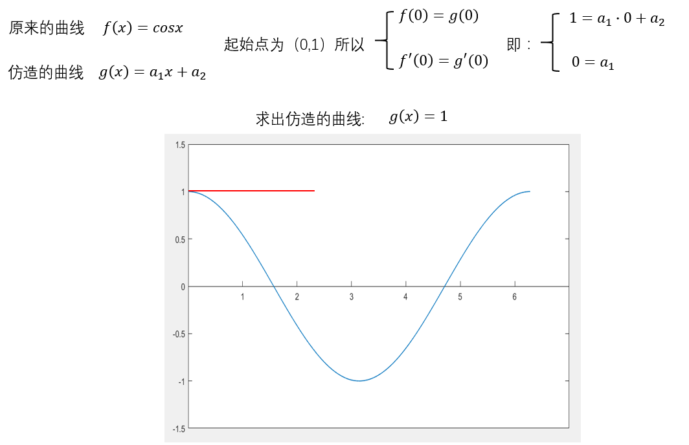
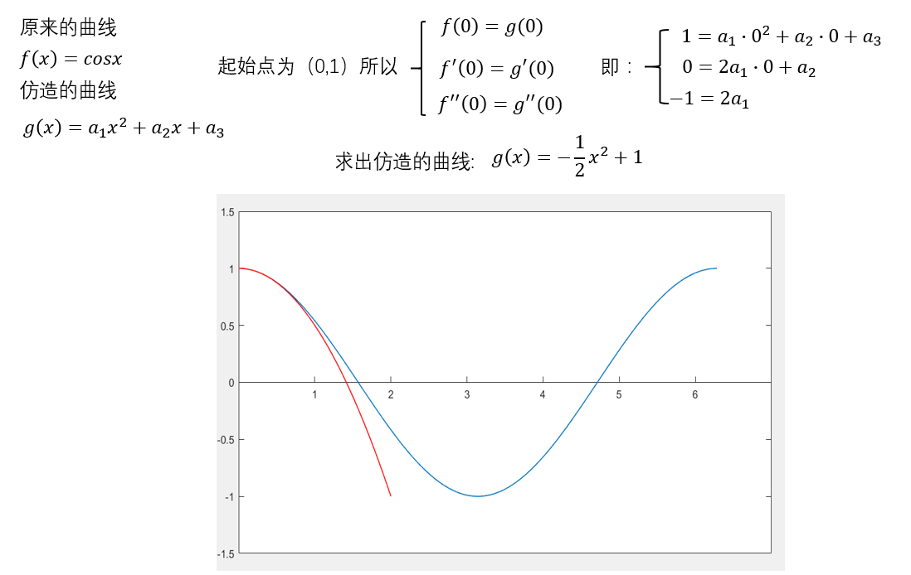
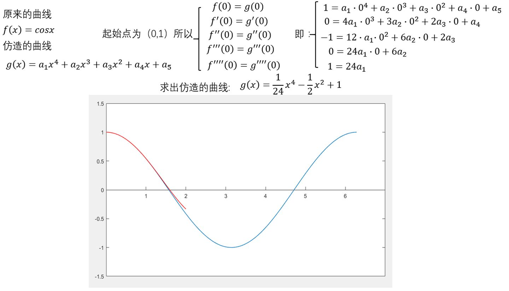

## 源起
有些函数不容易计算数值，比如$f(x)=\cos{x}$，要计算$f(2)$，只知道等于$\cos{2}$并没有什么用，除了三角函数，还有对数，开方之类的函数都不好计算（现代计算机都是用泰勒展开式做这些函数的计算的）
那么是不是可以构建一个$g(x)=f(x)$，这个$g(x)是容易计算的呢？$
假设选择$x=0$作为起始点，那么这两个函数需要
* 起始点相同，即$g(0)=f(0)$
* 增减性相同，即$g^{'}(x)=f^{'}(x)$
* 凹凸性相同，即$g^{''}(x)=f^{''}(x)$
* ...

因为多项式比较容易计算，选择$g(x)$为多项式，也就是
$$g(x)=a_0+a_1x+a_2x^2+a_3x^3+...+a_nx^n$$

先算一阶的

再算二阶的

再算三阶的

容易得到
$$g(x)=g(0)+\dfrac{f^{1}(0)}{1!}x+\dfrac{f^{2}(0)}{2!}x^2+\dfrac{f^{3}(0)}{3!}x^3+...+\dfrac{f^{n}(0)}{n!}x^n+...$$

如果不选择0作为起始点，换成$x_0$，则有
$$g(x)=g(x_0)+\dfrac{f^{1}(x_0)}{1!}(x-x_0)+\dfrac{f^{2}(x_0)}{2!}(x-x_0)^2+\dfrac{f^{3}(x_0)}{3!}(x-x_0)^3+...+\dfrac{f^{n}(x_0)}{n!}(x-x_0)^n+...$$

### 练习题
> 练习题1：$求\sin{x}的泰勒展开$
> $$\sin{x}=\sin(0)+\dfrac{\sin^{1}(0)}{1!}x+\dfrac{\sin^{2}(0)}{2!}x^2+\dfrac{\sin^{3}(0)}{3!}x^3+...+\dfrac{\sin^{n}(0)}{n!}x^n+...\\\quad\\=0+\dfrac{\cos(0)}{1!}x+\dfrac{-\sin(0)}{2!}x^2+\dfrac{-\cos(0)}{3!}x^3+\dfrac{\sin(0)}{4!}x^4+\dfrac{\cos(0)}{5!}x^5+...\\\quad\\=x-\dfrac{1}{3!}x^3+\dfrac{1}{5!}x^5-\dfrac{1}{7!}x^7+\dfrac{1}{9!}x^9-\dfrac{1}{11!}x^{11}+...$$

> 练习题2：证明欧拉公式$e^{it}=\cos(t)+i\sin(t)$
> 
> $e^x=e^0+\dfrac{e^0}{1!}x+\dfrac{e^0}{2!}x^2+\dfrac{e^0}{3!}x^3+...=1+x+\dfrac{1}{2!}x^2+\dfrac{1}{3!}x^3+...\\将其中的x替换成it，则有\\e^{it}=1+(it)+\dfrac{1}{2!}(it)^2+\dfrac{1}{3!}(it)^3+\dfrac{1}{4!}(it)^4+\dfrac{1}{5!}(it)^5+...\\\quad\\=1+(it)-\dfrac{1}{2!}t^2-i\dfrac{1}{3!}t^3+\dfrac{1}{4!}t^4+i\dfrac{1}{5!}t^5\\\quad\\=(1-\dfrac{1}{2!}t^2+\dfrac{1}{4!}t^4-...)+i(t-\dfrac{1}{3!}t^3+\dfrac{1}{5!}t^5-...)\\同时\\\sin{x}=x-\dfrac{1}{3!}x^3+\dfrac{1}{5!}x^5-...\\\quad\\\cos{x}=1-\dfrac{1}{2!}x^2+\dfrac{1}{4!}x^4-...\\\quad\\\therefore e^{it}=\cos{t}+i\sin{t}$

> 练习题3：展开函数$f(x)=\dfrac{x}{(1-x)^2}$
> 
> $f(0)=\dfrac{0}{(1-0)^2}=0$
> 
> $f^{'}(x)=\dfrac{d}{dx}f(x)=\dfrac{d}{dx}(x(1-x)^{-2})=(1-x)^{-2}\dfrac{d}{dx}x+x\dfrac{d}{dx}(1-x)^{-2}\\=(1-x)^{-2}+x(-2)(1-x)^{-3}\dfrac{d}{dx}(1-x)\\=(1-x)^{-2}+2x(1-x)^{-3}\\=\dfrac{1-x}{(1-x)^{3}}+\dfrac{2x}{(1-x)^3}\\=\dfrac{1+x}{(1-x)^3}\\f^{'}(0)=\dfrac{1+0}{(1-0)^3}=1\\f^{''}(x)=\dfrac{2(x+2)}{(1-x)^4}\\f^{''}(0)=4\\f^{3}(x)=\dfrac{6(x+3)}{(1-x)^5}\\f^{3}(0)=18$
> 
> $f(x)=f(0)+\dfrac{f^{1}(0)}{1!}x+\dfrac{f^{2}(0)}{2!}x^2+\dfrac{f^{3}(0)}{3!}x^3+...\\=0+x+2x^2+3x^3+...$
> 
> $\dfrac{x}{(1-x)^2}=x+2x^2+3x^3+4x^4+...$

## 基本幂级数
https://www.bilibili.com/video/av61211795/
* $\begin{aligned}e^x=\sum_{n=0}^{\infin}\dfrac{1}{n!}x^n,x\in{R}\end{aligned}$
* $\begin{aligned}\dfrac{1}{1-x}=\sum_{n=0}^{\infin}x^n,x\in(-1,1)------等比数列\end{aligned}$
* $\begin{aligned}\sin{x}=\sum_{n=0}^{\infin}\dfrac{(-1)^n}{(2n+1)!}x^{2n+1},x\in{R}\end{aligned}$
* $\begin{aligned}\dfrac{1}{1+x}=\sum_{n=0}^{\infin}(-1)^nx^n,x\in(-1,1)------对\dfrac{1}{1-x}换元x^{'}=-x得到\end{aligned}$
* $\begin{aligned}\cos{x}=\sum_{n=0}^{\infin}\dfrac{(-1)^n}{(2n)!}x^{2n},x\in{R}------对\sin{x}求导直接得到\end{aligned}$
* $\begin{aligned}\dfrac{1}{1+x^2}=\sum_{n=0}^{\infin}(-1)^nx^{2n},x\in(-1,1)\end{aligned}$
* $\begin{aligned}\ln(1-x)=-\sum_{n=1}^{\infin}\dfrac{1}{n}x^{n},x\in(-1,1)------对-\dfrac{1}{1-x}求积分\end{aligned}$
* $\begin{aligned}\ln(1+x)=-\sum_{n=1}^{\infin}(-1)^n\dfrac{1}{n}x^n,x\in(-1,1)------对\ln(1-x)换元x^{'}=-x得到\end{aligned}$
* $\begin{aligned}a^x=e^{x\ln{a}}=\sum_{n=0}^{\infin}\dfrac{(\ln{a})^n}{n!}x^n\end{aligned}$
* $\begin{aligned}\arctan{x}=\sum_{n=0}^{\infin}\dfrac{(-1)^n}{2n+1}x^{2n+1},x\in[-1,1]\end{aligned}$
* $\begin{aligned}(1+x)^{\alpha}=1+\sum_{n=0}^{\infin}\dfrac{\alpha\cdot(\alpha-1)\cdot...\cdot(\alpha-n+1)}{n!}x^n,x\in(-1,1)\end{aligned}$

#### 练习题1：根据基本幂级数展开，求函数$f(x)=\dfrac{1}{x^2+4x+3}$

#### 练习题2：根据基本幂级数展开，求函数$f(x)=\sin^3{x}在x=0处展开$
> $\begin{aligned}
    f(x)&=\sin^{3}x=\sin(x)(1-\cos^2{x})=\sin{x}[1-\dfrac{1}{2}(1+\cos{2x})]\\
    &=\sin{x}(\dfrac{1}{2}-\dfrac{1}{2}\cos{2x})\\
    &=\dfrac{1}{2}\sin{x}-\dfrac{1}{2}\sin{x}\cos{2x}\\
    &=\dfrac{1}{2}\sin{x}-\dfrac{1}{2}\cdot\dfrac{1}{2}(\sin{3x}-\sin{x})\\
    &=\dfrac{3}{4}\sin{x}-\dfrac{1}{4}\sin{3x}\\
    &=\dfrac{3}{4}\sum_{n=0}^{\infin}\dfrac{(-1)^n}{(2n+1)!}x^{2n+1}-\dfrac{1}{4}\sum_{n=0}^{\infin}\dfrac{(-1)^n}{(2n+1)!}(3x)^{2n+1}
\end{aligned}$

#### 练习题3：根据基本幂级数展开，求函数$f(x)=\dfrac{x}{(1-x)^2}$
> $\begin{aligned}&f(x)=\dfrac{x}{(1-x)^2}=-\dfrac{-x}{(1-x)^2}=-\left[\dfrac{1-x}{(1-x)^2}-\dfrac{1}{(1-x)^2}\right]=\dfrac{1}{(1-x)^2}-\dfrac{1}{1-x}\\
&\dfrac{1}{(1-x)^2}=\dfrac{d}{dx}\dfrac{1}{1-x}=\dfrac{d}{dx}\sum_{n=0}^{\infin}x^n=\sum_{n=1}^{\infin}nx^{n-1}=\sum_{n=0}^{\infty}(n+1)x^n\\
&\therefore f(x)=\sum_{n=0}^{\infty}(n+1)x^n-\sum_{n=0}^{\infin}x^n=\sum_{n=1}^{\infin}nx^n\end{aligned}$