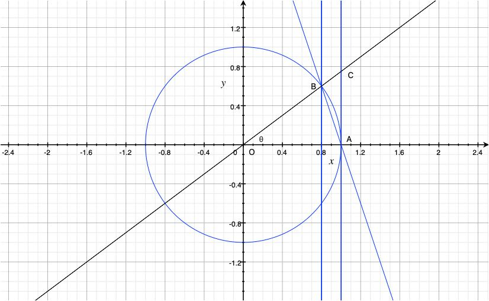
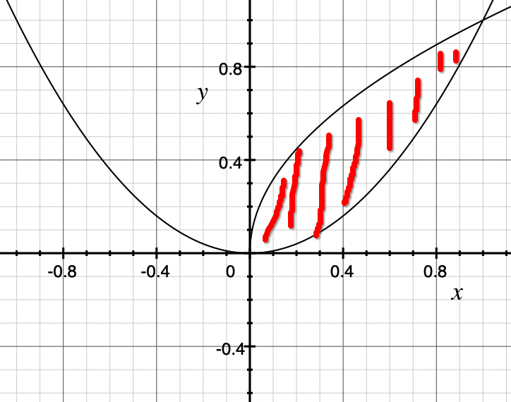
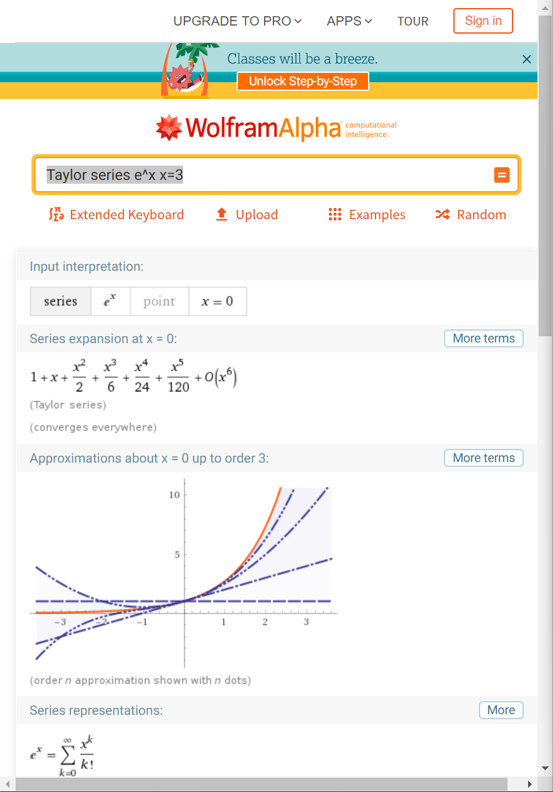

https://www.wolframalpha.com/

# 极限
### 案例一
$$\lim_{x\rightarrow 0} \dfrac{\cot 2x}{\csc x}$$
 

>$$=\lim_{x\rightarrow 0} \dfrac{\dfrac{\cos 2x}{\sin 2x} }{\dfrac{1}{\sin x} }$$
> 
>
>$$=\lim_{x\rightarrow 0} \dfrac{\cos 2x\times \sin x}{\sin 2x}=\lim_{x\rightarrow 0} \dfrac{\cos 2x\times \sin x}{2\times \sin x\times \cos x}=\lim_{x\rightarrow 0} \dfrac{\cos 2x}{2\times \cos x}$$
> 
>
>$$=\dfrac{1}{2\times 1}=\dfrac{1}{2}$$

### 案例二 $\begin{aligned}\lim_{x\rightarrow{0}}\dfrac{\ln(1+x)-x}{x^2}\end{aligned}$
#### 方法一：泰勒展开
> $\begin{aligned}\lim_{x\rightarrow{0}}\dfrac{\ln(1+x)-x}{x^2}=\lim_{x\rightarrow{0}}\dfrac{x-\frac{1}{2}x^2+o(x^2)-x}{x^2}=-\dfrac{1}{2}\end{aligned}$

#### 方法二：洛必达法则
$\begin{aligned}\lim_{x\rightarrow{0}}\dfrac{\ln(1+x)-x}{x^2}=\lim_{x\rightarrow{0}}\dfrac{\dfrac{d(ln(1+x)-x)}{dx}}{\dfrac{dx^2}{dx}}=\lim_{x\rightarrow{0}}\dfrac{\dfrac{1}{x+1}-1}{2x}=\lim_{x\rightarrow{0}}\dfrac{1-(1+x)}{2x(x+1)}=\lim_{x\rightarrow{0}}\dfrac{-1}{2(x+1)}=-\dfrac{1}{2}\end{aligned}$

### 案例三
$$
\lim_{x\rightarrow \infty } \sqrt{x^{2}+4x+1} -x
$$

>$$=\lim_{x\rightarrow \infty } \sqrt{x^{2}+4x+1} -x\  \times \  \dfrac{\sqrt{x^{2}+4x+1} +x}{\sqrt{x^{2}+4x+1} +x}$$
>$$=\lim_{x\rightarrow \infty } \dfrac{\left( x^{2}+4x+1\right)  -x^{2}}{\sqrt{x^{2}+4x+1} +x}$$
>$$=\lim_{x\rightarrow \infty } \dfrac{4x+1}{\sqrt{x^{2}+4x+1} +x} \times \dfrac{\dfrac{1}{x} }{\dfrac{1}{x} }$$
>$$=\lim_{x\rightarrow \infty } \dfrac{4+\dfrac{1}{x} }{\sqrt{1+\dfrac{4}{x} +\dfrac{1}{x^{2}} } +1} =\dfrac{4}{\sqrt{1} +1} =2$$
### 案例四
> ### 夹逼定理
> $$ 已知g\left( x\right)  \leqslant f\left( x\right) \leqslant h\left( x\right),并且\lim_{x\rightarrow a}g\left(x\right) = L,\lim_{x\rightarrow a}h\left(x\right) = L $$
> $$ 那么,\lim_{x\rightarrow a}f\left(x\right) = L $$
$$ 证明\lim_{x\rightarrow 0} \dfrac{\sin x}x = 1 $$

$$ 三角形AOB面积S_{1}=\dfrac 1 2 \times {\sin θ},弧形AOB面积S_{2}=\dfrac 1 2 θ,三角形AOC面积S_{3}=\dfrac 1 2 \times {\tan θ}$$
$$并且S_{1} < S_{2} < S_{3}$$
$$\dfrac 1 2 \times {\sin θ} < \dfrac 1 2 θ < \dfrac 1 2 \times {\tan θ}$$
$$\sin θ < θ < \tan θ $$
$$\sin θ < θ < \dfrac {\sin θ} {\cos θ} $$
$$1 < \dfrac θ {\sin θ} < \dfrac 1 {\cos θ} $$
$$1 > \dfrac {\sin θ} θ > \cos θ$$
$$\lim_{θ\rightarrow 0} 1 > \lim_{θ\rightarrow 0} \dfrac {\sin θ} θ > \lim_{θ\rightarrow 0} \cos θ$$
$$1 >\lim_{θ\rightarrow 0} \dfrac {\sin θ} θ  >1$$
$$\lim_{θ\rightarrow 0} \dfrac {\sin θ} θ = 1$$
$$\lim_{x\rightarrow 0} \dfrac {\sin x} x = 1$$
### 案例五
$$\lim_{n\rightarrow \infty} (1+\dfrac 1 n)^n = e$$

> 其中$e$中定义出来，不是等于出来的
> 
> 设$x_n=(1+\dfrac{1}{n})^n$，可以证明$x_n$是递增的，也就是$x_n<x_{n+1}$
>
> 其次设$y_n=(1+\dfrac{1}{n})^{n+1}$， 可以证明$x_n<y_n<y_1=4$
> 
> 所以$$\lim_{n\rightarrow \infty} (1+\dfrac 1 n)^n必定小于收敛到小于4的一个实数，定义为e$$
#### 第一题
$$ 求\lim_{n\rightarrow \infty} (1+\dfrac{k}{n})^n$$
>$$ 设x = \dfrac{n}{k},则n=xk $$
>$$ 则,\lim_{n\rightarrow \infty} (1+\dfrac{k}{n})^n =\lim_{x\rightarrow \infty}(1 + \dfrac{1}{x})^{xk} = \lim_{x\rightarrow \infty}((1 + \dfrac{1}{x})^{x})^k=(\lim_{x\rightarrow \infty}(1 + \dfrac{1}{x})^{x})^k=e^k$$
>
>$$ 如果初始值为P,一个周期的增长率为r,如果连续计算复利(每个无限分之一都计算复利)$$
>$$ 那么,在这个周期结束时将达到Pe^r $$
>$$ 那么这个周期重复t次,将达到Pe^{rt} $$
#### 第二题
细菌培养一开始有100个细胞，以与其数量成某种比例的速度生长，一个小时后，数量增至420
+ 求出t小时后，细菌数量的表达式
+ 求出3小时后，细菌的数量
+ 求出3小时后，细菌的生长速率
+ 求出几个小时后，细菌数量达到10,000

设每小时为一个周期 

>$解一:f(t)=Pe^{rt}$
>
>$f(t)=100e^{rt}$
>
>$f(1)=100e^{r} = 420$
>
>$e^r = 4.2$
>
>$r = \ln 4.2$
>$f(t)=100e^{t \ln 4.2} =100(e^{\ln 4.2})^t=100 \times 4.2^t$
>
>$解二:f(3)=100 \times 4.2^{3}$
>
>$解三:求f(t)在t=3这个位置上的斜率,f^{\prime} (t)=(100\times4.2^t)^{\prime}=100\times(4.2^t)^{\prime}=100\times\ln{4.2}\times4.2^t$
>
>$f^{\prime}(3)=100\times\ln{4.2}\times4.2^3$
>
>$解四:f(t)=100\times4.2^t = 10000$
>
>$4.2^t=100$
>
>$t=\dfrac{\ln 100}{\ln 4.2}$

> $\color{green}{为什么要以e为底,如果换成2为底呢?不管以e为底,还是2为底,结果都是一样的}$
> 
> $f(t)=P2^{rt};f(t)=100\times2^{rt}$
> 
> $f(1)=100\times2^{r}=420$
> 
> $2^r=4.2$
> 
> $r=\log_{2} 4.2$
> 
> $f(t)=100\times2^{(\log_{2} 4.2 )t}=100\times4.2^t$

# 复数
$$ Z = a+bi$$
$$ 在极坐标系统(r,\phi )中a=r\cos \phi, b=r\sin \phi, Z=r\cos \phi + ir\sin \phi$$
$$ Z = r(\cos\phi +i\sin\phi) = re^{i\phi}$$
### 案例一
$$ 假设Z=\dfrac{\sqrt{3}}{2}+\dfrac{1}{2}i$$
>$则r=|Z|=\sqrt{(\dfrac{\sqrt{3}}{2})^2+(\dfrac{1}{2})^2}=1; \phi=\dfrac{\pi}{6}$
>
>$则Z=re^{i\phi}=e^{\dfrac{\pi}{6}i}$
### 案例二
$$ 求x^3=1的所有实根或者复根$$
#### 解法一
>$x^3 -1 = 0$
>
>$(x-1)(x^2+x+1) = 0$
>
>$x_{1}=1;x_{2}=-\dfrac{1}{2}+\dfrac{\sqrt{3}}{2}i;x_{3}=-\dfrac{1}{2}-\dfrac{\sqrt{3}}{2}i$
#### 解法二
>$1 = 1\times e^{0i} = e^{0i} = e^{2\pi i} = e^{4\pi i}$
>
>$x^3 = 1;x^3 = e^{2\pi i}; x^3 = e^{4\pi i}$
>
>$(x^3)^{\frac{1}{3}} = (1)^{\frac{1}{3}};(x^3)^{\frac{1}{3}} = (e^{2\pi i})^{\frac{1}{3}}; (x^3)^{\frac{1}{3}} = (e^{4\pi i})^{\frac{1}{3}}$
>
>$x_{1} = 1;x_{2} = e^{\frac{2}{3}\pi i};x_{3}=e^{\frac{4}{3}\pi i}$
>
>$x_{1}=1;x_{2}=\cos \frac{2\pi}{3}+i\sin \frac{2\pi}{3};x_{3}=\cos \frac{4\pi}{3}+i\sin \frac{4\pi}{3};$
>
>$x_{1}=1;x_{2}=-\frac{1}{2}+\frac{\sqrt{3}}{2}i;x_{3}=-\frac{1}{2}-\frac{\sqrt{3}}{2}i$

# 微分学
## 概念
$$ \lim_{\triangle x \rightarrow 0}\dfrac{\triangle y}{\triangle x} \rightarrow  \dfrac{dy}{dx}  $$
$$ \epsilon - \delta定义:对于\lim_{x\rightarrow a}f(x)=b,给定任意大于0的\epsilon,则能给出\delta > 0 ,使得0<|x-a|<\delta时,|f(x)-b|<\epsilon$$

$$ f^{\prime}(x) = \lim_{h\rightarrow 0} \dfrac{f(x+h)-f(x)}{h} $$
### 案例一
$$ 设f(x)=x^2,求f^{\prime}(3)$$

>$$ f^{\prime}(x)=\lim_{h\rightarrow 0}\dfrac{f(x+h)-f(x)}{h}=\lim_{h\rightarrow 0}\dfrac{x^2 + 2hx + h^2 - x^2}{h}=\lim_{h\rightarrow 0}\dfrac{2hx + h^2}{h}=2x$$
>
>$$ f^{\prime}(3)=2 \times 3 = 6$$
>$$ 也可以写成 \dfrac{d}{dx}f(3)=6$$

## 法则一
$$ \dfrac{d}{dx}x^n=nx^{n-1}$$
> 证明如下
>
> $$\dfrac{d}{dx}x^n = \lim_{h\rightarrow 0}\dfrac{(x+h)^n - x^n}{h}=\lim_{h\rightarrow 0}\dfrac{x^n + {n \choose 1}x^{n-1}h + {n \choose 2}x^{n-2}h^2 + ... + {n \choose n-1}xh^{n-1} + h^n - x^n}{h} $$
>
> $$=\lim_{h \rightarrow 0} \dfrac{{n \choose 1}x^{n-1}h + {n \choose 2}x^{n-2}h^2 + ... + {n \choose n-1}xh^{n-1} + h^n}{h}$$
>
> $$=\lim_{h \rightarrow 0}({n \choose 1}x^{n-1} + {n \choose 2}x^{n-2}h + ... + {n \choose {n-1}}xh^{n-2} + h^{n-1})$$
>
> $$=nx^{n-1}$$
求解 $\dfrac{d}{dx} \sqrt {x}$
> $$ \dfrac{d}{dx}\sqrt{x}=\lim_{h\rightarrow 0}\dfrac{\sqrt {x+h}-\sqrt {x}}{h}=\lim_{h\rightarrow 0}\dfrac{(\sqrt {x+h}-\sqrt{x})(\sqrt {x+h}+\sqrt{x})}{h(\sqrt {x+h}+\sqrt{x})}$$
>  
>
> $$=\lim_{h\rightarrow 0}\dfrac{h}{h(\sqrt {x+h}+\sqrt{x})}=\lim_{h\rightarrow 0}\dfrac{1}{\sqrt{x+h}+\sqrt{x}}=\dfrac{1}{2\sqrt x}$$
>  
>
> $$=\dfrac{1}{2}x^{-\dfrac{1}{2}}$$
## 法则二
$$ \dfrac{d}{dx}Af(x)=A\dfrac{d}{dx}f(x)$$
## 法则三
$$ \dfrac{d}{dx}(f(x)+g(x))=\dfrac{d}{dx}f(x)+\dfrac{d}{dx}g(x)$$

### 案例二
>$设f(x)=3x^2+5x+3,则\dfrac{d}{dx}f(x)=3\times2x + 5 = 6x + 5$

>$设y=10x^5-7x^3+4x+1,则\dfrac{dy}{dx}=10\times5x^4-7\times3x^2+4=50x^4-21x^2+4$
## 链式法则
$$f(x)=h(g(x)),则\dfrac{d}{dx}f(x)=\dfrac{d}{dx}g(x)\times\dfrac{d}{dx}h(g(x))$$
> 证明如下:

### 案例三
$$ 设f(x)=(2x+3)^5$$
>$\dfrac{d}{dx}f(x)=\dfrac{d}{dx}(2x+3)^5=(\dfrac{d}{dx}(2x+3))\times5(2x+3)^4=2\times5(2x+3)^4=10(2x+3)^4$
## 乘积法则
$$f(x)=h(x)g(x),则\dfrac{d}{dx}f(x)=g(x)\dfrac{d}{dx}h(x) + h(x)\dfrac{d}{dx}g(x)$$
> 证明如下:

## 常用函数的导函数
导函数一:$\dfrac{d}{dx}e^x=e^x$
> 证明如下:
>
> $$ 式一:\dfrac{d}{dx}\ln {e^x}=\dfrac{d}{dx}x \ln {e} = \dfrac{d}{dx}x \times 1 = 1$$
> 同时根据链式法则有
>
> $$ 式二:\dfrac{d}{dx}\ln{e^x}=(\dfrac{d}{dx}e^x)\times \dfrac{1}{e^x}$$
> 因为式一与式二相等,所以
>
> $$(\dfrac{d}{dx}e^x)\times \dfrac{1}{e^x} = 1$$
> $$\dfrac{d}{dx}e^x = e^x$$

导函数二:$\dfrac{d}{dx}\ln x=\dfrac{1}{x}$
> |$f(x)$|$x^{-3}$|$x^{-2}$|$x^{-1}$|$\color{yellow}{\ln x}$|$x^{0}=1$|$x$|$x^2$|$x^3$|
> |----|----|----|----|----|----|----|----|----|
> |$f^{\prime}(x)$|$-3x^{-4}$|$-2x^{-3}$|$-x^{-2}$|$\color{yellow}{x^{-1}}$|$0$|$x^0 =1$|$2x$|$3x^2$|
> 证明如下:
>
> $$\dfrac{d}{dx}\ln x=\lim_{h\rightarrow 0}\dfrac{\ln{(x+h)}-\ln x}{h}=\lim_{h\rightarrow 0}(\dfrac{1}{h}\times \ln \dfrac{x+h}{x})=\lim_{h\rightarrow 0}(\dfrac{1}{h}\times \ln{(1+\dfrac{h}{x})})$$
>  
>
>$$=\lim_{h\rightarrow 0}\ln{((1+\dfrac{h}{x})^{\dfrac{1}{h}})}$$
> 
>
>设$u=\dfrac{x}{h},则\dfrac{1}{h}=ux$
>
> $$原式=\lim_{u\rightarrow \infty}\ln{((1+\dfrac{1}{u})^{\dfrac{u}{x}})}=\lim_{u\rightarrow \infty}\ln((1+\dfrac{1}{u})^{u})^{\dfrac{1}{x}}=\lim_{u\rightarrow \infty}(\dfrac{1}{x}\ln{(1+\dfrac{1}{u})^u})=\dfrac{1}{x}\ln({\lim_{u\rightarrow \infty}(1+\dfrac{1}{u})^u})$$
>  
>
>$$=\dfrac{1}{x}\ln{e}=\dfrac{1}{x}$$
求$\log_ax$的导函数

> 解:$\dfrac{d}{dx}\log_ax=\dfrac{d}{dx}\dfrac{\ln x}{\ln a}=\dfrac{1}{\ln a}\dfrac{d}{dx}\ln x = \dfrac{1}{x \ln a}$

求$a^x$的导函数

> 解:$1=\dfrac{d}{dx}x=\dfrac{d}{dx}\log_a a^x$
>
> 根据链式法则有$\dfrac{d}{dx}\log_a a^x=\dfrac{d}{dx}a^x\times\dfrac{1}{a^x\times \ln a}$
>
> 综上$\dfrac{d}{dx}a^x\times\dfrac{1}{a^x\times \ln a}=1$
> 
> 则$\dfrac{d}{dx}a^x =a^x \ln {a}$

导函数三:$\dfrac{d}{dx}\sin x=\cos x$

导函数四:$\dfrac{d}{dx}\cos x=-\sin x$

导函数五:$\dfrac{d}{dx}\tan x=\dfrac{1}{\cos ^ 2 x}=\sec^2 x$
### 案例四
$$f(x)=\sin {(3x^5+2x)}$$
>$\dfrac{d}{dx}f(x)=(\dfrac{d}{dx}(3x^5+2x))\times \cos (3x^5+2x)=(15x^4+2)\times \cos(3x^5+2x)$
### 案例五
$$f(x)=e^x\cos^5x$$
>$\dfrac{d}{dx}f(x)=\cos^5x\dfrac{d}{dx}e^x + e^x\dfrac{d}{dx}\cos^5x=(\cos^5x)e^x+e^x\times(\dfrac{d}{dx}\cos x)\times5\cos^4x$
>
>$=(\cos^5x)e^x+e^x\times(-\sin x)\times(5\cos^4x)$
>
>$=e^x(\cos^5x-5\sin x \cos^4x)$
### 案例六
$$f(x)=\dfrac{\ln x}{3x+10}$$
> $\dfrac{d}{dx}f(x)=\dfrac{d}{dx}(\ln x)(3x+10)^{-1}=(3x+10)^{-1}\dfrac{d}{dx}\ln x + \ln x\dfrac{d}{dx}(3x+10)^{-1}$
>
> $=(3x+10)^{-1} \times x^{-1}+\ln x \times \dfrac{d}{dx}(3x+10) \times (-1)(3x+10)^{-2}$
>
>$=\dfrac{1}{x(3x+10)} + \ln x \times 3 \times (-1) \times (3x+10)^{-2}$
>
>$=\dfrac{1}{3x^2+10x} -3(3x+10)^{-2} \ln x$
>
>$=\dfrac{1}{3x^2+10x}-\dfrac{3\ln x}{(3x+10)^2}$

# 积分学
## 概念
$$如果\dfrac{d}{dx}f(x)=g(x),则\int g(x)dx=f(x),称之为不定积分$$

> 这是$dx$可不是放在那里做摆设的

## 法则一
$$ \int x^n dx=\dfrac{1}{n+1}x^{n+1} + C$$
## 法则二
$$ \int (f(x)+g(x))dx=\int f(x)dx + \int g(x)dx$$
### 案例一
$$\int(x^3-\dfrac{1}{3}x4+10)=\dfrac{1}{4}x^4-\dfrac{1}{3}\times \dfrac{1}{5}x^5 + 10x + C=\dfrac{1}{4}x^4-\dfrac{1}{15}x^5+10x+C$$
## 逆链式法则
$$\int f^{\prime}(x)g(x)dx=\int g(f(x))dx$$
### 案例二
$$\int \dfrac{(\ln {x})^2}{x}dx=\int \dfrac{1}{x}(\ln x)^2dx$$
$$设u=\ln x,则\dfrac{1}{x}=\dfrac{du}{dx}$$
$$原式=\int \dfrac{du}{dx}u^2dx=\int u^2 du=\dfrac{1}{3}u^3 + C=\dfrac{1}{3}(\ln x)^3 + C$$
### 案例三
$$\int e^{-3x}dx=\int e^x \times e^{-4x}dx=\int e^x \times (e^x)^{-4}dx$$
$$设u=e^x,则e^x=\dfrac{du}{dx}$$
$$原式=\int \dfrac{du}{dx}u^{-4}dx=\int u^{-4}du=-\dfrac{1}{3}u^{-3} + C=-\dfrac{1}{3}e^{-3x} + C$$

## 分部积分
$$\dfrac{d}{dx}(f(x)g(x))=f^{\prime}(x)g(x)+f(x)g^{\prime}(x)$$
$$f(x)g(x)=\int f^{\prime}(x)g(x)dx + \int f(x)g^{\prime}(x)dx$$
 

$$\color{red}{\int f(x)g^{\prime}(x)dx=f(x)g(x)-\int f^{\prime}(x)g(x)dx}$$
### 案例四
$$求\int x\cos x dx$$
> 设$f(x)=x,g(x)=\sin x,则原式=\int f(x)g^{\prime}(x) dx=f(x)g(x)-\int f^{\prime}(x)g(x)dx$
>
> $=x \sin x-\int 1\times \sin x dx$
> 
> $=x \sin x - \int \sin x dx$
> 
> $=x \sin x - (- \cos x + C)$
>
> $=x \sin x + \cos x - C$
### 案例五
$$求\int e^x \cos x dx$$
> $\int e^x \cos x dx=e^x \sin x - \int e^x \sin x dx$
>
> $=e^x \sin x - (e^x(-\cos x)-\int e^x(-\cos x)dx)$
>
> $=e^x \sin x + e^x \cos x - \int e^x \cos x dx$
>
> 则有$2\int e^x \cos x dx = e^x \sin x+e^x \cos x$
>
> $\int e^x \cos x dx = \dfrac{1}{2}e^x(\sin x + \cos x)$
### 案例六
$$求\int \dfrac{\sin x}{(\cos x)^2}dx$$
> $\int \dfrac{\sin x}{(\cos x)^2}dx = -\int (-\sin x) \times (\cos x)^{-2}dx$
>
>设$u=\cos x$,则$(-\sin x)=\dfrac{du}{dx}$
>
>原式=$-\int \dfrac{du}{dx}\times u^{-2}dx$
>
>$=-\int u^{-2}du$
>
>$=-(-1)\times u^{-1}+C=\dfrac{1}{u}+C=\dfrac{1}{\cos x}+C$

### 案例七
$$求\int{x^2e^{-x}}dx$$
> $设f(x)=x^2,g(x)=e^{-x},则原式=-\int{f(x)g^{'}(x)}dx=-(f(x)g(x)-\int{f^{'}(x)g(x)}dx)\\=\int{f^{'}(x)g(x)}dx-f(x)g(x)\\=\int{2x}e^{-x}dx-x^2e^{-x}$
> 
> $设f(x)=x,g(x)=e^{-x},则\int{x}e^{-x}dx=\int{f^{'}(x)g(x)}dx-f(x)g(x)\\=\int{e^{-x}}dx-xe^{-x}=-e^{-x}-xe^{-x}+C$
> 
> $则原式=2(-e^{-x}-xe^{-x})-x^2e^{-x}+C\\=-e^{-x}(x^2+2x+2)+C$

 ## 定积分
 $$\dfrac{d}{dx}F(x)=f(x), 则\int^{b}_{a} f(x) dx=F(b)-F(a),称之为定积分$$
 ### 案例七
 $$求\int^{3}_{-1}x^2+1dx$$
 > 原式=$\dfrac{1}{3}x^3+x|^{3}_{-1}$
 >
 >$=(\dfrac{1}{3}\times 3^3 + 3)-(\dfrac{1}{3}(-1)^3-1)$
 >
 >$=12-(-\dfrac{4}{3})=\dfrac{40}{3}$
 ### 案例八
 $$求y=\sqrt{x}与y=x^2相交的面积$$

> 两条曲线的交点为$(0,0)$与$(1,1)$
> 原题相当于
> 
> $\int^{1}_{0}\sqrt{x}-x^2dx=\dfrac{2}{3}x^{\dfrac{3}{2}}-\dfrac{1}{3}x^3|^{1}_{0}=(\dfrac{2}{3}-\dfrac{1}{3})-0 = \dfrac{1}{3}$

### 案例九
$$求\int \dfrac{1}{\sqrt{3-2x^2}}dx$$
> 原式$=\int \dfrac{1}{\sqrt{3(1-\dfrac{2}{3}x^2)}}dx$
>
>设$\dfrac{2}{3}x^2 = (\sin θ)^2$
>
>$x^2=\dfrac{3}{2}(\sin θ)^2$
>
>$x=\dfrac{\sqrt 3}{\sqrt 2} \sin θ;θ=\arcsin {\dfrac{\sqrt 2}{\sqrt 3}x}$
>
>$\dfrac{dx}{dθ}=\dfrac{\sqrt 3}{\sqrt 2} \cos θ$
>
>$dx =\dfrac{\sqrt 3}{\sqrt 2}\cos θ dθ$
>
>则原式$=\int \dfrac{1}{\sqrt {3(1-(\sin θ)^2)}} \dfrac{\sqrt 3}{\sqrt 2} \cos θ dθ$
>
>$=\int \dfrac{1}{\sqrt{3 (\cos θ)^2}}\dfrac{\sqrt 3}{\sqrt 2} \cos θ dθ$
>
>$=\int \dfrac{1}{\sqrt 2}dθ=\dfrac{1}{\sqrt 2}θ + C =\dfrac{1}{\sqrt 2}\arcsin {\dfrac{\sqrt 2}{\sqrt 3}x} + C$
### 案例十
$$求\int \dfrac{1}{36+x^2}dx$$
>$原式=\int \dfrac{dx}{36(1+\dfrac{x^2}{36})}$
>
>$设\dfrac{x^2}{36}=(\tan θ)^2$
>
>$x^2 =(6\tan θ)^2$ 
>
>$x=6\tan θ;θ=\arctan\dfrac{x}{6}$
>
>$\dfrac{dx}{dθ}=\dfrac{d}{dθ}6\tan θ=6\dfrac{d}{dθ}{\sin θ}(\cos θ)^{-1}=6(\cos θ(\cos θ)^{-1} + \sin θ(-1)(\cos θ)^{-2}(-\sin θ))$
>
>$=6(1+\dfrac{(\sin θ)^{2}}{(\cos θ)^{2}})=\dfrac{6}{(\cos θ)^{2}}$
>
>$dx=\dfrac{6 dθ}{(\cos θ)^{2}}$
>
>$则原式=\int\dfrac{6 dθ}{36(\cos θ)^2(1+(\tan θ)^2)}=\int\dfrac{dθ}{6(\cos θ)^2(1+\dfrac{(\sin θ)^2}{(\cos θ)^2})}=\int \dfrac{dθ}{6(\cos θ)^2\dfrac{1}{(\cos θ)^2}}=\int \dfrac{1}{6}dθ=\dfrac{1}{6}θ+C$
>
>$=\dfrac{1}{6}\arctan{\dfrac{x}{6}}+C$
### 案例十一
$$求\int\sqrt{6x-x^2-5}dx$$
>$原式=\int\sqrt{-(x^2-6x+9)+4}dx=\int\sqrt{-(x-3)^2+4}dx=\int\sqrt{4(1-\dfrac{1}{4}(x-3)^2)}dx$
>
>$设\dfrac{1}{4}(x-3)^2=(\sin θ)^2$
>
>$\dfrac{x-3}{2}=\sin θ$
>
>$x=3+2\sin θ;θ=\arcsin \dfrac{x-3}{2}$
>
>$\dfrac{dx}{dθ}=2\cos θ$
>
>$dx=2\cos θ dθ$
>
>$则原式=\int\sqrt{4(1-(\sin θ)^2)}\times 2\cos θ dθ=\int\sqrt{4(\cos θ)^2}\times 2\cos θ dθ=\int4(\cos θ)^2dθ$
>
>$因为\color{green}{(\cos θ)^2=\dfrac{1}{2}(1+\cos {2θ})}$
>
>$所以原式=\int4\times \dfrac{1}{2}(1+\cos {2θ})dθ=\int(2+2\cos {2θ})dθ$
>
>$=2θ+\sin 2θ + C$
>
>$因为\color{green}{\sin{2θ}=2\sin{θ}\cos{θ}}$
>
>$所以原式=2θ + 2\sin{θ}\cos{θ}+C=2θ + 2\sin{θ}\sqrt{1-(\sin{θ})^2}+C$
>
>$=2\arcsin{\dfrac{x-3}{2}}+2\dfrac{x-3}{2}\sqrt{1-(\dfrac{x-3}{2})^2}+C$
>
>$=2\arcsin{\dfrac{x-3}{2}}+(x-3)\sqrt{\dfrac{4-(x^2-6x+9)}{4}}+C$
>
>$=2\arcsin{\dfrac{x-3}{2}}+\dfrac{x-3}{2}\sqrt{-x^2+6x-5}+C=\int\sqrt{6x-x^2-5}dx$
## 微分方程
>$设\dfrac{dy}{dx}=x^2+1$
>
>$则dy = (x^2+1)dx,表示每个无限小的x的改变,对应的y的改变$
>
>$两边同时取积分,得到\int dy = \int (x^2+1)dx$
>
>$两边分别计算,得到y=\dfrac{1}{3}x^3+x+C,是该微分方程的通解,是一个方程,而不是数值$
>
>$如果加上条件,比如x=1时y=1,那么代入通解,得到1=\dfrac{1}{3}1^3+1+C$
>
>$则C=-\dfrac{1}{3},特解为y=\dfrac{1}{3}x^3+x-\dfrac{1}{3}$
### 微分方程例题一
$$\dfrac{dy}{dx}=\dfrac{x}{y},y=1@x=1$$
> $ydy=xdx$
>
>$\int ydy = \int xdx$
>
>$\dfrac{1}{2}y^2=\dfrac{1}{2}x^2+C$
>
>$y^2=x^2+C$
>
>$代入y=1@x=1,得到1^2=1^2+C,则C=0$
>
>$特解为y^2=x^2$
### 微分方程例题二
$$\dfrac{dy}{dx}=\sqrt{\dfrac{x}{y}},y=4@x=1$$
>$y^{\dfrac{1}{2}}dy=x^{\dfrac{1}{2}}dx$
>
>$\int y^{\dfrac{1}{2}}dy=\int x^{\dfrac{1}{2}}dx$
>
>$\dfrac{2}{3}y^{\dfrac{3}{2}}=\dfrac{2}{3}x^{\dfrac{3}{2}} + C$
>
>$y^{\dfrac{3}{2}}=x^{\dfrac{3}{2}}+C$
>
>$代入y=4@x=1,得到4^{\dfrac{3}{2}}=1+C,则C=7$
>
>$特解为y^{\dfrac{3}{2}}=x^{\dfrac{3}{2}}+7$
### 旋转体
$$圆的方程式为x^2+y^2=r^2,将这个圆绕着x轴旋转一周,求形成的这个球的体积$$
>$y^2=r^2-x^2$
>
>$体积=\int^{r}_{-r}\pi y^2dx=\int^{r}_{-r}\pi(r^2-x^2)dx=\int^{r}_{-r}\pi r^2-\pi x^2dx=\pi r^2 x-\dfrac{1}{3}\pi x^3|^{r}_{-r}$
>
>$=(\pi r^2 r-\dfrac{1}{3}\pi r^3)-(\pi r^2(-r)-\dfrac{1}{3}\pi(-r)^3 )$
>
>$=\dfrac{2}{3}\pi r^3 - (-\dfrac{2}{3}\pi r^3)$
>
>$=\dfrac{4}{3}\pi r^3$
## 马克劳林和泰勒级数
$$马克劳林级数是泰勒级数在0点的特例$$
$$P(x)=f(0)+f^{\prime}(0)x+f^{\prime \prime}(0)\dfrac{1}{2}x^2+f^{\prime \prime \prime}(0)\dfrac{1}{2\times 3}x^3+...+f^{n\prime}(0)\dfrac{x^n}{n!}$$
### $\cos x$的马克劳林级数展开
$$设f(x)=\cos x$$
>$f(0)=1$
>
>$f^{\prime}(0)=-\sin (0)=0$
>
>$f^{\prime \prime}(0)=-\cos (0)=-1$
>
>$f^{\prime \prime \prime}(0)=\sin (0)=0$
>
>$f^{\prime \prime \prime \prime}(0)=\cos (0)=1$
>
>$P(x)=1+(0)x+(-1)\dfrac{x^2}{2!}+(0)\dfrac{x^3}{3!}+(1)\dfrac{x^4}{4!}+...$
>
>$P(x)=1-\dfrac{x^2}{2!}+\dfrac{x^4}{4!}-\dfrac{x^6}{6!}+\dfrac{x^8}{8!}-\dfrac{x^10}{10!}+...$
### $\sin x$的马克劳林级数展开
$$设f(x)=\sin x$$
>$f(x)=\sin x;f(0)=0$
>
>$f^{\prime}(x)=\cos x;f^{\prime}(0)=1$
>
>$f^{\prime \prime}(x)=-\sin x;f^{\prime \prime}(0)=0$
>
>$f^{\prime \prime \prime}(x)=-\cos x;f^{\prime \prime \prime}(0)=-1$
>
>$f^{\prime \prime \prime \prime}(x)=\sin x;f^{\prime \prime \prime \prime}(0)=0$
>
>$P(x)=\dfrac{x}{1!}-\dfrac{x^3}{3!}+\dfrac{x^5}{5!}-\dfrac{x^7}{7!}+\dfrac{x^9}{9!}-...$
### $e^x$的马克劳林级数展开
$$设f(x)=e^x$$
>$f(x)=e^x;f(0)=1$
>
>$f^{\prime}(x)=e^x;f^{\prime}(0)=1$
>
>$e^x \approx P(x)=1+\dfrac{x}{1!}+\dfrac{x^2}{2!}+\dfrac{x^3}{3!}+\dfrac{x^4}{4!}+\dfrac{x^5}{5!}+...$
### Magic e
>$e \approx 1+\dfrac{1}{1!}+\dfrac{1}{2!}+\dfrac{1}{3!}+\dfrac{1}{4!}+\dfrac{1}{5!}+...$
### 欧拉公式与欧拉恒等式
>$e^{ix} \approx 1+\dfrac{ix}{1!}+\dfrac{(ix)^2}{2!}+\dfrac{(ix)^3}{3!}+\dfrac{(ix)^4}{4!}+\dfrac{(ix）^5}{5!}+...$
>
>$=1+\dfrac{ix}{1!}-\dfrac{x^2}{2!}-\dfrac{ix^3}{3!}+\dfrac{x^4}{4!}+\dfrac{ix^5}{5!}+...$
>
>$=(1-\dfrac{x^2}{2!}+\dfrac{x^4}{4!}-\dfrac{x^6}{6!}++...)+i(\dfrac{x}{1!}-\dfrac{x^3}{3!}+\dfrac{x^5}{5!}-...)$
>
>$有欧拉公式:\color{green}{e^{ix}=\cos x + i\sin x}$
>
>$当x=\pi,e^{i\pi}=\cos \pi+i\sin \pi$
>
>$有欧拉恒等式:\color{green}{e^{i\pi}+1=0}$
### $e^x$的泰勒级数展开
$$P(x)=f(c)+f^{\prime}(c)(x-c)+f^{\prime \prime}(c)\dfrac{(x-c)^2}{2!}+f^{\prime \prime \prime}(c)\dfrac{(x-c)^3}{3!}+...$$
>$设f(x)=e^x$
>
>$f(3)=f^{\prime}(3)=f^{\prime \prime}{3}=...=e^3$
>
>$则e^x \approx e^3+e^3(x-3)+e^3\dfrac{(x-3)^2}{2!}+e^3\dfrac{(x-3)^3}{3!}+...$

