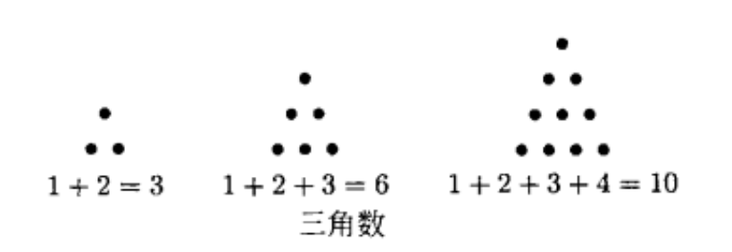
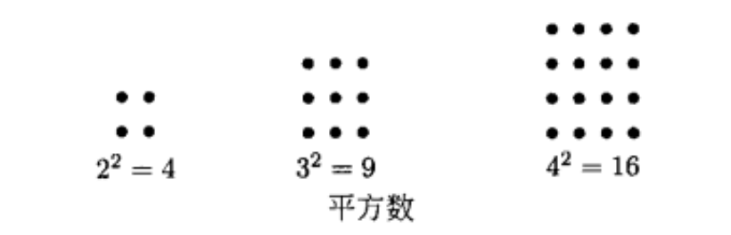

## 什么是数论
研究正整数集合有趣性质的学问

### 典型数论问题
+ 两个平方数之和可能等于平方数吗?
  + $3^2+4^2=9 + 16 =25=5^2$
  + $5^2+12^2=25 + 144 = 169=13^2$
  + $8^2+15^2=64 + 225 = 289=17^2$
+ 两个立方数之和可能等于立方数吗?两个n次方之和可能是n次方吗?(费马大定理)
+ 存在无穷多个素数吗?
  + $存在无穷多个除4余1的素数吗?$
  + $存在无穷多个除4余3的素数吗?$
+ 哪些数等于两个平方数之和?
  + 3不是
  + $5=1^2+2^2$
  + 7不是
  + 11不是
  + $13=2^2+3^2$
  + $17=1^2+4^2$
  + $p与1\pmod 4同余,则p是两个平方数之和$
  + $p与3\pmod 4同余,则p不是两个平方数之和$
+ 数的形状
  + 三角数 
  + 平方数 
  + 是否存在三角平方数
    + $36=6^2=\dfrac{1}{2}(8\times9)$
    + 有无穷多个三角平方数吗?
+ 孪生素数
  + 3,5,7
  + 11,13
  + 17,19
  + 29,31
  + 41,43
  + 59,61
  + 71,73
  + $是否存在无穷多个素数p,使得p+2也是素数?迄今为止,没有人能够解答这个问题$
+ 形如$N^2+1$的素数
  + $5=2^2+1$
  + $17=4^2+1$
  + $37=6^2+1$
  + $65=8^2+1$
  + $101=10^2+1$
  + $145=12^2+1$
  + $197=14^2+1$
  + $257=16^2+1$
  + $325=18^2+1$
  + $401=20^2+1$
  + 是否存在无穷多个?迄今为止,没有人能够解答这个问题
+ 完全数:所有除本身以外的因数相加等于自己的数
  + $6=1+2+3$
  + $28=1+2+4+7+14$
  + 是否存在无穷多个完全数?

### 习题
1. $前两个三角平方数是1和36,求下一个,能给出求三角平方数的有效办法吗?会有无穷多个吗?$
   > 三角数符合特征$\dfrac{1}{2}n(n+1)$
   >
   > 平方数符合特征$m^2$
   > 
   > 所以三角平方数符合特征$m^2=\dfrac{1}{2}n(n+1)\Rightarrow 2m^2=n^2+n$
2. $连续奇数3,5,7都是素数,存在无穷多个素数p,使得p+2,p+4都是素数吗?$
   > $如果p是素数,那么p \equiv 1\pmod 3或者p\equiv 2\pmod 3\\\begin{cases}如果p \equiv 1\pmod 3,p+2\equiv0\pmod 3\\如果p \equiv 2\pmod 3,p+2\equiv1\pmod 3,p+4\equiv0\pmod 3\end{cases}\\\therefore除了3,5,7,没有其他素数p,使得p+2,p+4都是素数$
3. 尽管没有人能证明,但人们普遍认为有无穷多个素数形如$N^2+1$,那么
   1. 你认为存在无穷多个素数形如$N^2-1$吗?
   1. 你认为存在无穷多个素数形如$N^2-2$吗?
   3. 你认为存在无穷多个素数形如$N^2-3$吗?
   4. 你认为存在无穷多个素数形如$N^2-4$吗?
   5. 你认为有哪些a有无穷多个形如$N^2-a$的素数?

## 勾股数组
+ $3^2+4^2=9 + 16 =25=5^2$
+ $5^2+12^2=25 + 144 = 169=13^2$
+ $8^2+15^2=64 + 225 = 289=17^2$

### 有无穷多个勾股数组吗?
> 如果$a^2+b^2=c^2,那么对任意整数n\\(na)^2+(nb)^2=n^2(a^2+b^2)=n^2c^2=(nc)^2\\如果我们只关心没有大于1的公因数的三元组(a,b,c),称之为$**本原勾股数组**

### 有无穷多个本原勾股数组吗?
> 证明如下
>
> 观察
> 
> $3^2+4^2=5^2\\5^2+12^2=13^2\\8^2+15^2=17^2$
> 
> 猜想ab奇偶性不同,c是奇数
> > + 如果ab都是偶数,那么c必然是偶数,那么abc有公因数2,不是本原勾股数
> > + 如果ab奇偶性不同,c为偶数
> > 
> > $设a=2x+1, b=2y+1, c=2z代入方程a^2+b^2=c^2得到\\(2x+1)^2+(2y+1)^2=(2z)^2 \\ 4x^2+4x+1+4y^2+4y+1=4z^2 \\ 2x^2+2x+2y^2+2y+1=2z^2\\该等式说一个奇数等于一个偶数,不成立\\\therefore ab奇偶性不同,c是奇数$
> 
> $问题化简为a^2+b^2=c^2,其中a是奇数,b是偶数,c是奇数,abc互素的所有自然数解$
> $a^2=c^2-b^2\\a^2=(c-b)(c+b)$
> 
> 观察
> 
> $3^2=(5-4)(5+4)=1\times9\\5^2=(13-12)(13+12)=1\times25\\15^2=(17-8)(17+8)=9\times25$
> 
> 猜想$c-b和c+b都是奇数,互素,平方数$
> > $如果d是c-b与c+b的公因数\\那么(c-b)+(c+b)=2c,(c+b)-(c-b)=2b\\d应该也是2c与2b的公因数,因为b与c互素,所以d必等于1或2\\同时d也应该整除(c-b)(c+b)=a^2,但因为a是奇数\\\therefore d只能是1,所以c-b和c+b互素\\c-b和c+b互素,同时乘积为平方数,只可能c-b和c+b同时都是平方数$
> 
> $设c+b=s^2,c-b=t^2,其中s>t\ge 1是互素的奇数\\\therefore c=\dfrac{1}{2}(s^2+t^2),b=\dfrac{1}{2}(s^2-t^2),a=\sqrt{(c-b)(c+b)}=st$

|$s$|$t$|$a=st$|$b=\dfrac{1}{2}(s^2-t^2)$|$c=\dfrac{1}{2}(s^2+t^2)$|
|:-:|:-:|:-:|:-:|:-:|
|3|1|3|4|5|
|5|1|5|12|13|
|7|1|7|24|25|
|9|1|9|40|41|
|5|3|15|8|17|
|7|3|21|20|29|
|7|5|35|12|37|
|9|5|45|28|53|
|9|7|63|16|65|