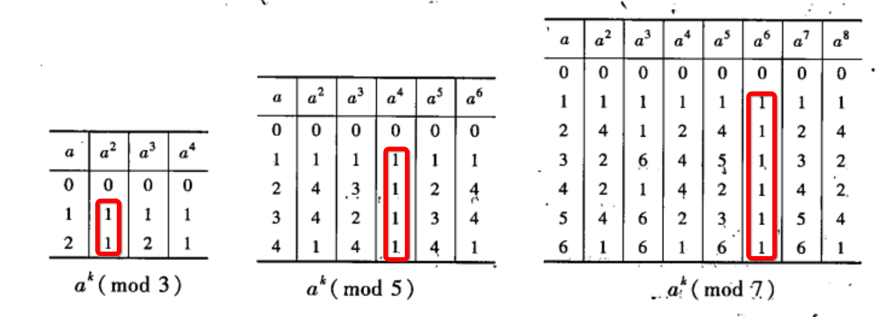
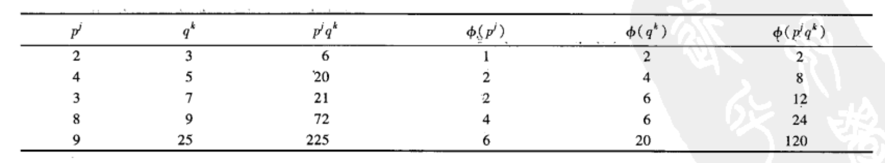

## 整除性与最大公因数
$假设m与n是整数,m\neq 0,m整除n指存在整数k使得n=mk\\如果m整除n,记作m \mid n,否则m \nmid n\\整除n的数称之为n的因数\\两个数a和b(不全为零)的最大公因数是整除它们两个的最大数,记作\gcd(a,b)\\如果\gcd(a,b)=1,我们称a与b互素$

### 欧几里得算法求最大公因数
$求\gcd(1160718174,316258250)$
> $$1160718174=3\times316258250+211943424\\316258250=1\times 211943424+104314826\\ 211943424=2\times 104314826 + 3313772\\104314826=31\times 3313772+1587894\\ 3313772=2\times 1587894 + 137984\\1587894 = 11\times 137984 + 70070\\137984=1\times 70070 + 67914\\70070 =1\times 67914+2156\\67914=31\times 2156+1078\Leftarrow最大公因数\\2156=2\times 1078+0$$

### 线性方程定理
$设a与b是非零整数,g=\gcd(a,b),方程ax+by=g总有一个整数解(x_1,y_1),它可由前面叙述的欧几里得算法得到,则方程的每个解可由\\\Big(x_1+k\cdot\dfrac{b}{g},y_1-k\cdot\dfrac{a}{g}\Big)得到,k为任意整数$

> $代入方程可得到\\a(x_1+k\cdot\dfrac{b}{g})+b(y_1-k\cdot\dfrac{a}{g})=ax_1+ak\cdot\dfrac{b}{g}+by_1-bk\cdot\dfrac{a}{g}=ax_1+by_1=g\\证毕$

## 因数分解与算术基本定理
$每个整数n\ge 2都可以唯一分解成素数乘积$
$$n=p_1p_2p_3...p_r$$

## 同余式
$如果m\mid (a-b),我们就说a与b模m同余,记作$
$$a\equiv b\pmod m$$

$如果a_1\equiv b_1\pmod m且a_2\equiv b_2\pmod m,则$
$$a_1+a_2\equiv b_1+b_2\pmod m\\a_1a_2\equiv b_1b_2\pmod m$$

$但是如果有ac\equiv bc\pmod m,未必有a\equiv b\pmod m,只有当\gcd(c,m)=1时才可以把两边的c消掉$
> $15\cdot 2\equiv20\cdot2\pmod{10},但是15\not\equiv20\pmod{10}\\6\cdot4\equiv0\pmod{12},但是6\not\equiv0\pmod{12}并且4\not\equiv0\pmod{12}$

### 例题一
$$4x\equiv3\pmod{19},求x$$
> $4\cdot5x\equiv3\cdot5\pmod{19}\\20x\equiv15\pmod{19}\\\because20\equiv1\pmod {19}\\\therefore1\cdot x\equiv15\pmod {19}\\\therefore x\equiv15\pmod{19}$

### 例题二
$$18x\equiv8\pmod{22},求x$$
> $原式等价于求满足18x-8=22y的x值\\也就是解线性方程18x-22y=8的整数解\\已知18u-22v=\gcd(18,22)=2有整数解,通过欧几里德算法容易求得u=5,v=4\\\therefore 18\cdot(5\cdot4)-22\cdot(4\cdot4)=2\cdot4=8\\\therefore18\cdot20\equiv8\pmod{22}\\\therefore x\equiv20\pmod{22}\color{green}但实际还有一个解x\equiv9\pmod{22}$

### 线性同余式定理
$设a,c与m是整数,m\ge 1,且g=\gcd(a,m)$
+ $如果g\nmid c,则同余式ax\equiv c\pmod m没有解$
+ $如果g\mid c,则同余式ax\equiv c\pmod m恰好有g个不同的解\\要求这些解,首先求线性方程au+mv=g的一个解(u_0,v_0),则x_0=cu_0/g是ax\equiv c\pmod m的解,不同余的完全解有\\x\equiv x_0+k\cdot \dfrac{m}{g}\pmod m,k=0,1,2,...,g-1$

$当\gcd(a,m)=1,同余式ax\equiv c\pmod m恰好有一个解,x\equiv\dfrac{c}{a}\pmod m$

### 例题三
$$求x^2\equiv1\pmod7$$
> $原式等价于求满足x^2-7y=1的x值\\\because(x+7)^2=x^2+14x+49\\\begin{aligned}\therefore(x+7)^2&\equiv(x^2+14x+49)\pmod7\\&\equiv x^2\pmod7\end{aligned}\\\therefore只需要把x\equiv 0,1,2,...,6分别代入运算就可以了$

## 同余式与费马小定理
$对于整数a,考虑它的幂a,a^2,a^3,...模m,存在什么模式吗?$

$设p为素数,a是任意整数且a\not\equiv0\pmod{p},则$
$$a^{p-1}\equiv{1}\pmod{p}$$

### 费马小定理的应用
$计算2^{35}\pmod{7}$
> $2^{35}=2^{6\cdot5+5}=(2^6)^5\cdot2^5\equiv1^5\cdot2^5\equiv32\equiv4\pmod7$

$解同余式x^{103}\equiv4\pmod{11}$
> $x^{103}=x^{100}\cdot x^3=(x^{10})^{10}\cdot x^3\equiv1^{10}\cdot x^3\equiv x^3\pmod{11}\\\therefore原式相当于求x^3\equiv4\pmod{11}\\尝试把x=1, x=2,...,x=10代入可得该同余式解为x\equiv5\pmod{11}$

### 费马小定理的证明
#### 断言一
$设p为素数,a是任何整数且a\not\equiv0\pmod{p},则数$
$$a,2a,3a,...,(p-1)a\pmod{p}$$
与数
$$1,2,3,...,p-1\pmod{p}$$
相同，尽管它们次序不同
> $数列a,2a,3a,...,(p-1)a包含p-1个数,显然没有一个数被p整除\\假设其中存在ja与ka模p同余,则p\mid(j-k)a\\\because p\nmid a,则必有p\mid(j-k)\\另一方面已知1\le j,k \le p-1,则必有|j-k|<p-1\\\therefore j-k=0\\\therefore j=k$

#### 证明
> 由断言一得到
> 
> $a\cdot2a\cdot3a\cdot...\cdot(p-1)a\equiv1\cdot2\cdot3\cdot...\cdot(p-1)\pmod{p}\\a^{p-1}(p-1)!\equiv(p-1)!\pmod{p}\\\because p\nmid(p-1)!\\\therefore a^{p-1}\equiv1\pmod{p}$

### 费马小定理的应用二
$请问1234567是素数吗?$
> $我们无需因式分解1234567,只需要计算2^{1234566}\pmod{1234567}是不是等于1即可\\至于如何计算,后面的课程会讲\\用同样的方法,我们也可以判断m=10^{100}+37是不是素数\\\color{green}但是,即使与1同余,也有可能是卡米歇尔数$

## 同余式,幂与欧拉公式
$如果p是素数且p\nmid a,有费马小定理a^{p-1}\equiv1\pmod{p}\\如果p是合数,例如5^5\equiv5\pmod{6},2^8\equiv4\pmod{9}.因此我们问是否有依赖模m的指数使得$

$$a^{???}\equiv1\pmod{m}$$

$欧拉函数\phi(m)=\#\{a:1\le a\le m, \gcd(a,m)=1\}\\对于素数p，\phi(p)=p-1$ 

### 欧拉公式
$如果\gcd(a,m)=1,则$

$$a^{\phi(m)}\equiv1\pmod{m}$$
> 证明过程类似于费马小定理的证明

### 卡米歇尔数
$如果对于每个整数a(\gcd(a,m)=1),同余式a^{m-1}\equiv1\pmod{m}成立,则称m为卡米歇尔数$

#### 例题一
$验证m=561=3\cdot11\cdot17是卡米歇尔数$
> $\because a^2\equiv1\pmod{3}\\\therefore a^{m-1}=a^{560}=(a^2)^{280}\equiv1^{280}\equiv1\pmod{3}\\\therefore3\mid a^{560}-1\\同理可得11 | a^{560}-1, 17|a^{560}-1\\\therefore 3\cdot11\cdot17=561\mid a^{560}-1\\\therefore a^{560}\equiv1\pmod{561}$
#### 例题二
$试求另一个卡米歇尔数.你认为卡米歇尔数有无穷多个吗?$
https://blog.csdn.net/feynman1999/article/details/82117231

## 欧拉$\phi$函数与中国剩余定理
欧拉公式

$$a^{\phi(m)}\equiv1\pmod{m}$$
是既优美又有力的结果,但除非能找到计算$\phi(m)$的有效方法,否则其用途发挥不出来

### $当m=p是素数时$
> $\phi(m)=m-1$

### $当m=p^k是素数幂次时$
> $由满足1\le a\le p^k一共有p^k个整数,丢弃与p^k不互素的整数即可,其中p的倍数有$
>
> $$p,2p,3p,...,(p^{k-1}-2)p,(p^{k-1}-1)p,p^k$$
> $一共有p^{k-1}个整数\\\therefore\phi(p^k)=p^k-p^{k-1}$

### $当m=p^jq^k是两个素数幂次的乘积时$

$其实\phi(14)=6,\phi(15)=8,\phi(210)=\phi(14\cdot15)=48$

观察可得猜想

$$如果\gcd(m,n)=1,\phi(mn)=\phi(m)\cdot\phi(n)$$
> 证明如下
> 
> $构建两个集合,分别包含\phi(mn)个元素与\phi(m)\phi(n)个元素\\然后证明两个集合包含个数相同的元素\\第一个集合\{a:1\le a\le mn, \gcd(a,mn)=1\}\\第二个集合\{(b,c):1\le b\le m,\gcd(b,m)=1,1\le c\le n,\gcd(c,n)=1\}$
> 
> $假设m=4,n=5\\第一个集合\{a:1,3,7,9,11,13,17,19\}\\第二个集合\{(b,c):(1,1),(1,2),(1,3),(1,4),(3,1,),(3,2),(3,3),(3,4)\}\\发现每个(a \bmod{m},a\bmod{n})与每个(b,c)一一对应$
> 
> 只要证明
> 1. 第一个集合的不同数对应第二个集合中不同序对
> 1. 第二个集合每个序对适合第一个集合中的某个数
> 
> 就可以知道两个集合元素个数相同
> 
> 验证一
>
> $我们取第一个集合中的两个数a_1,a_2,假设在第二个集合中有$
> 
> $$a_1\equiv a_2\pmod{m},a_1\equiv a_2\pmod{n}$$
> $因此a_1-a_2\mid m并且a_1-a_2\mid n,因为\gcd(m,n)=1,所以a_1-a_2\mid mn\\\therefore a_1\equiv a_2\pmod{mn}\\\therefore a_1和a_2在第一个集合中是同一个元素$
> 
> 验证二
> 
> $需要证明对b与c的任何已知值,至少可求一个整数a满足$
> 
> $$a\equiv b\pmod{m}与a\equiv c\pmod{n}$$
> $由中国剩余定理可知验证二成立$

### 例题一
$$求\phi(1512)$$
> $\begin{aligned}\phi(1512)&=\phi(2^3\cdot3^3\cdot7)\\&=\phi(2^3)\cdot\phi(3^3)\cdot\phi(7)\\&=(2^3-2^2)\cdot(3^3-3^2)\cdot(7-1)\\&=4\cdot18\cdot6\\&=432\end{aligned}$

### 例题二
$$求\phi(97)$$
> $\phi(97)=97-1=96$

### 例题三
$$求\phi(8800)$$
> $\begin{aligned}\phi(8800)&=\phi(2^3\cdot 11\cdot10^2)\\&=\phi(2^3)\cdot\phi(11)\cdot\phi(10^2)\\&=(2^3-2^2)(11-1)(10^2-10)\\&=4\cdot10\cdot90\\&=3600\end{aligned}$

### 中国剩余定理
$设m与n是整数,\gcd(m,n)=1,b与c是任意整数,则同余式组$

$$x\equiv b\pmod{m}与x\equiv c\pmod{n}$$
$恰有一个解0\le x\le mn$
> 证明如下
> 
> $由x\equiv b\pmod{m},可知其解由形如x=my+b的所有数组成\\代入x\equiv c\pmod{n},得到\\my+b\equiv c\pmod{n}\\my\equiv c-b\pmod{n}\\已知\gcd(m,n)=1,线性同余式定理告诉我们恰有一个y_1,0\le y_1 \lt n,则\\x_1=my_1+b,是0\le x_1 \lt mn中的唯一解$