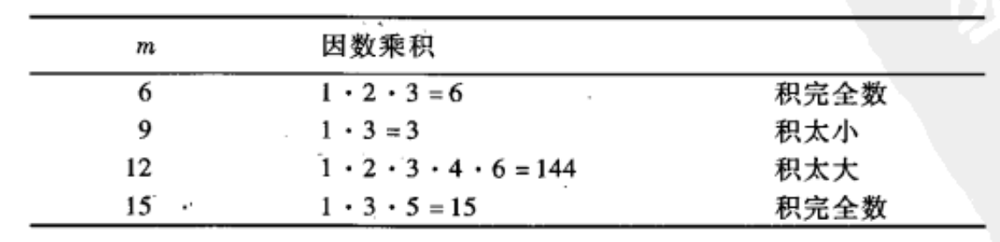

## 素数
### 无穷多素数定理
$$存在无穷多个素数$$
> 证明如下
> 
> $假设只存在n个素数,其中从小到大依次是p_1,p_2,p_3,...,p_{n-1},p_n\\那么A=p_1p_2p_3...p_n+1对任意p_r(1\le r \le n)取模都是余1,无法整除\\\therefore A也是素数$

### 模4余3的素数定理
$$存在无穷多个模4余3的素数$$
> 证明如下
> 
> $假设模4余3的素数的初始表是$
> $$3,p_1,p_2,...,p_r$$
> 考虑数
> $$A=4p_1p_2...p_r+3$$
> $同时我们知道可将A分解成素数乘积,譬如$
> $$A=q_1q_2...q_s$$
> $第一个断言q_1,q_2,...,q_s中至少有一个必是模4余3的\\\because如果q_1,q_2,...,q_s都是模4余1,此时其乘积A必定模4余1,与A的定义矛盾\\\therefore存在q_i\equiv3\pmod{4}\\第二个断言q_i不在初始模4余3的素数中\\\because q_i\mid A并且p_i\nmid A(1\le i \le r)\\\therefore 除了模4余3初始表中的素数,还有q_i\\\therefore 存在无穷多个模4余3的素数$

### 算术级数的素数狄利克雷定理
$设a与m是整数,\gcd(a,m)=1.则存在无穷多个素数模m余a,即存在无穷多个素数p满足$
$$p\equiv a\pmod{m}$$
> $模4余3的素数定理就是(a,m)=(3,4)的狄利克雷定理$
> 
> 完整的狄利克雷定理的证明需要使用复数微积分的方法

## 素数计数
$E(x)=\#\{偶数n | 1\le n \le x\}表示不超过x的正偶数个数$
$$\lim_{x\rightarrow\infty}\dfrac{E(x)}{x}=\dfrac{1}{2}$$

### 素数定理
$\pi(x)=\#\{素数p | p\le x\}表示不超过x的素数个数\\当x很大时,小于x的素数个近似等于x/\ln(x)$
$$\lim_{x\rightarrow\infty}\dfrac{\pi(x)}{x/\ln(x)}=1$$

### 哥德巴赫猜想
$每个偶数n\ge 4可表示成两个素数之和$

### 孪生素数猜想
$存在无穷多个素数p使得p+2也是素数$

### $N^2+1猜想$
$存在无穷多个形如N^2+1的素数$

## 梅森素数
$本章我们研究形如a^n-1(n\ge 2)的素数\\\begin{cases}a是奇数时,a^n-1是偶数\\a=2,n为偶数时,2^n-1被3=2^2-1整除\\a=2,n被3整除时,2^n-1被7=2^2-1整除\\a=2,n被5整除时,2^n-1被31=2^5-1整除\end{cases}$
> 证明如下
> 
> $假设n=mk,则2^n=(2^{m})^{k},则$
> $$2^n-1=(2^{m})^{k}-1=(2^m-1)((2^{m})^{k-1}+(2^{m})^{k-2}+..+(2^{m})^{2}+2^{m}+1)$$
> $\therefore 如果n是合数,则2^n-1是合数$

### 命题
$如果对整数a\ge 2与n \ge 2,a^n-1是素数,则a必等于2且n一定是素数$

### 问题
$存在无穷多个梅森素数吗?$

## 梅森素数与完全数
### 欧几里得完全数公式
$如果2^p-1是素数,则2^{p-1}(2^p-1)是完全数$
> 证明如下
> 
> $设q=2^p-1,我们需要验证2^{p-1}q是完全数,2^{p-1}q的真因数是$
> $$1,2,4,...,2^{p-1}与q,2q,4q,...,2^{p-2}q\\1+2+4+...+2^{p-1}=\dfrac{2^{p}-1}{2-1}=2^p-1=q\\q+2q+4q+...+2^{p-2}q=q(\dfrac{2^{p-1}-1}{2-1})=q(2^{p-1}-1)\\\therefore 1+2+4+..+2^{p-1}+q+2q+4q+...+2^{p-2}q=2^{p-1}q\\\therefore 2^{p-1}q是完全数$$

### $\sigma函数公式$
$\sigma(n)=n的所有因数之和(包括1与n)\\对于素数p$
$$\sigma(p)=p+1$$
$对于素幂数p^k$
$$\sigma(p^k)=1+p+p^2+...+p^k=\dfrac{p^{k+1}-1}{p-1}$$
$如果\gcd(m,n)=1$
$$\sigma(mn)=\sigma(m)\sigma(n)$$
> $\color{green}自己想办法证明$

### 欧拉完全数定理
$如果n是偶完全数,则n是$
$$n=2^{p-1}(2^p-1)$$
> 证明如下
> 
> $假设n是偶完全数,则n可以分解成$
> $$n=2^km,k\ge 1且m为奇数$$
> $\sigma(n)=\sigma(2^km)=\sigma(2^k)\sigma(m)=(2^{k+1}-1)\sigma(m)\\\because n是完全数\\\therefore\sigma(n)=2n=2\cdot2^km=2^{k+1}m\\\therefore (2^{k+1}-1)\sigma(m)=2^{k+1}m\\显然2^{k+1}-1是奇数,所以2^{k+1}\mid\sigma(m),也就是存在整数c,使得\sigma(m)=2^{k+1}c\\\therefore2^{k+1}m=(2^{k+1}-1)\sigma(m)=(2^{k+1}-1)2^{k+1}c\\\therefore m=(2^{k+1}-1)c同时\sigma(m)=2^{k+1}c\\假设c>1,由m=(2^{k+1}-1)c可知m至少被1,m,c三个数整除\\\therefore\sigma(m)\ge 1+c+m=1+c+(2^{k+1}-1)c=2^{k+1}c+1\\同时\because\sigma(m)=2^{k+1}c\\\therefore2^{k+1}c\ge 2^{k+1}c+1这是荒谬的\\\therefore 必定有c=1\\\therefore m=2^{k+1}-1且\sigma(m)=2^{k+1}=m+1\\\therefore m是素数\\\therefore n=2^km=2^k(2^{k+1}-1),2^{k+1}-1是素数\\\because 2^{k+1}-1是素数\therefore k+1也是素数\\\therefore 每个偶完全数n=2^{p-1}(2^p-1)$

### 问题
$存在奇完全数吗?$
> 目前人们已知不存在小于$10^{300}$的奇完全数,但是没找到不代表没有,至今没有人能够结论性地证明奇完全数不存在

### 例题一
$$求\sigma(1728)$$
> $\sigma(1728)=\sigma(2^6\cdot3^3)=\sigma(2^6)\sigma(3^3)=\dfrac{2^7-1}{2-1}\cdot\dfrac{3^4-1}{3-1}=127\cdot40=5080$

### 积完全数

### 亲和数对
$如果m的真因数之和为n,n的真因数之和为m,则称m与n是亲和数对,比如(220,284)\\284=1+2+4+5+10+11+20+22+44+55+110(220的因数)\\220=1+2+4+71+142(284的因数)$
