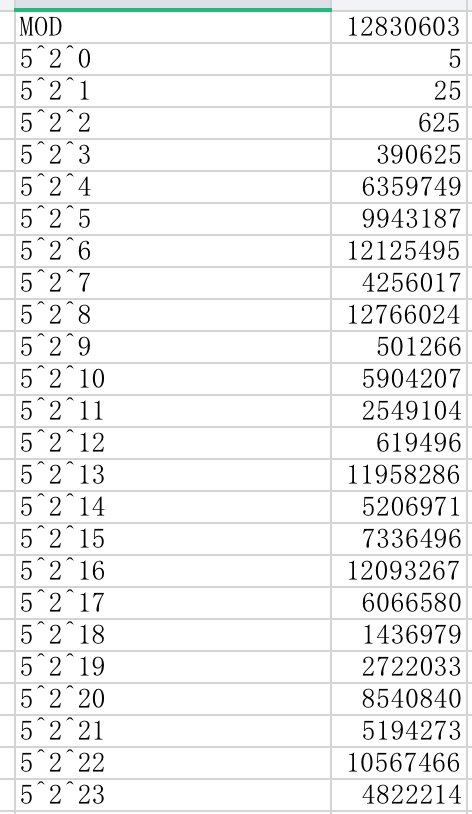
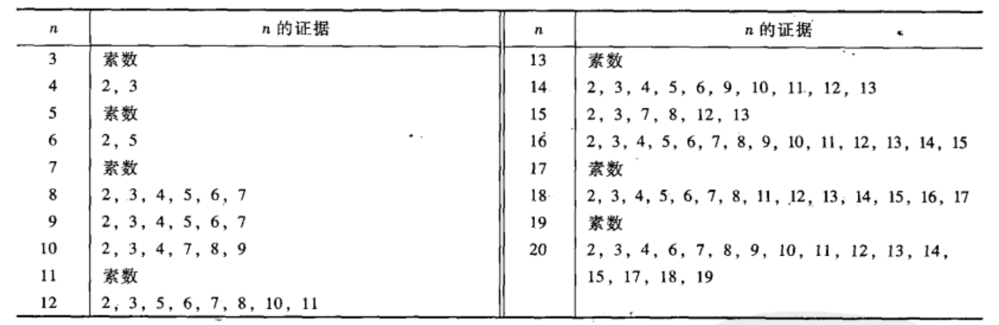
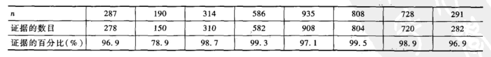

## 幂模$m$与逐次平方法
$$计算5^{100000000000000}\pmod{12830603}$$
> $如果12830603是素数,可以用费马小定理a^{p-1}\equiv1\pmod{p}\\但12830603=3571\cdot3593是合数\\\phi(但12830603)=\phi(3571)\cdot\phi(3593)=3570\cdot3592=12823440\\由欧拉公式,当\gcd(a,m)=1,a^{\phi(m)}\equiv1\pmod{m}\\\therefore 5^{100000000000000}=(5^{12823440})^{7798219}\cdot5^{6546640}\equiv5^{6546640}\pmod{12830603}\\\quad\\6546640=2^{22}+2^{21}+2^{17}+2^{16}+2^{15}+2^{14}+2^{13}+2^{10}+2^{7}+2^{6}+2^{4}\\5^{1}\equiv5\equiv5\pmod{12830603}\\5^2\equiv25\equiv25\pmod{12830603}\\5^4\equiv(5^2)^2\equiv25^2\equiv625\pmod{12830603}\\5^8\equiv(5^4)^2\equiv625^2\equiv390625\pmod{12830603}\\5^{16}\equiv(5^8)^2\equiv390625^2\equiv6359749\pmod{12830603}\\5^{32}\equiv(5^{16})^2\equiv6359749^2\equiv9943187\pmod{12830603}\\5^{64}\equiv(5^{32})^2\equiv9943187^2\equiv12125495\pmod{12830603}\\5^{128}\equiv(5^{64})^2\equiv12125495^2\equiv4256017\pmod{12830603}\\5^{256}\equiv(5^{128})^2\equiv4256017^2\equiv12766024\pmod{12830603}\\5^{512}\equiv(5^{256})^2\equiv12766024^2\equiv501266\pmod{12830603}\\5^{1024}\equiv(5^{512})^2\equiv501266^2\equiv5904207\pmod{12830603}\\5^{2048}\equiv(5^{1024})^2\equiv390625^2\equiv2549104\pmod{12830603}$
> $\begin{aligned}5^{6546640}&=5^{2^{22}+2^{21}+...+2^6+2^4}\\&=5^{2^{22}}\cdot5^{2^{21}}\cdot...\cdot5^{2^6}\cdot5^{2^4}\\&\equiv10567466\cdot5194273\cdot...\cdot12125495\cdot6359749\pmod{12830603}\\&\equiv不算了\pmod{12830603}\end{aligned}$

### 应用
$判断一个数值n是不是素数,根据费马小定理,如果n是素数\\那么a^{n-1}\equiv1\pmod{n},则可以测试\\2^{n-1}\bmod n\\3^{n-1}\bmod n\\5^{n-1}\bmod n\\7^{n-1}\bmod n\\\begin{cases}如果其中有一个不是1,那么n是合数\\不幸的是,如果这是一个卡米歇尔数,对于所有a,如果\gcd(a,m)=1,a^{m-1}\equiv1\pmod{m}\end{cases}$

### 例题一
$$求28^{749}\pmod{1147}$$
> 算吧

## $计算模m的k次根$
$前一章学习了当k与m很大时,如何计算模m的k次幂,现在反过来,已知数b来求同余式$
$$x^k\equiv b\pmod{m}$$

### 原理
$设b,k与m是已知整数,满足$
$$\gcd(b,m)=1与\gcd(k, \phi(m))=1$$
$下述步骤给出同余式$
$$x^k\equiv b\pmod{m}$$
$的解$
1. $计算\phi(m)$
2. $求满足ku-\phi(m)v=1的正整数解u,v(另一种叙述方式是u为满足ku\equiv1\pmod{\phi(m)})的正整数,u实际上是k\pmod{\phi(m)}的逆$
3. $用逐次平方法计算b^u\pmod{m}所得解即x$

> $为什么可行呢?我们需要证明x=b^u是同余式x^k\equiv b\pmod{m}的解\\\begin{aligned}x^k&=(b^u)^k&将x=b^u代入x^k\\&=b^{uk}\\&=b^{1+\phi(m)v}&由第二步的ku-\phi(m)v=1\\&=b\cdot(b^{\phi(m)})^{v}\\&\equiv b\pmod{m}&由b^{\phi(m)}\equiv1\pmod{m}\end{aligned}$

$该方法第二和第三步没什么问题\\但如果m是由两个100位的大素数p,q相乘得到,第一步求\phi(m)的难度就很大了\\基于此,就可以用来构造密码体制$

### 因数分解的方法
1. $Pollard的\rho方法$
2. $Pollard的\rho-1方法$
3. 二次筛法因数分解法
4. Lenstra椭圆曲线因数分解法
5. 数域筛法

##  素数测试与卡米歇尔数
### 素数测试
$如果a^n\not\equiv a\pmod{n},我们称a为n是合数的证据$

$当n=287,证据个数为278,占比96.9\%$

### 卡米歇尔数
猜想
1. $每个卡米歇尔数是奇数$
2. $每个卡米歇尔数是不同奇数的乘积$

> 证明如下
> 
> $令a=n-1\therefore a\equiv -1\pmod{n}\\\because a^n\equiv a\pmod{n}\\\therefore (-1)^n\equiv (-1)\pmod{n}\\\therefore n=2或者n为奇数\\\because n为合数\\\therefore猜想1证毕$
> 
> $设p是整除n的素数,p^{e+1}是整除n的最大次幂,如果能证明e=0,那么猜想2得到证明\\将a=p^e代入a^n\equiv a\pmod{n}\\p^{en}\equiv p^e\pmod{n}\\\therefore n\mid(p^{en}-p^e)\\\because p^{e+1}\mid n\\\therefore\dfrac{p^{en}-p^e}{p^{e+1}}=\dfrac{p^{en-e}-1}{p}是整数\\\therefore e只能等于0$

### 卡米歇尔数的考塞特判别法
$设n是合数,则n是卡米歇尔数当且仅当它是奇数,且整除n的每个素数p满足下面两个条件$
1. $p^2不整除n$
2. $p-1整除n-1$

### 素数的一个性质
$设p是奇素数,记$
$$p-1=2^kq,\quad q是奇数$$
$设a是不被p整除的任何数,则下述两个条件之一成立$
1. $a^q模p余1$
2. $数a^q,a^2q,a^{2^2}q,...,a^{2^{k-1}}q之一模p余-1$

### 合数的拉宾-米勒测试
$设n是奇素数,记作n-1=2^kq,q是奇数.对不被n整除的某个a,如果下述两个条件都成立,则n是合数$
1. $a^q\not\equiv1\pmod{n}$
2. $对所有i=0,1,2,...,k-1,a^{2^i}q\not\equiv-1\pmod{n}$