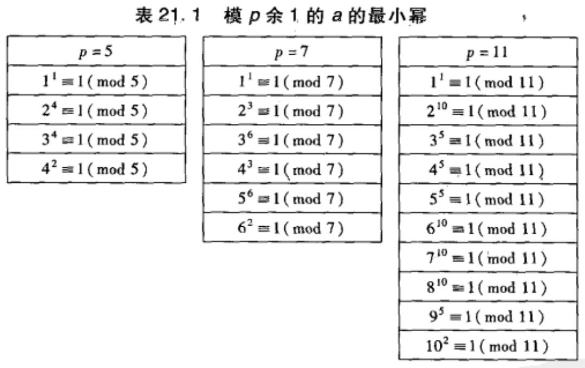
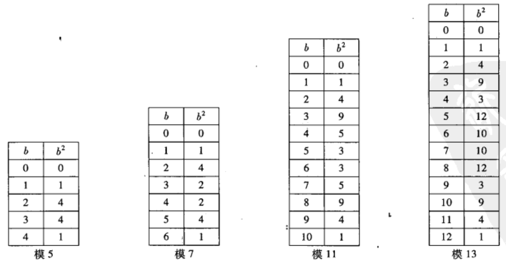

## $欧拉\phi函数与因数和$
### 欧拉$\phi$函数求和公式
$设d_1,d_2,...,d_r是整除n的数,包括1与n,则$
$$\phi(d_1)+\phi(d_2)+...+\phi(d_r)=n$$

## $幂模p与原根$
$a模p的次数(或阶)$
$$e_p(a)=(使得a^e\equiv1\pmod{p}的最小指数e\ge1)$$

### 次数整除性质
$设a是不被素数p整除的整数,假设a^n\equiv1\pmod{p}\\则次数e_p(a)整除n,特别地,次数e_p(a)总整除p-1$
> 证明
> 
> $由e_p(a)的定义可得$
> $$a^{e_p(a)}\equiv1\pmod{p}$$
> $假设a^n\equiv1\pmod{p}.设G=\gcd(e_p(a),n),并设(u,v)是方程$
> $$e_p(a)u-nv=G$$
> $的正整数解.现在用两种不同的方式计算a^{e_p(a)u}\pmod{p}$
> $$\begin{aligned}&a^{e_p(a)u}=(a^{e_p(a)})^u\equiv1^u\equiv1\pmod{p}\\&a^{e_p(a)u}=a^{nv+G}=(a^n)^v\cdot a^G\equiv1^v\cdot a^G\equiv a^G\pmod{p}\end{aligned}$$
> $\therefore a^G\equiv1\pmod{p}\\但是e_p(a)是同余于1\pmod{p}的a的最小幂次\\\therefore G\ge e_p(a)\\同时G=\gcd(e_p(a),n)\\\therefore G=e_p(a)\\\therefore e_p(a)\mid n\\由费马小定理得a^{p-1}\equiv1\pmod{p},也就是取n=p-1时\\e_p(a)\mid(p-1)$

### 原根定理
$具有最高次数e_p(g)=p-1的数g称为模p的原根\\见上图,可以发现\\2,3是模5的原根\\3,5是模7的原根\\2,6,7,8是模11的原根$

$每个素数p都有原根.更精确地,有恰好\phi(p-1)个模p的原根$
> 证明没看懂，哈哈

### 阿廷猜想
$有无数多个素数p使得2是模p的原根$

### 广义阿廷猜想
$设整数a不是完全平方也不等于-1,有无穷多个素数p使得a是模p的原根$

## 原根与指标
没兴趣

## $模p平方剩余$

$(p-b)^2=p^2-2pb+b^2\equiv b^2\pmod{p}$

### 概念
$与一个平方数模p同余的非零数称为模p的二次剩余\\不与任何一个平方数模p同余的数称为模p的二次非剩余$

### 定理1
$设p是奇素数,则恰有\dfrac{p-1}{2}个模p的二次剩余,且恰有\dfrac{p-1}{2}个模p的二次非剩余$
> 证明

# 不学啦！！