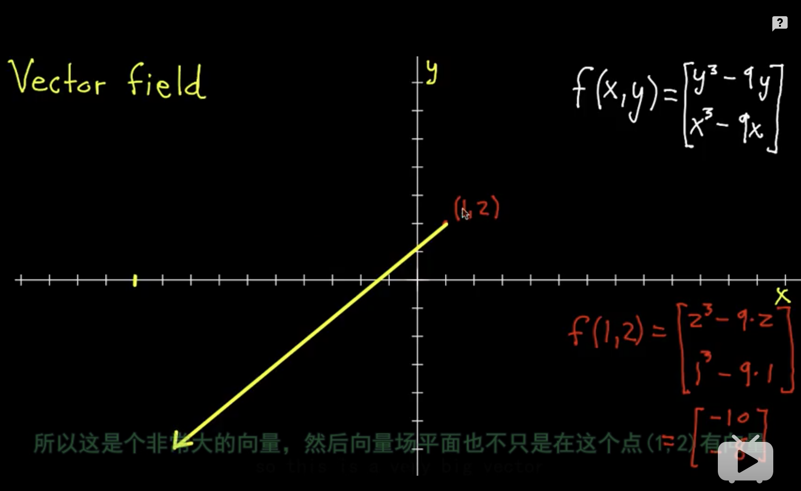
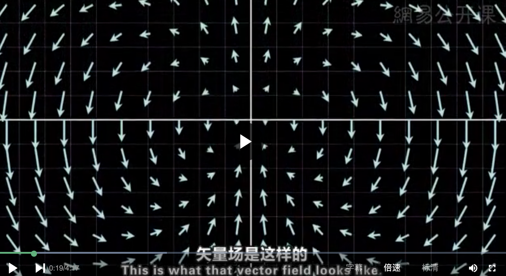
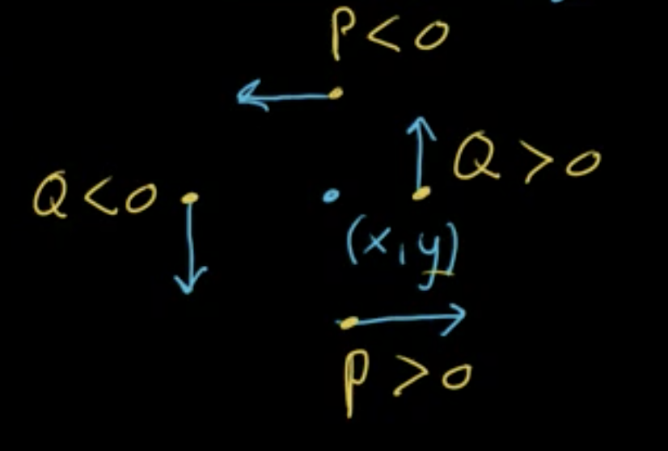

## 概念
### 散度
$\vec{V}(1,2)=\begin{bmatrix}-10\\-8\\\end{bmatrix}$

$\vec{V}(x,y)=\begin{bmatrix}P(x,y)\\\\Q(x,y)\end{bmatrix}表示一个二维的矢量场,有P和Q两个函数分别表示x和y\\div\vec{V}(x,y)表示该矢量场在(x,y)位置的散度\\div\vec{V}(x,y)\begin{cases}\gt 0 &流出大于流入,密度减小\\\lt 0 &流出小于流入,密度增大\\= 0 &流出等于流入,密度不变\end{cases}\\\quad\\div\vec{V}(x,y)=\dfrac{\partial{P}}{\partial{x}}+\dfrac{\partial{Q}}{\partial{y}}=\nabla\cdot\vec{V}=\begin{bmatrix}\dfrac{\partial}{\partial{x}}\\\\\dfrac{\partial}{\partial{y}}\end{bmatrix}\cdot\begin{bmatrix}P(x,y)\\\\Q(x,y)\end{bmatrix}$

$如下图所示,求矢量场\vec{V}=\begin{bmatrix}xy\\y^2-x^2\end{bmatrix}的散度$

>$解\\div\vec{V}(x,y)=\dfrac{\partial{P}}{\partial{x}}+\dfrac{\partial{Q}}{\partial{y}}=(y)+(2y)=3y$

### 旋度
逆时针旋转为正,顺时针旋转为负

$对于\vec{V}=\begin{bmatrix}P(x,y)\\Q(x,y)\end{bmatrix}$

$如下图所示,在(x,y)上的旋度为正\\在y轴方向上,随着y变大，P从大于0变成小于0\\所以\dfrac{\partial{P}}{\partial{y}}<0\\在x轴方向上,随着x变大,Q从小于0变成大于0\\所以\dfrac{\partial{Q}}{\partial{x}}>0\\其二维空间的旋度2d\cdot curl\vec{V}(x,y)=\dfrac{\partial{Q}}{\partial{x}}-\dfrac{\partial{P}}{\partial{y}}$

### 如何表示一个三维空间的旋转
$向量\begin{bmatrix}x\\y\\z\end{bmatrix}表示旋转轴,向量的模表示旋转的强度,向量的方向根据右手法则确定旋转的方向$

### 三维空间的旋度
$\vec{V}(x,y,z)=\begin{bmatrix}P(x,y,z)\\\\Q(x,y,z)\\\\R(x,y,z)\end{bmatrix}\\curl\vec{V}(x,y,z)=\nabla \times \vec{V}(x,y,z)=\begin{bmatrix}\dfrac{\partial}{\partial{x}}\\\\\dfrac{\partial}{\partial{y}}\\\\\dfrac{\partial}{\partial{z}}\end{bmatrix}\times\begin{bmatrix}P(x,y,z)\\\\Q(x,y,z)\\\\R(x,y,z)\end{bmatrix}=\begin{bmatrix}\dfrac{\partial{R}}{\partial{y}}-\dfrac{\partial{Q}}{\partial{z}}\\\\\dfrac{\partial{P}}{\partial{z}}-\dfrac{\partial{R}}{\partial{x}}\\\\\dfrac{\partial{Q}}{\partial{x}}-\dfrac{\partial{P}}{\partial{y}}\end{bmatrix}$

### Laplacian拉普拉斯方程
$\Delta{f}(x,y)=div(grad(f))=\nabla\cdot\nabla{f}\\\quad\\f(x,y)表示三维空间的一个图像\\\quad\\\nabla{f}=\begin{bmatrix}\dfrac{\partial}{\partial{x}}\\\\\dfrac{\partial}{\partial{y}}\end{bmatrix}f(x,y)=\begin{bmatrix}\dfrac{\partial}{\partial{x}}f(x,y)\\\\\dfrac{\partial}{\partial{y}}f(x,y)\end{bmatrix}表示该三维空间图像的梯度,也就是指向结果值变大的方向\\\quad\\\nabla\cdot\nabla{f}=\begin{bmatrix}\dfrac{\partial}{\partial{x}}\\\\\dfrac{\partial}{\partial{y}}\end{bmatrix}\cdot\begin{bmatrix}\dfrac{\partial}{\partial{x}}f(x,y)\\\\\dfrac{\partial}{\partial{y}}f(x,y)\end{bmatrix}=\dfrac{\partial^2}{\partial{x^2}}f(x,y)+\dfrac{\partial^2}{\partial{y^2}}f(x,y)表示该三维空间图像梯度的散度,散度的最大值最小值分别代表了三维图像区域内的最小值与最大值$