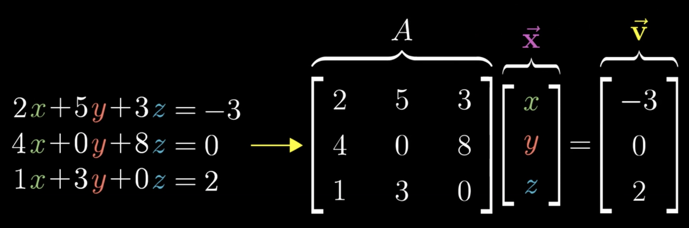
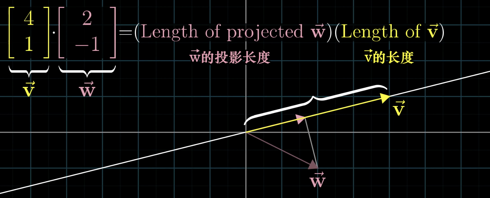
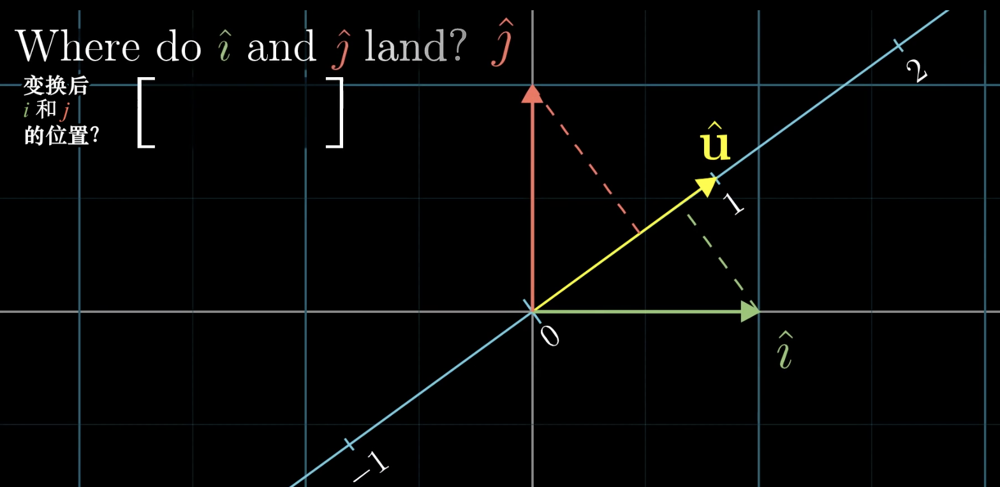
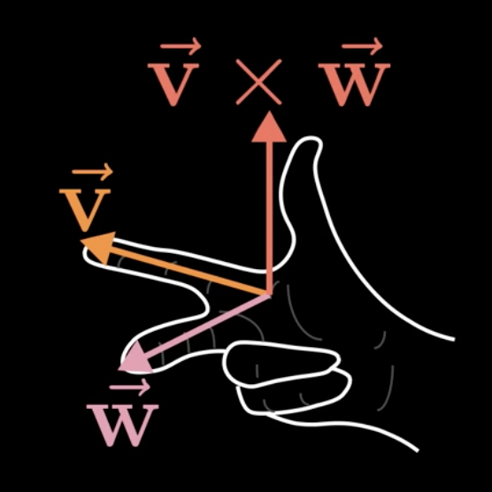
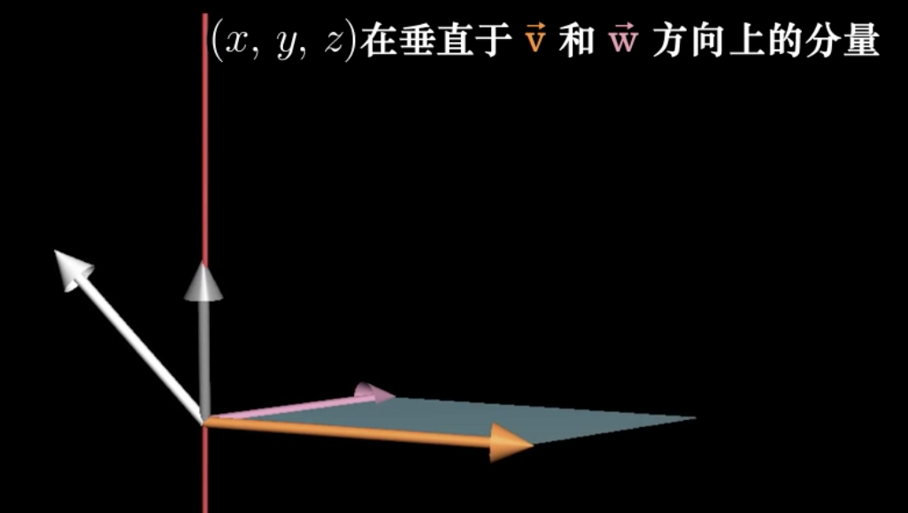
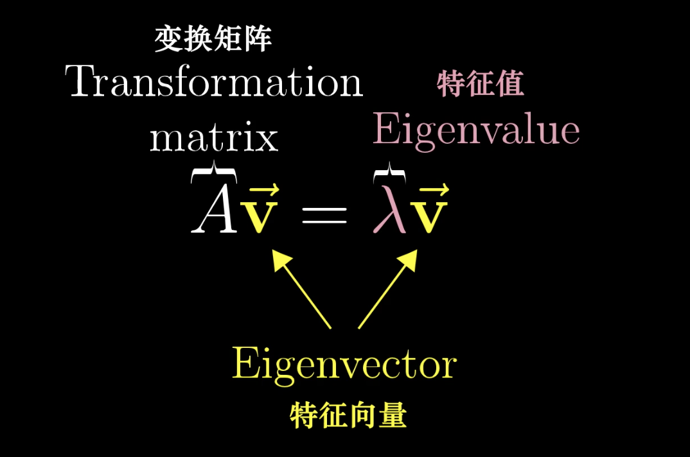
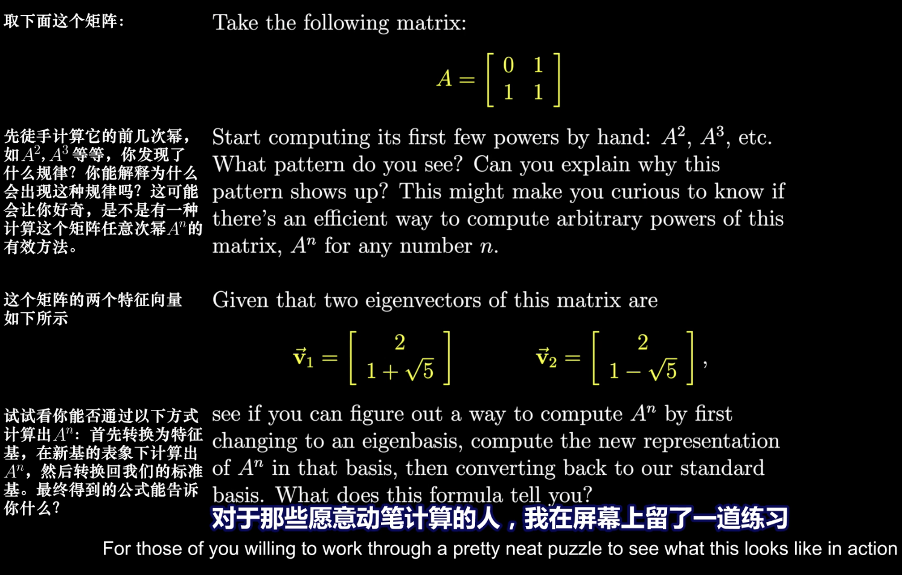
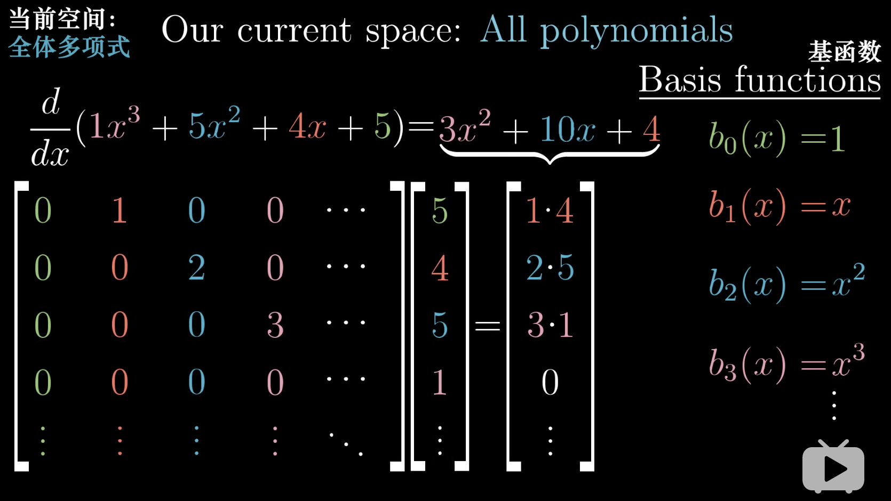
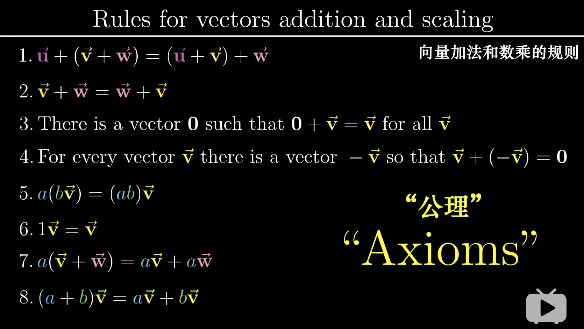

### 什么是向量
#### 两个基础运算
+ 向量相加：$\vec{v}+\vec{w}$
+ 向量数乘：$n\vec{v}$

#### 两个基向量
+ $\hat{i}$
+ $\hat{j}$

$\begin{bmatrix}-5\\2\end{bmatrix}=-5\hat{i}+2\hat{j}$

### 空间变换
$\begin{bmatrix}1&2\\-1&3\end{bmatrix}相当于\hat{i}变换到\begin{bmatrix}1\\-1\end{bmatrix}的位置,\hat{j}变换到\begin{bmatrix}2\\3\end{bmatrix}的位置\\\quad\\那么原来空间中的\begin{bmatrix}-5\\2\end{bmatrix}=-5\hat{i}+2\hat{j}=-5\begin{bmatrix}1\\-1\end{bmatrix}+2\begin{bmatrix}2\\3\end{bmatrix}=\begin{bmatrix}-1\\11\end{bmatrix}\\\quad\\\begin{bmatrix}1&2\\-1&3\end{bmatrix}\begin{bmatrix}-5\\2\end{bmatrix}=\begin{bmatrix}-1\\11\end{bmatrix}$

$$\color{green}\begin{bmatrix}a&b\\c&d\end{bmatrix}\begin{bmatrix}x\\y\end{bmatrix}=x\begin{bmatrix}a\\c\end{bmatrix}+y\begin{bmatrix}b\\d\end{bmatrix}=\begin{bmatrix}ax+by\\cx+dy\end{bmatrix}$$
>$\begin{bmatrix}a&b\\c&d\end{bmatrix}为空间变换的方式：\hat{i}变换到\begin{bmatrix}a\\c\end{bmatrix},\hat{j}变换到\begin{bmatrix}b\\d\end{bmatrix}\\\quad\\原向量\begin{bmatrix}x\\y\end{bmatrix}将变换成\begin{bmatrix}ax+by\\cx+dy\end{bmatrix}\\\quad\\\begin{bmatrix}a&b\\c&d\end{bmatrix}\begin{bmatrix}x_1&x_2&x_3\\y_1&y_2&y_3\end{bmatrix}则可以看成是\begin{bmatrix}x_1\\y_1\end{bmatrix}\begin{bmatrix}x_2\\y_2\end{bmatrix}\begin{bmatrix}x_3\\y_3\end{bmatrix}这三个向量在\begin{bmatrix}a&b\\c&d\end{bmatrix}空间变换后的结果$

#### 行列式
$\hat{i}和\hat{j}组成的单位面积,在\hat{i}\Rightarrow\begin{bmatrix}1\\-1\end{bmatrix},\hat{j}\Rightarrow\begin{bmatrix}2\\3\end{bmatrix}后面积变成1\cdot 3 - (-1)\cdot 2=5$

$$\color{green}\det(\begin{bmatrix}a&b\\c&d\end{bmatrix})=ad-bc$$

$当二维矩阵行列式=0,也就是变换后单位面积变成了0,空间被压缩成了一条线,也就是\begin{bmatrix}a\\c\end{bmatrix}和\begin{bmatrix}b\\d\end{bmatrix}线性相关$

$$\color{green}\det(\begin{bmatrix}a&b&c\\d&e&f\\g&h&i\end{bmatrix})=a\cdot\det(\begin{bmatrix}e&f\\h&i\end{bmatrix})-b\cdot\det(\begin{bmatrix}d&f\\g&i\end{bmatrix})+c\cdot\det(\begin{bmatrix}d&e\\g&h\end{bmatrix})$$

$当三维矩阵行列式=0,也就是变换后单位体积变成了0,空间被压缩成了一个平面或者一条线,也就是\begin{bmatrix}a\\d\\g\end{bmatrix}\begin{bmatrix}b\\e\\h\end{bmatrix}\begin{bmatrix}c\\f\\i\end{bmatrix}线性相关$

### 非方阵的空间变换
$\begin{bmatrix}a&b&c\\d&e&f\end{bmatrix}表示原三维空间的基向量\hat{i},\hat{j},\hat{k}分别转换到了二维空间中的\begin{bmatrix}a\\d\end{bmatrix}\begin{bmatrix}b\\e\end{bmatrix}\begin{bmatrix}c\\f\end{bmatrix}\\\quad\\原三维空间中的\begin{bmatrix}x\\y\\z\end{bmatrix}=x\hat{i}+y\hat{j}+z\hat{k}=x\begin{bmatrix}a\\d\end{bmatrix}+y\begin{bmatrix}b\\e\end{bmatrix}+z\begin{bmatrix}c\\f\end{bmatrix}=\begin{bmatrix}ax+by+cz\\dx+ey+fz\end{bmatrix}$

$$\color{green}\begin{bmatrix}a&b&c\\d&e&f\end{bmatrix}\begin{bmatrix}x\\y\\z\end{bmatrix}=x\begin{bmatrix}a\\d\end{bmatrix}+y\begin{bmatrix}b\\e\end{bmatrix}+z\begin{bmatrix}c\\f\end{bmatrix}=\begin{bmatrix}ax+by+cz\\dx+ey+fz\end{bmatrix}$$

$\begin{bmatrix}a&b\\c&d\\e&f\end{bmatrix}表示原二维空间的基向量\hat{i},\hat{j}分别转换到了三维空间中的\begin{bmatrix}a\\c\\e\end{bmatrix}\begin{bmatrix}b\\d\\f\end{bmatrix}\\\quad\\原二维空间中的\begin{bmatrix}x\\y\end{bmatrix}=x\hat{i}+y\hat{j}=x\begin{bmatrix}a\\c\\e\end{bmatrix}+y\begin{bmatrix}b\\d\\f\end{bmatrix}=\begin{bmatrix}ax+by\\cx+dy\\ex+fy\end{bmatrix}$

$$\color{green}\begin{bmatrix}a&b\\c&d\\e&f\end{bmatrix}\begin{bmatrix}x\\y\end{bmatrix}=x\begin{bmatrix}a\\c\\e\end{bmatrix}+y\begin{bmatrix}b\\d\\f\end{bmatrix}=\begin{bmatrix}ax+by\\cx+dy\\ex+fy\end{bmatrix}$$

### 逆矩阵
$$A\vec{X}=\vec{V}$$

$已知线性变换A,变换后的向量\vec{V},求变换前的向量\vec{X}$

+ 当行列式不为0,逆向$A$的线性变换即可,$A^{-1}A\vec{X}=A^{-1}\vec{V}$
+ 当行列式为0,维度被压缩,压缩后空间中的向量将对应高维度多个向量,只有当幸运地$\vec{V}$就在压缩后的空间中

### 秩
+ 如果变换后空间是一维的,一条直线,秩为1
+ 如果变换后空间是二维的,一个平面,秩为2
+ 如果变换后空间是三维的,一个立体,秩为3
+ ...

### 列空间
列向量的线性组合组成的空间

### 零空间
$A\vec{X}=\vec{0}经过线性变换A之后,所有落在向量\vec{0}上的\vec{X}的集合组成的空间$

>$也就是说如果A没有压缩空间,那么零空间中只有\vec{0}$

### 向量的点积

#### 二维转一维

Q：什么样的二维转一维的变换,能把二维空间压缩到长度为1的向量$\hat{u}$所在的直线空间上并且$\hat{u}$的长度不变？

>A：$\hat{u}$在原二维空间的表达方式为$\begin{bmatrix}u_x\\u_y\end{bmatrix}$,设矩阵变换为$\begin{bmatrix}t_x&t_y\end{bmatrix}\\则有\begin{bmatrix}t_x,t_y\end{bmatrix}\begin{bmatrix}u_x\\u_y\end{bmatrix}=t_xu_x+t_yu_y=1\\同时|\hat{u}|=\sqrt{u_x^2+u_y^2}=1\Rightarrow u_x^2+u_y^2=1\\\therefore t_xu_x+t_yu_y=u_x^2+u_y^2\\\therefore t_x=u_x,t_y=u_y\\\therefore 矩阵变换为\begin{bmatrix}u_x&u_y\end{bmatrix}$

Q：为什么二维转一维的矩阵变换与点积结果相同$\begin{bmatrix}a&b\end{bmatrix}\begin{bmatrix}c\\d\end{bmatrix}==\begin{bmatrix}a\\b\end{bmatrix}\cdot\begin{bmatrix}c\\d\end{bmatrix}=ac+bd$
>A:对于原二维空间中任意$\begin{bmatrix}x\\y\end{bmatrix}$在空间变换后的位置为$\begin{bmatrix}u_x&u_y\end{bmatrix}\begin{bmatrix}x\\y\end{bmatrix}=u_x\cdot x+u_y\cdot y$
>
>同时原二维空间中任意$\begin{bmatrix}x\\y\end{bmatrix}$与$\hat{u}$点积$\begin{bmatrix}u_x\\u_y\end{bmatrix}\cdot\begin{bmatrix}x\\y\end{bmatrix}=u_x\cdot x+u_y\cdot y$
>
>如果点积的对象不是单位向量呢？假设是$3\hat{u}$,因为是线性变换,上述计算过程3倍即可,同样适用

总结
+ 向量夹角$\begin{cases}锐角&点积大于0\\直角&点积等于0\\钝角&点积小于0\end{cases}$
+ 向量点积,相当于把其中一个向量当成一个转一维的线性变换
+ 对于一个二维转一维的矩阵变换,唯一存在一个向量,使得矩阵变换的结果和与该向量点积结果相同

### 向量的叉积
$\vec{V}\times\vec{W}$的结果满足三个条件

+ 模等于$\vec{V}和\vec{W}$组成的平行四边形面积
+ 同时与$\vec{V}和\vec{W}$垂直
+ 方向符合右手法则:食指表示$\vec{V}$中指表示$\vec{W}$,则大拇指指向结果向量方法

$$\begin{bmatrix}v_1\\v_2\\v_3\end{bmatrix}\times\begin{bmatrix}w_1\\w_2\\w_3\end{bmatrix}=\det\Bigg(\begin{bmatrix}\hat{i}&v_1&w_1\\\hat{j}&v_2&w_2\\\hat{k}&v_3&w_3\end{bmatrix}\Bigg)=\hat{i}(v_2w_3-v_3w_2)+\hat{j}(v_3w_1-v_1w_3)+\hat{k}(v_1w_2-v_2w_1)$$

可通过计算验证的数学事实

+ $\vec{V}\cdot(\vec{V}\times\vec{W})=0$
+ $\vec{W}\cdot(\vec{V}\times\vec{W})=0$
+ $\theta = \arccos(\vec{V}\cdot\vec{W}/(|\vec{V}|\cdot|\vec{W}|))$
+ $|\vec{V}\times\vec{W}|=|\vec{V}||\vec{W}|\sin(\theta)$

> 证明思路
> 1. 根据$\vec{V}和\vec{W}定义一个三维到一维的线性变换$
> 1. 找到它的对偶向量
> 1. 说明这个对偶向量就是$\vec{V}\times\vec{W}$ 

是否存在一个三维到一维的线性变换,使得对于空间内任意向量$\begin{bmatrix}x\\y\\z\end{bmatrix}$都有

$$\begin{bmatrix}?&?&?\end{bmatrix}\begin{bmatrix}x\\y\\z\end{bmatrix}=\det\Bigg(\begin{bmatrix}x&v_1&w_1\\y&v_2&w_2\\z&v_3&w_3\end{bmatrix}\Bigg)$$

三维到一维的线性变换,可以转变为点积,也就是找到一个向量$\begin{bmatrix}p_1\\p_2\\p_3\end{bmatrix}$使得对于空间内任意向量$\begin{bmatrix}x\\y\\z\end{bmatrix}$都有

$$\color{green}\begin{bmatrix}p_1\\p_2\\p_3\end{bmatrix}\cdot\begin{bmatrix}x\\y\\z\end{bmatrix}=\det\Bigg(\begin{bmatrix}x&v_1&w_1\\y&v_2&w_2\\z&v_3&w_3\end{bmatrix}\Bigg)$$

从计算角度证明
>$p_1\cdot x+p_2\cdot y+p_3\cdot z=x(v_2w_3-v_3w_2)+y(v_3w_1-v_1w_3)+z(v_1w_2-v_2w_1)$
>
>$\therefore \begin{bmatrix}p_1\\p_2\\p_3\end{bmatrix}=\begin{bmatrix}v_2w_3-v_3w_2\\v_3w_1-v_1w_3\\v_1w_2-v_2w_1\end{bmatrix}$

从几何角度证明
>+ $\det\Bigg(\begin{bmatrix}x&v_1&w_1\\y&v_2&w_2\\z&v_3&w_3\end{bmatrix}\Bigg)$的结果是$\begin{bmatrix}x\\y\\z\end{bmatrix}\vec{V}\vec{W}$三个向量组成的平行六面体的体积,也就是$\vec{V}\vec{W}$组成的平行四边形的体积乘以$\begin{bmatrix}x\\y\\z\end{bmatrix}$到该平面的高
>
>+ $\begin{bmatrix}x\\y\\z\end{bmatrix}$到该平面的高也就是$\begin{bmatrix}x\\y\\z\end{bmatrix}$在垂直于$\vec{V}$和$\vec{W}$的直线上的投射的长度
> 
>
>+ 那么,如果有一个向量在红线上,且长度等于$\vec{V}\vec{W}$组成的平行四边形的面积且方向正负符合右手法则,该向量与$\begin{bmatrix}x\\y\\z\end{bmatrix}$的点积就$=\begin{bmatrix}x\\y\\z\end{bmatrix}\vec{V}\vec{W}$组成平行六面体的体积$=$行列式
>
>也就是$\begin{bmatrix}p_1\\p_2\\p_3\end{bmatrix}\cdot\begin{bmatrix}x\\y\\z\end{bmatrix}=\det\Bigg(\begin{bmatrix}x&v_1&w_1\\y&v_2&w_2\\z&v_3&w_3\end{bmatrix}\Bigg)$

### 特征向量,特征值

经过矩阵A变换后,在原空间中的$\vec{V}$,只发生了$\lambda$大小的向量数乘,这种$\vec{V}$称之为原空间的特征向量,$\lambda$称之为特征值

#### 特征向量,特征值的计算
$A\vec{V}=\lambda\vec{V}=(\lambda I)\vec{V}\\A\vec{V}-(\lambda I)\vec{V}=0\\(A-\lambda I)\vec{V}=\vec{0}\\也就是经过(A-\lambda I)的矩阵变换,\vec{V}成为零向量,那该矩阵变换必须是降维压缩空间的\\\therefore \det(A-\lambda I)=0求得\lambda$

### 抽象
线性的严格定义
+ 可加性：$f(x+y)=f(x)+f(y)$
+ 成比例（一阶齐次）：$f(cx)=cf(x)$

> 求导是线性运算
> + $\dfrac{d}{dx}(x^3+x^2)=\dfrac{d}{dx}(x^3)+\dfrac{d}{dx}(x^2)$
> + $\dfrac{d}{dx}(4x^3)=4\dfrac{d}{dx}(x^3)$

### 线性代数的计算
$$求解\begin{bmatrix}-4&2&3\\-1&0&2\\-4&6&-9\end{bmatrix}\begin{bmatrix}x\\y\\z\end{bmatrix}=\begin{bmatrix}\color{yellow}{7}\\\color{yellow}{-8}\\\color{yellow}{3}\end{bmatrix}$$

$$x=\dfrac{\det\Bigg(\begin{bmatrix}\color{yellow}{7}&2&3\\\color{yellow}{-8}&0&2\\\color{yellow}{3}&6&-9\end{bmatrix}\Bigg)}{\det\Bigg(\begin{bmatrix}-4&2&3\\-1&0&2\\-4&6&-9\end{bmatrix}\Bigg)}\quad y=\dfrac{\det\Bigg(\begin{bmatrix}-4&\color{yellow}{7}&3\\-1&\color{yellow}{-8}&2\\-4&\color{yellow}{3}&-9\end{bmatrix}\Bigg)}{\det\Bigg(\begin{bmatrix}-4&2&3\\-1&0&2\\-4&6&-9\end{bmatrix}\Bigg)}\quad z=\dfrac{\det\Bigg(\begin{bmatrix}-4&2&\color{yellow}{7}\\-1&0&\color{yellow}{-8}\\-4&6&\color{yellow}{3}\end{bmatrix}\Bigg)}{\det\Bigg(\begin{bmatrix}-4&2&3\\-1&0&2\\-4&6&-9\end{bmatrix}\Bigg)}$$