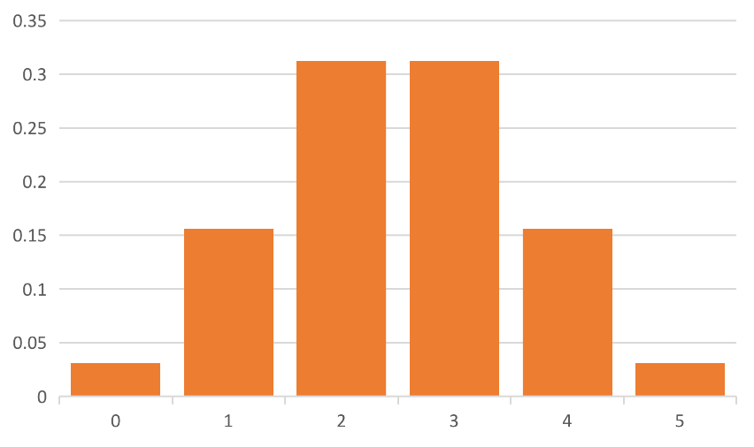
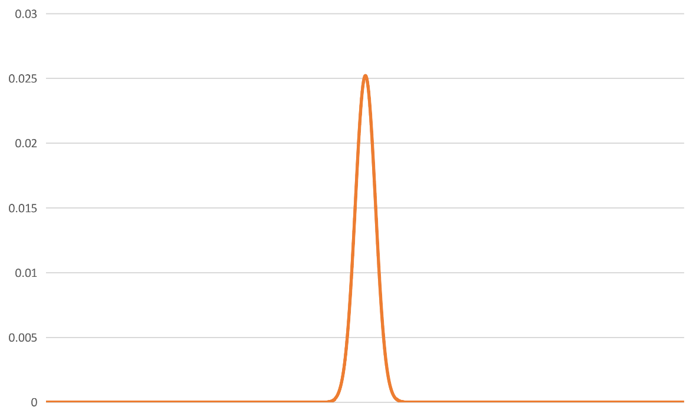
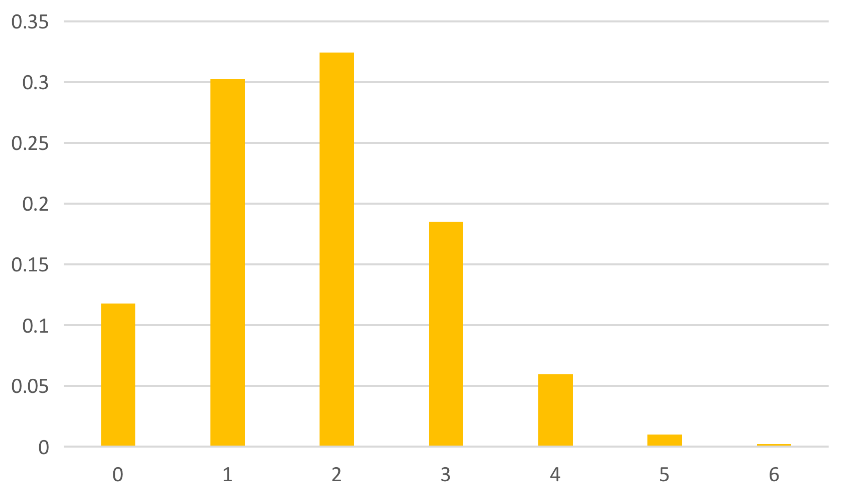
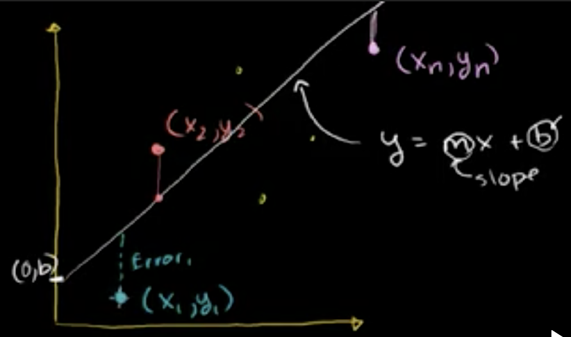

## 概述
三类统计学

+ 描述性统计学：无需将所有数据都说一次的前提下，找到一些指示性的数字来代表所有数据
+ 推论统计学：通过样本推断整体

### 描述性统计学

表示数据集中趋势的三种方式

+ 均值（算术平均，几何平均，调和平均）
+ 中位数
+ 众数

### 样本与总体
$\mu$表示总体均值

$$\mu=\dfrac{1}{N}\sum^{N}_{i=1} x_{i}$$
$\bar{X}$表示样本均值

$$\bar{X}=\dfrac{1}{n}\sum^{n}_{i=1} x_{i}$$

### 总体方差
表示离中趋势的衡量

$$\sigma^2=\dfrac{1}{N}\sum_{i=1}^N(x_i-\mu)^2\\\quad\\=\dfrac{1}{N}\sum_{i=1}^N(x_i^2-2\mu x_i + \mu^2)\\\quad\\=\dfrac{1}{N}\sum_{i=1}^Nx_i^2-\dfrac{1}{N}2\mu\sum_{i=1}^Nx_i+\dfrac{1}{N}\mu ^2\sum_{i=1}^N1\\\quad\\=\dfrac{1}{N}\sum_{i=1}^Nx_i^2-2\mu ^2+\mu ^2\\\quad\\=\color{green}\dfrac{1}{N}\sum_{i=1}^Nx_i^2-\mu ^2$$

### 样本方差
$$S_n^2=\dfrac{1}{n}\sum^{n}_{i=1} (x_{i}-\bar{X})^2\\\quad\\通常会比总体方差偏小,Why$$

### 无偏样本方差
$$S^2=S_{n-1}^2=\dfrac{1}{n-1}\sum^{n}_{i=1} (x_{i}-\bar{X})^2$$

### 标准差
$$总体标准差：\sigma=\sqrt{\dfrac{1}{N}\sum_{i=1}^N(x_i-\mu)^2}$$

$$样本标准差：S=\sqrt{\dfrac{1}{n-1}\sum^{n}_{i=1} (x_{i}-\bar{X})^2}$$

## 概率分布

### 随机变量
随机变量不是传统意义上的变量,而是一种函数,通过随机过程映射到数值的函数

$$X=\begin{cases}0&如果明天下雨\\1&如果明天不下雨\end{cases}\\\quad\\X=骰子抛出来的数值\\\quad\\X=\begin{cases}0&抛出的硬币正面朝上\\1&抛出的硬币背面朝上\end{cases}\\\quad\\X=明天的雨量$$

> + 对于连续概率分布函数,每个点对应的概率都是0,只能计算一个区间对应的概率
> + 所有概率和为1

## 二项分布
### 例子一
$X=抛五次硬币正面朝上的次数\\P(X=0)=(\dfrac{1}{2})^5=\dfrac{1}{32}\\P(X=1)=\binom{5}{1}\cdot(\dfrac{1}{2})^5=\dfrac{5}{32}\\P(X=2)=\binom{5}{2}\cdot(\dfrac{1}{2})^5=\dfrac{10}{32}\\P(X=3)=\binom{5}{3}\cdot(\dfrac{1}{2})^5=\dfrac{10}{32}\\P(X=4)=\binom{5}{4}\cdot(\dfrac{1}{2})^5=\dfrac{5}{32}\\P(X=5)=\binom{5}{5}\cdot(\dfrac{1}{2})^5=\dfrac{1}{32}$

当次数达到1000次

### 例子二
$X=投篮命中率为30\%的前提下,投6次命中的次数\\P(X=0)=0.7^{6}\\P(X=1)=0.7^5\times 0.3\times \binom{6}{1}\\P(X=2)=0.7^4\times 0.3^2 \times \binom{6}{2}\\P(X=3)=0.7^3\times 0.3^3 \times \binom{6}{3}\\P(X=4)=0.7^2\times 0.3^4 \times \binom{6}{4}\\P(X=5)=0.7^1\times 0.3^5 \times \binom{6}{5}\\P(X=6)=0.7^0\times 0.3^6 \times \binom{6}{6}$

### 期望值
$期望值E(X)实际就是总体均值\mu$
> $假设总体为3,3,4,5,6,6\\\mu=(3+3+4+5+6+6)/6\\=(3\times 2+4\times 1+5\times 1+6\times 2)/6\\=3\times(2/6)+4\times(1/6)+5\times(1/6)+6\times(2/6)=E(X)$

$对总体个数为无穷时,我们可以通过计算E(X)得到总体均值\mu$

### 二项分布的期望值
$$E(X)=\sum_{k=0}^nk\binom{n}{k}p^k(1-p)^{n-k}=\sum_{k=1}^nk\binom{n}{k}p^k(1-p)^{n-k}\\=\sum_{k=1}^nk\dfrac{n!}{k!(n-k)!}p^k(1-p)^{n-k}\\=\sum_{k=1}^n\dfrac{n!}{(k-1)!(n-k)!}p^k(1-p)^{n-k}\\=\sum_{k=1}^n\dfrac{n(n-1)!}{(k-1)!(n-k)!}p\cdot p^{k-1}(1-p)^{n-k}\\=np\sum_{k=1}^n\dfrac{(n-1)!}{(k-1)!(n-k)!}p^{k-1}(1-p)^{n-k}$$

$设a=k-1,b=n-1,则k=a+1,n=b+1$

$$原式=np\sum_{a=0}^{b}\dfrac{b!}{a!(b-a)!}p^a(1-p)^{b-a}\\=np\sum_{a=0}^b\binom{b}{a}p^a(1-p)^{b-a}\\=\color{green}np\times 1$$

## 泊松分布
$X=一小时内通过的车辆数$

$设E(X)=\lambda,也就是每小时通过\lambda辆车,根据二项分布,\lambda可以理解成,如果每分钟通过一辆车的概率是p,那么E(X)=\lambda=n\times p,其中n=60,但每分钟可能不止通过一辆车,所以,把时间拆成无穷多份,也就是当n\rightarrow\infty时$

$$1小时内通过k辆车的概率P(X=k)=\lim_{n\rightarrow\infty}\binom{n}{k}p^k(1-p)^{n-k}\\=\lim_{n\rightarrow\infty}\binom{n}{k}(\lambda/n)^k(1-\lambda/n)^{n-k}\\=\lim_{n\rightarrow\infty}\dfrac{n!}{k!(n-k)!}\cdot \dfrac{\lambda^k}{n^k}\cdot(1-\dfrac{\lambda}{n})^n\cdot(1-\dfrac{\lambda}{n})^{-k}\\=\lim_{n\rightarrow\infty}\dfrac{n\cdot(n-1)...(n-k+1)}{n^k}\cdot\dfrac{\lambda^k}{k!}\cdot(1-\dfrac{\lambda}{n})^n\cdot(1-\dfrac{\lambda}{n})^{-k}\\=(\lim_{n\rightarrow\infty}\dfrac{n^k+...}{n^k})\cdot(\lim_{n\rightarrow\infty}\dfrac{\lambda^k}{k!})\cdot(\lim_{n\rightarrow\infty}(1-\dfrac{\lambda}{n})^{n}\cdot (1-\dfrac{\lambda}{n})^{-k})\\=1\cdot \dfrac{\lambda^k}{k!}\cdot e^{-\lambda}\cdot 1\\\quad\\\color{green}P(X=k)=\dfrac{\lambda^k}{k!}e^{-\lambda}$$

$如果平均每小时通过汽车的数量为9,那么某个小时有2辆车通过的概率=\dfrac{9^2}{2!}e^{-9}$

## 大数定律
$设X=抛100枚硬币,正面朝上的硬币个数,则E(X)=50\\假设,做了n次实验\bar{X_n}=60,那么是不是继续做试验,后面的试验出现正面朝下的概率会变大?$

>$$大数定律的意思是\lim_{n\rightarrow\infty}\bar{X_n}=E(X)$$
>$前面有限次数的样本均值>E(X),后面\infty次的样本均值依旧只需要=E(X),就可以把总的均值趋向于E(X)$

## 正态分布
$$P(x)=\dfrac{1}{\sigma\sqrt{2\pi}}e^{-\dfrac{1}{2}(\dfrac{x-\mu}{\sigma})^2}$$

>$\dfrac{x-\mu}{\sigma}表示离均值有多少个标准差,也叫标准z分值$

$$P(x)=\dfrac{1}{\sqrt{2\pi\sigma^2e^{z^2}}}$$

因为正态分布是连续概率密度分布,所以在某个点的概率都是0,只是计算一个区间的概率
$$\int_{-1}^{1}P(x)dx=\int_{-1}^{1}\dfrac{1}{\sigma\sqrt{2\pi}}e^{-\dfrac{1}{2}(\dfrac{x-\mu}{\sigma})^2}dx$$

有不幸，这个积分很难算,不过针对正态分布,有个累积积分函数
$$CDF(x)=\int_{-\infty}^xP(x)dx$$

$$所以\int_{-1}^{1}P(x)dx=CDF(1)-CDF(-1)$$

+ 均值左右一个标准差概率$\approx 68.3\%$
+ 均值左右两个标准差概率$\approx 95.4\%$
+ 均值左右三个标准差概率$\approx 99.7\%$
+ 均值左右四个标准差概率$\approx 99.9937\%$
+ 均值左右五个标准差概率$\approx 99.999943\%$

### 中心极限定理
从任意分布,任意与正态分布无关的分布,取任意数量的样本值n,取n次样本然后算均值,再取n次样本算均值,如此重复,进行无限次后,会得到完美的正态分布

生活中存在很多随机过程,蛋白质之间的作用,人类的疯狂行为,这些概率分布都是不知道的,中心极限定理告诉我们,将这些综合起来,我们可以得到相同的分布

有个特殊的骰子,每一面朝上的概率$\begin{cases}1&40\%\\2&0\%\\3&10\%\\4&10\%\\5&0\%\\6&40\%\end{cases}$

每个样本的容量$n=4$

$第一个样本S_1=[1,1,3,6]均值\bar{x_1}=2.75\\第二个样本S_2=[3,4,3,1]均值\bar{x_2}=2.75\\第三个样本S_3=[1,1,6,6]均值\bar{x_3}=3.5$

### 样本均值的抽样分布
http://onlinestatbook.com/stat_sim/sampling_dist/index.html

当样本数越大，样本均值越趋近于原分布均值

偏度：与正态分布相比,均值偏左还是偏右
峰度：与正态分布相比,均值点的数量偏高还是偏低

$样本容量n与生成的分布之间的关系\\\sigma_{\bar{X}}^2表示样本分布的方差\\\sigma^2表示原分布的方差\\n表示样本容量$

$$\sigma_{\bar{X}}^2=\dfrac{\sigma^2}{n}$$

#### 例题一
男性在户外活动时平均喝2升水,标准差是0.7升,组织一天户外活动,50名男性,那么准备110升水不够的概率有多大
> 男性需要的用水量不一定符合正态分布
> 
> 那么问题中50名男性准备110升水不够的概率,也就是选取50个样本,平均值大于2.2的概率有多大
> 
> 选取样本的标准差$\sigma_{\bar{X}}=\dfrac{\sigma}{\sqrt{n}}=\dfrac{0.7}{\sqrt{50}}\approx 0.099\\z=\dfrac{2.2-2}{0.099}\approx 2.02\\查z表得到z=+2.02对应的概率为97.83\%$

#### 例题二
农场收获了200,000个苹果,从中选取36个样本,样本中苹果重量均值是112克,标准差为40克,问这200,000个苹果重量均值在100到124克之间的概率是多少
> 设总体均值为$\mu$,标准差为$\sigma$,不断以容量为36选取样本,可以得到样本抽样均值分布,这,接近是一个正态分布,其均值为$\mu_{\bar{X}}=\mu$,其标准差$\sigma_{\bar{X}}=\sigma/\sqrt{36}=\dfrac{1}{6}\sigma\\\quad\\题中要求\mu在100到124之间的概率\\也就是\mu在样本均值112克左右12克范围的概率\\也就是样本均值在\mu左右12克范围的概率\\\quad\\\mu\approx S=40\\\sigma_{\bar{X}}=\dfrac{1}{6}\sigma\approx 6.67\\z=12/\sigma_{\overleftarrow{X}}= 1.8\\\quad\\原题相当于求样本均值在\mu左右1.8个标准差范围内的概率是多少\\查z表格得到,小于右侧1.8个标准差的概率为96.41\%\\那么从均值到右侧1.8个标准差的概率为96.41\%-50\%=46.41\%\\那么在均值左右1.8个标准差范围内的概率为46.41\%\times 2=92.82\%$

## 伯努利分布
如果总体中有60%选择是,40%选择否,这个分布的期望值是多少,方差是多少?
> 设选择是对应的数值为1,选择否对应的数值为0
> 
> $\mu=1\times 0.6+0\times 0.4=0.6$,意味着如果调研100个人,将有60人选择是,40人选择否
> 
> $\sigma^2=0.4(0-0.6)^2+0.6(1-0.6)^2=0.24\\\sigma\approx 0.49$

$成功的概率为p,对应值为1,失败的概率为1-p,对应值为0\\\mu=(1-p)\cdot 0+p\cdot 1=p\\\sigma^2=(1-p)(0-p)^2+p(1-p)^2=p^2-p^3+p-2p^2+p^3=p(1-p)$

### 例题一
全国有1亿人口,总统选举有两位候选人A和B,随机调查100人,57人说选A,43人说选B

> $给A的投票记为0,给B的投票记为1,设投票给B的概率为p\\则样本均值\bar{X}=(57\times 0+43\times 1)/100=0.43\\样本方差S^2=(57\times (0-0.43)^2+43\times(1-0.43)^2)/(100-1)\approx 0.2475\\样本标准差S=\sqrt{0.2475}\approx 0.5\\\quad\\这次随机调查100人得到的均值\bar{X},相当于来自样本均值的抽样分布\\样本均值抽样分布的均值\mu_{\bar{X}}=总体均值\mu=p\\样本均值抽样分布的标准差\sigma_{\bar{X}}=\dfrac{\sigma}{\sqrt{n}}=\dfrac{1}{10}\sigma\\\quad\\在不知道\sigma的前提下,样本标准差S是对总体标准差的\sigma的最佳估计\\所以\sigma_{\bar{X}}=\dfrac{1}{10}S=0.05\\\quad\\样本均值\bar{X}=0.43在样本均值抽样分布的均值\mu_{\bar{X}}两个标准差范围内,也就是置信度达到95.4\%\\那么\mu_{\bar{X}}\in[0.43-2\sigma_{\bar{X}},0.43+2\sigma_{\bar{X}}]=[0.33,0.53]\\\quad\\所以投票给B的概率p=\mu=\mu_{\bar{X}}\in[0.33,0.53]的置信度为95.4\%\\也可以换个说法,43\%的人投票给B,57\%投给A的误差范围为10\%$

### t分布
对于小容量样本而言,$\color{green}通常来说,当n小于30时,正态分布预估都是糟糕的估计$,$\sigma_{\bar{X}}=\dfrac{\sigma}{\sqrt{n}}\approx\dfrac{S}{\sqrt{n}},S会对\sigma低估,从而\sigma_{\bar{X}}也被低估,不能使用z表格,而要用t表格,查找$

### 例题二
有一个生物学家做了一个实验,给100只老鼠注射了药物,已知如果不注射药物,老鼠的平均反应时间为1.2秒,现在这100只老鼠的平均反应时间为1.05秒,标准差为0.5秒,请问,这个药物有效吗?

> $H_0假设药物无效,\mu=1.2s\\H_1假设药物有效,\mu\neq1.2s\\假设H_0是正确的,那么得到均值1.05s,标准差为0.5s的概率是多少\\样本均值抽样分布的均值\mu_{\bar{X}}=\mu=1.2s\\样本均值抽样分布的标准差\sigma_{\bar{X}}=\dfrac{\sigma}{\sqrt{n}}=\dfrac{1}{10}\sigma\approx\dfrac{1}{10}S=\dfrac{1}{10}\cdot 0.5=0.05s\\1.05s离\mu_{\bar{X}}的距离z=(1.2-1.05)/0.05=3个标准差\\\quad\\如果H_0假设成立,均值出现3个标准差以外的概率为0.3\%,极端假设成立的p值为0.3\%\\如果H_0假设成立,均值出现低于3个标准差以外的概率为0.15\%$

### 例题三
为了验证假设是不是30%的家庭能连入互联网(95%的置信度),随机调研了150个家庭,其中57个可以接入

> $无法接入取值为0,可以接入取值为1\\H_0假设小于30\%的家庭可以接入互联网为真,取P_{H_0}=30\%,则\sigma_{H_0}=\sqrt{0.3\cdot 0.7} \approx 0.4582\\\quad\\样本均值\bar{X}=57/150\approx 0.38\\因为np=150\times 0.38 > 5 并且 n(1-p)=150\times 0.62 > 5,所以可以用正态分布来近似样本均值抽样分布\\样本均值抽样分析的标准差\sigma_{\bar{X}}=\dfrac{\sigma}{\sqrt{n}}=0.4582/\sqrt{150}\approx 0.037\\z=(0.38-0.3)/0.037\approx 2.14\\查z表格得到95\%对应的标准差为1.65\\也就是如果H_0成立,小于30\%的家庭可以接入互联网,95\%的置信度能得到样本均值最多为0.3+1.65\times 0.037=0.36105 < 0.38$

## 均值之差
$有两个相互独立的随机变量X和Y\\E(X)=\mu_X\\Var(X)=E((X-\mu_X)^2)=\sigma_X^2\\E(Y)=\mu_Y\\Var(Y)=E((Y-\mu_Y)^2)=\sigma_Y^2\\如果有A=X+Y,则有E(A)=E(X)+E(Y);\mu_A=\mu_X+\mu_Y\\Var(A)=Var(X)+Var(Y);\sigma_A^2=\sigma_X^2+\sigma_Y^2\\如果有B=X-Y,则有E(B)=E(X)-E(Y);\mu_B=\mu_X-\mu_Y\\Var(B)=Var(X)+Var(Y);\sigma_B^2=\sigma_X^2+\sigma_Y^2$

> $\sigma_B^2=\sigma_{X-Y}^2=\sigma_{X+(-Y)}^2=\sigma_X^2+\sigma_{-Y}^2\\\sigma_{-Y}^2=Var(-Y)=E((-Y-\mu_{-Y})^2)=E((-1)^2(Y+\mu_{-Y})^2)\\=E((Y+\mu_{-Y})^2)=E((Y-\mu_Y)^2)=\sigma_Y^2\\\therefore\sigma_B^2=\sigma_X^2+\sigma_Y^2$

我们要检验一种低脂节食方法的有效性,抽样100人采取低脂节食,另外抽样100人采取非低脂的普通节食方法,少吃几乎等量的食物,4个月后,第一组体重平均减轻9.31kg,样本标准差为4.67kg,第二组平均减轻7.4kg,样本标准差为4.04kg

> $低脂组:\bar{X_1}=9.31,S_1=4.67\\普通组:\bar{X_2}=7.4,S_2=4.04\\\bar{X_1}-\bar{X_2}=9.31-7.4=1.91\\我们要记算该均值左右两个标准差范围,以确保95.4\%的置信度\\\sigma_{\bar{X_1}-\bar{X_2}}^2=\sigma_{\bar{X_1}}^2+\sigma_{\bar{X_2}}^2=(S_1/\sqrt{100})^2+(S_2/\sqrt{100})^2\\\therefore\sigma_{\bar{X_1}-\bar{X_2}}\approx 0.617\\因此低脂节食可额外减脂1.91\pm 2\sigma=1.91\pm 1.234$

### 例题一
$候选人投票中,男性有P_1的概率投给该候选人,女性有P_2的概率投给该候选人\\随机调研了1000名男性,642名投给了候选人\\随机调研了1000名女性,591名投给了候选人\\求男性和女性投票之间是否有显著差别$

> $记投票给候选人对应的值为1,则\\\mu_1=P_1,\sigma_1^2=P_1(1-P_1)\\\mu_2=P_2,\sigma_2^2=P_2(1-P_2)\\原题要求就是求P_1-P_2的95\%的置信区间\\\bar{P_1}=0.642;\mu_{\bar{P_1}}=P_1;\sigma_{\bar{P_1}}^2=\dfrac{P_1(1-P_1)}{1000}\\\bar{P_2}=0.591;\mu_{\bar{P_2}}=P_2;\sigma_{\bar{P_2}}^2=\dfrac{P_2(1-P_2)}{1000}\\\quad\\\mu_{\bar{P_1}-\bar{P_2}}=P_1-P_2\approx \bar{P_1}-\bar{P_2}=0.051\\\sigma_{\bar{P_1}-\bar{P_2}}=\sqrt{\dfrac{P_1(1-P_1)+P_2(1-P_2)}{1000}}\approx\sqrt{\dfrac{\bar{P_1}(1-\bar{P_1})+\bar{P_2}(1-\bar{P_2})}{1000}}=0.022\\95\%的置信度相当于左右分别1.96个标准差=1.96\times 0.022\approx0.043\\\quad\\95\%的置信度差别在0.051\pm0.043$

## 线性回归中的平方误差
$在XY坐标系中,有n个点(x_1,y_1),(x_2,y_2)...(x_n,y_n),找到一条直线,最小化这些点到该直线的平方误差$

> $设直线为y=mx+b\\Error_n=y_n-(mx_n+b)\\SE_{Line}=(y_1-(mx_1+b))^2+(y_2-(mx_2+b))^2+...+(y_n-(mx_n+b))^2\\=(y_1^2-2y_1(mx_1+b)+(mx_1+b)^2)+...+(y_n^2-2y_n(mx_n+b)+(mx_n+b)^2)\\=(y_1^2-2y_1mx_1-2y_1b+m^2x_1^2+2bmx_1+b^2)+...+(y_n^2-2y_nmx_n-2y_nb+m^2x_n^2+2bmx_n+b^2)\\=(y_1^2+...+y_n^2)-2m(x_1y_1+...+x_ny_n)-2b(y_1+...+y_n)+m^2(x_1^2+...+x_n^2)+2mb(x_1+...+x_n)+nb^2\\\quad\\\bar{y^2}=\dfrac{1}{n}(y_1^2+y_2^2+...+y_n^2)\Rightarrow y_1^2+y_2^2+...+y_n^2=n\bar{y^2}\\x_1y_1+x_2y_2+...+x_ny_n=n\bar{xy}\\y_1+y_2+...+y_n=n\bar{y}\\x_1^2+x_2^2+...+x_n^2=n\bar{x^2}\\x_1+x_2+...+x_n=n\bar{x}\\\quad\\则SE_{Line}=n\bar{y^2}-2mn\bar{xy}-2bn\bar{y}+m^2n\bar{x^2}+2mbn\bar{x}+nb^2\\\quad\\在上述等式中,只有m,b,SE_{Line}三个变量,其他都是常量\\相当于求这个三维图像的SE_{Line}的最小值\\\quad\\\dfrac{\partial{SE}}{\partial{m}}=-2n\bar{xy}+2n\bar{x^2}m+2bn\bar{x}=0\Rightarrow\bar{xy}-\bar{x^2}m-b\bar{x}=0\Rightarrow\bar{x^2}m+b\bar{x}=\bar{xy}\Rightarrow\dfrac{\bar{x^2}}{\bar{x}}m+b=\dfrac{\bar{xy}}{\bar{x}}\\\dfrac{\partial{SE}}{\partial{b}}=-2n\bar{y}+2mn\bar{x}+2nb=0\Rightarrow\bar{y}-\bar{x}m-b=0\Rightarrow\bar{x}m+b=\bar{y}\\\quad\\可知在目标直线y=mx+b上有两个点(\bar{x},\bar{y})和(\dfrac{\bar{x^2}}{\bar{x}},\dfrac{\bar{xy}}{\bar{x}})$

$$m=\dfrac{\bar{x}\bar{y}-\bar{xy}}{(\bar{x})^2-\bar{x^2}}\\b=\bar{y}-\bar{x}m$$

$y的总波动SE_{\bar{y}}=(y_1-\bar{y})^2+(y_2-\bar{y})^2+...+(y_n-\bar{y})^2\\不被回归线所影响的y的波动,也就是实际y与回归线的误差SE_{Line}\\\therefore y的总波动中没有被x的波动所描述的百分比为\dfrac{SE_{Line}}{SE_{\bar{y}}}\\\therefore y的总波动中被直线所描述的百分比为1-\dfrac{SE_{Line}}{SE_{\bar{y}}},该系数被称之为决定系数r^2\\拟合结果越好,r^2越接近1$

## 协方差
两随机变量,离各自均值距离之积的期望值$E[(X-E[X])(Y-E[Y]]$表示两个变量多大程度上一同变化

$E[(X-E[X])(Y-E[Y]]\\=E[XY-XE[Y]-YE[X]+E[X]E[Y]]\\=E[XY]-E[XE[Y]]-E[YE[X]]+E[E[X]E[Y]]\\=E[XY]-E[Y]E[X]-E[X]E[Y]+E[X]E[Y]\\=E[XY]-E[X]E[Y]\\\quad\\如果只有一些样本,那么\\E[XY]\approx \bar{XY}\\E[X]=\bar{X}\\E[Y]=\bar{Y}\\\quad\\则原式=\bar{XY}-\bar{X}\bar{Y}这是回归斜率m的分子部分\\\quad\\对总体线性回归斜率的近似\hat{m}=\dfrac{\bar{XY}-\bar{X}\bar{Y}}{\bar{X^2}-(\bar{X})^2}=\dfrac{\bar{XY}-\bar{X}\bar{Y}}{\bar{XX}-\bar{X}\bar{X}}=\dfrac{X与Y的协方差}{X与X的协方差}=\dfrac{X与Y的协方差}{X的方差}$

## $\chi^2$分布
$\chi^2分布用于判断理论分布与实际观测的吻合程度\\X\sim N(0,1)表示X为服从E(X)=0,Var(X)=1的正态分布\\Q=X^2,此时Q一个就是\chi^2分布的随机变量,或者记作Q\sim \chi_1^2\\因为Q是\chi^2分布的一员,只是一个独立的标准正态分布随机变量平方之和,只有一个自由度\\Q_2=X_1^2+X_2^2,则Q_2\sim\chi_2^2\\Q_3=X_1^2+X_2^2+X_3^2,则Q_3\sim\chi_3^2$

### 例题一
我打算购入一家餐厅,于是询问了该餐厅的顾客情况,得到下面这个表格

|Day|M|T|W|T|F|S|
|-|-|-|-|-|-|-|-|
|期望%|10|10|15|20|30|15|
|观察(客户数)|30|14|34|45|57|20|

> $H_0:店主给的分布是正确的,显著性水平为5\%\\根据店主给的分布,期望的客户数与观察到的客户数对比如下$
>
> |Day|M|T|W|T|F|S|
> |-|-|-|-|-|-|-|-|
> |观察(客户数)|30|14|34|45|57|20|
> |期望(客户数)|20|20|30|40|60|30|
> 
> $假设服务\chi^2分布,则\chi^2=\dfrac{(30-20)^2}{20}+\dfrac{(14-20)^2}{20}+...+\dfrac{(20-30)^2}{30}=11.44\\有6个数据,但是有了前面5个就可以算出第6个,所以自由度为5\\查\chi^2分布表显著性指标为5\%对应的\chi^2值为11.07\\也就是\chi^2极端值达到11.07的概率为5\%,我们得到的结果11.44>11.07概率就更小了$

### 例题二
假设有一些人相信能预防流感的药草,为了检验这个,我们到流感季节,随机将人们分成三组,A组服用药草1,B组服用药草2,C组服用安慰剂

||药草1|药草2|安慰剂|总人数|
|-|-|-|-|-|
|生病|20|30|30|80|
|不生病|100|110|90|300|
|总人数|120|140|120|380|

> 假设药草无效