### 图的一些概念
#### 无序积
$A\And B=\{\{a,b\}|a\in{A}\wedge b\in{B}\}$
+ $记\{a,b\}=(a,b)$
+ $允许a=b$
+ $(a,b)=(b,a)$

#### 无向图
$G=\langle{V,E}\rangle$
+ $V\not ={\empty},顶点集$
+ $E\subseteq V\And V,边集(多重集:允许有多条一样的边)$

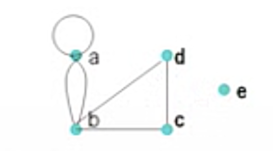
$G=\langle{V,E}\rangle$
+ $V=\{a,b,c,d,e\}$
+ $E=\{(a,a),(a,b),(a,b),(b,c),(c,d),(b,d)\}$

#### 有向图
$D=\langle{V,E}\rangle$
+ $V\not ={\empty},顶点集$
+ $E\subseteq V\times V,边集(多重集:允许有多条一样的边)$
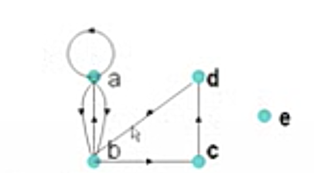
$D=\langle{V,E}\rangle$
+ $V=\{a,b,c,d,e\}$
+ $E=\{\langle{a,a}\rangle,\langle{a,b}\rangle,\langle{a,b}\rangle,\langle{b,a}\rangle,\langle{b,c}\rangle,\langle{c,d}\rangle,\langle{d,b}\rangle\}$

#### 其他概念
+ $若G=\langle{V,E}\rangle,则顶点集V(G)=V,边集E(G)=E$
+ $若D=\langle{V,E}\rangle,则顶点集V(D)=V,边集E(D)=E$
+ $若|V(G)|=n,则该图称为n阶图$
+ $若|V(G)|\lt\infin,则该图称为有限图$
+ $若E=\empty,则该图称为零图,记作N_n,表示n阶零图$
+ $一阶零图N_1称为平凡图$
+ $V=E=\empty,则该图称为空图,记作\empty$
+ $顶点或边带标记的图,称为标定图$
+ $顶点或边都不带标记的图,称为非标定图$
+ $有边相连的两个顶点是相邻的,有公共顶点的两条边是相邻的$
+ $有向图中,相邻的两个顶点,存在u邻接到(to)v,同时v邻接于(from)u$
+ $一条边的端点与这条边是关联的$
+ $只有一个顶点关联的边,称为环$
+ $不与任何边关联的顶点,称为孤立点$
+ $无向图中,端点相同的两条无向边是平行边$
+ $有向图中,起点与终点相同的两条有向边是平行边$
+ $无向图中的开邻域N_G(v)=\{u\in V(G)|(u,v)\in E(G)\wedge u\not ={v}\}$
+ $无向图中的闭邻域\overline{N_G(v)}=N_G[v]=N_G(v)\cup\{v\}$
+ $关联集I_G(v)=\{e|e与v关联\}$
+ $后继\Gamma_D^+(v)=\{u\in{V(D)}|\langle{v,u}\rangle\in{E(D)}\wedge{u\not ={v}}\}$
+ $前驱\Gamma_D^-(v)=\{u\in{V(D)}|\langle{u,v}\rangle\in{E(D)}\wedge{u\not ={v}}\}$
+ $有向图中的开邻域N_D(v)=\Gamma_D^+(v)\cup \Gamma_D^-(v)$
+ $有向图中的闭邻域\overline{N_D(v)}=N_D[v]=N_D(v)\cup\{v\}$
+ $顶点的度d_G(v)=与v关联的边的次数之和$
+ $有向图的出度d_D^+(v)=与v关联的出边的次数之和$
+ $有向图的入度d_D^-(v)=与v关联的入边的次数之和$
+ $有向图顶点的度d_D(v)=d_D^+(v) + d_D^-(v)$
+ $最大度\Delta(G)=max\{d_G(v)|v\in V(G)\}$
  + $最大出度\Delta^+(G)=max\{d_G^+(v)|v\in V(G)\}$
  + $最大入度\Delta^-(G)=max\{d_G^-(v)|v\in V(G)\}$
+ $最小度\delta(G)=min\{d_G(v)|v\in V(G)\}$
  + $最小出度\delta^+(G)=min\{d_G^+(v)|v\in V(G)\}$
  + $最小入度\delta^-(G)=min\{d_G^-(v)|v\in V(G)\}$

#### 图论基本定理(握手定理)
$设G=\lang{V,E}\rang是无向图,V=\{v_1,v_2,...,v_n\},|E|=m,则$
$$d(v_1)+d(v_2)+...+d(v_n)=2m$$

$设D=\lang{V,E}\rang是有向图,V=\{v_1,v_2,...,v_n\},|E|=m,则$
$$\begin{aligned}&d^+(v_1)+d^+(v_2)+...+d^+(v_n)\\=&d^-(v_1)+d^-(v_2)+...+d^-(v_n)\\=&m\end{aligned}$$

#### 又是一批概念
+ $简单图：既无环也无平行边的图\Rightarrow 0\le\Delta(G)\le n-1$
+ $k-正则图：所有顶点的度都是k$
+ $度数列：设G=\lang{V,E}\rang,V=\{v_1,v_2,...,v_n\},称d=(d(v_1),d(v_2),...,d(v_n))为G的度数列$
+ $可图化：设非负整数列d=(d_1,d_2,...,d_n),若存在图G使得G的度数列是d,则称d是可图化的$
  + $非负整数列d=(d_1,d_2,...,d_n)可图化\Leftrightarrow d_1+d_2+...+d_n\equiv{0}\pmod{2}$
+ $可简单图化：设非负整数列d=(d_1,d_2,...,d_n),若存在简单图G使得G的度数列是d,则称d是可简单图化的$
  + $设非负整数列d=(d_1,d_2,...,d_n)满足\\d_1+d_2+...+d_n\equiv{0}\pmod{2}\\n-1\ge d_1\ge d_2\ge...\ge d_n\ge 0\\则d可简单图化\Leftrightarrow d'(d_2-1,d_3-1,...,d_{d_1+1}-1,d_{d_1+2},...,d_n)可简单图化$
  > $d=(4,4,3,3,2,2),d'=(3,2,2,1,2)\\1.把d降序排列\\2.取出d中第一个元素k,删掉\\3.把第2到第k+1个元素减1\\4.从k+2个元素开始保持不变\\5.d'构建完成$
  + $设非负整数列d=(d_1,d_2,...,d_n)满足\\n-1\ge d_1\ge d_2\ge...\ge d_n\ge 0\\则d可简单图化\Leftrightarrow d_1+d_2+...+d_n\equiv{0}\pmod{2}\\并且对r=1,2,...,n-1有\\d_1+d_2+...+d_r\le r(r-1)+min\{r,d_{r+1}\}+min\{r,d_{r+2}\}+...+min\{r,d_n\}$  
+ $图同构：设G_1=\lang{V_1,E_1}\rang,G_2=\lang{V_2,E_2}\rang\\G_1\cong{G_2}\Leftrightarrow\exist{f}:V_1\rightarrow{V_2}双射,满足\\(\forall{u,v\in{V_1}})[(u,v)\in{E_1}\leftrightarrow(f(u),f(v))\in{E_2}]$
  + 如何判断两个图是否同构：NAUTY算法
  + 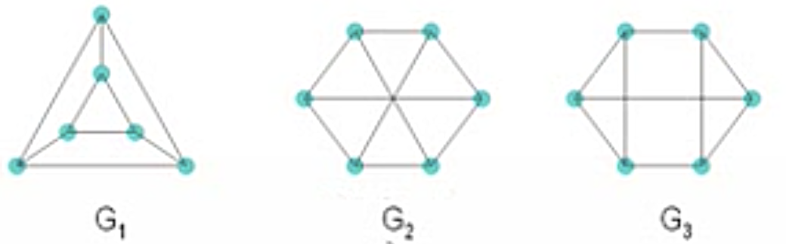$G_1\cong{G_3}\\G_1\not\cong{G_2}$
  + 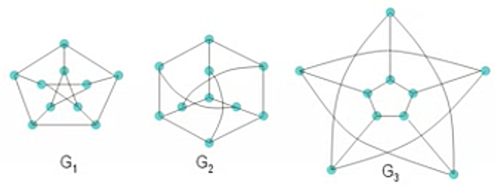$G_1\cong{G_2}\cong{G_3}$
+ $有向图同构：设D_1=\lang{V_1,E_1}\rang,D_2=\lang{V_2,E_2}\rang\\D_1\cong{D_2}\Leftrightarrow\exist{f}:V_1\rightarrow{V_2}双射,满足\\(\forall{u,v\in{V_1}})[\lang{u,v}\rang\in{E_1}\leftrightarrow\lang{f(u),f(v)}\rang\in{E_2}]$

#### 图族
+ 完全图：边数达到最大的简单图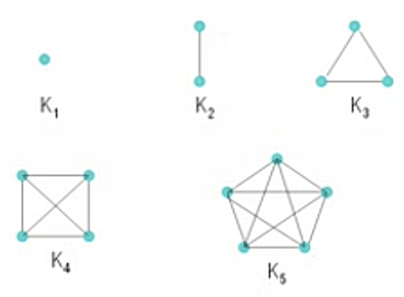
+ 有向完全图
+ 竞赛图：无向完全图每一条边随机加一个方向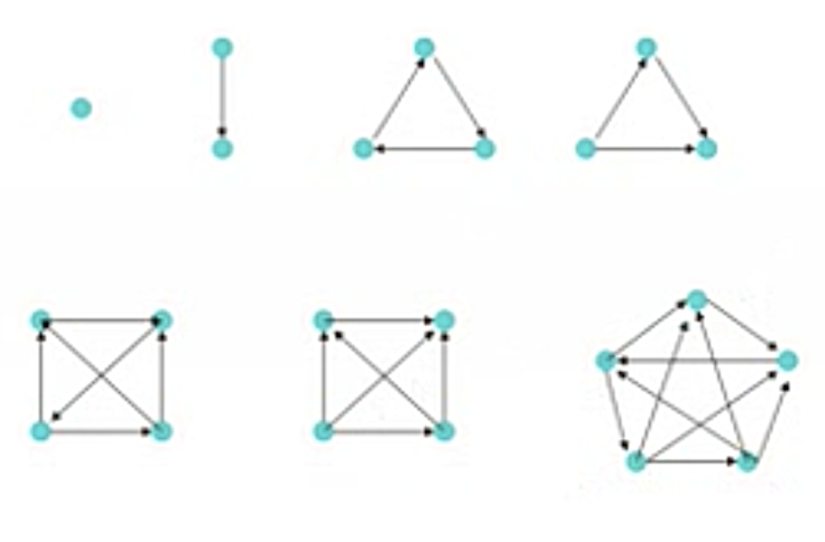
> 可以用于显示小组循环赛的结果
+ 柏拉图图(五种正多面体)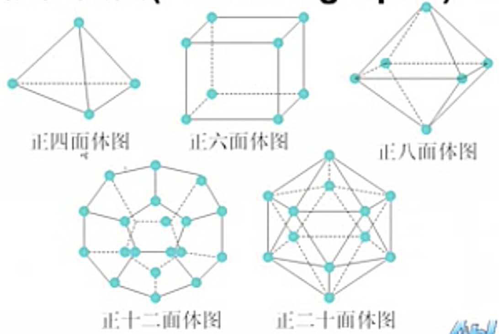
+ 彼德森图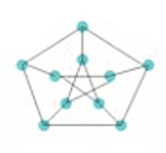
+ 库拉图斯基图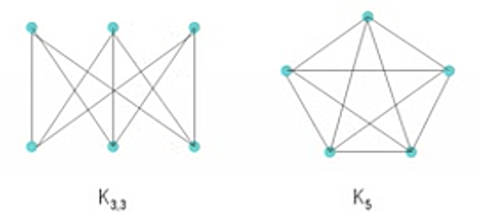
+ r部图：$G=\lang{V,E}\rang,V=V_1\cup{V_2}\cup...\cup{V_r},V_i\cap{V_j}=\empty(i\not ={j}),E\subseteq{\cup_{i\not ={j}}(V_i\And{V_j})}\\也记作G=\lang{V_1,V_2,...,V_r;E}\rang$
+ 二部图：$G=\lang{V_1,V_2;E}\rang,也称为偶图$
+ 完全r部图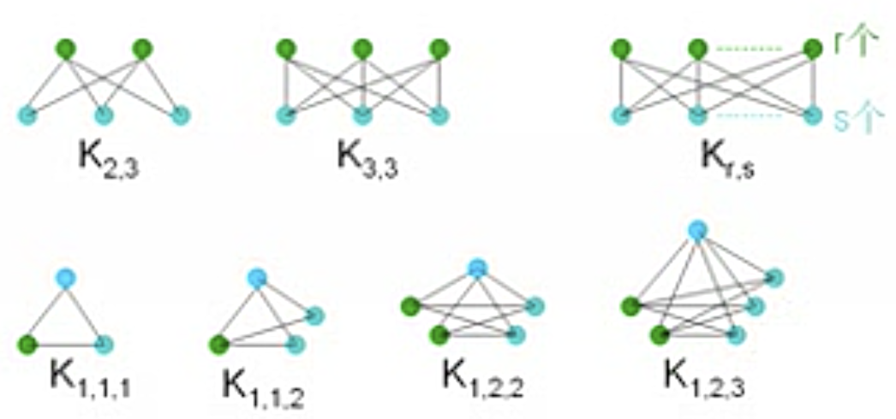
+ 路径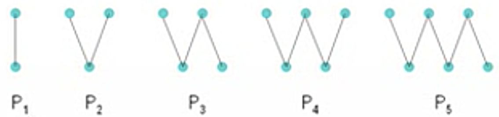
+ 圈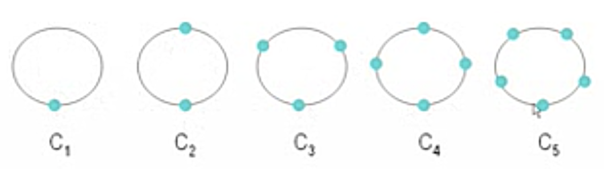
+ 轮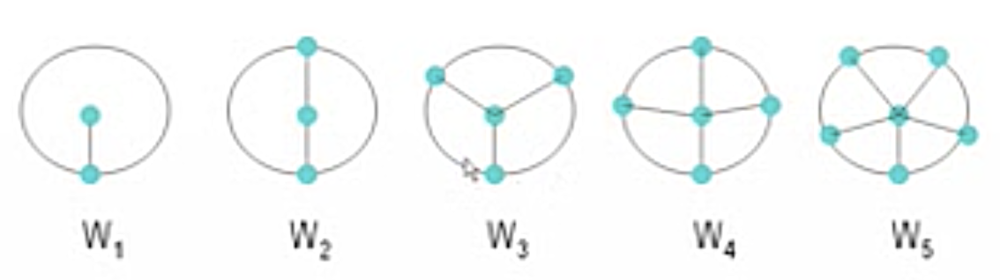
+ 超立方体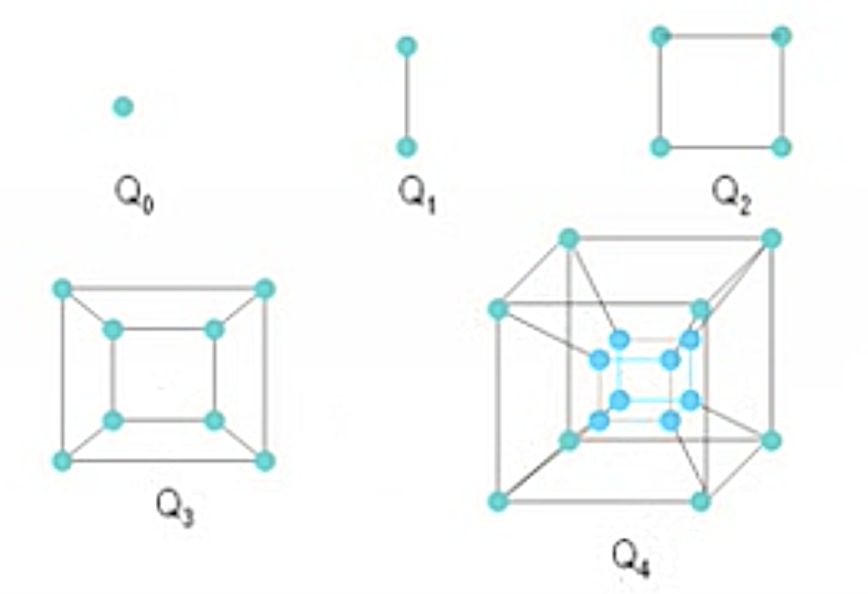

#### 子图
+ 子图：$G=\lang{V,E}\rang,G'=\lang{V',E'}\rang\\G'\subseteq{G}\Leftrightarrow{V'\subseteq{V}\wedge E'\subseteq{E}}$
+ 真子图：$G'\subset{G}\Leftrightarrow{V'\subset{V}\wedge E'\subset{E}}$
+ 生成子图：$G'是G的生成子图\Leftrightarrow G'\subseteq{G}\wedge V'=V$
+ 导出子图：$G=\lang{V,E}\rang\\\begin{cases}若V_1\subset{V},E_1=E\cap{V_1\And{V_1}},则称G[V_1]=\lang{V_1,E_1}\rang为由V_1的导出子图\\若\empty\not ={E_1}\subset{E},V_1=\{v|v与E_1中的边关联\},则称G[E_1]=\lang{V_1,E_1}\rang为由E_1的导出子图\end{cases}$

#### 补图
+ 补图：$G=\lang{V,E}\rang,\bar{G}=\lang{V,E(K_n)-E}\rang$
+ 自补图：$G\cong\bar{G}$

#### 图的运算
+ 删除
  + $G-e=\lang{V,E-\{e\}}\rang,删除边e$
  + $G-E'=\lang{V,E-E'}\rang,删除边集E'$
  + $G-v=\lang{V-\{v\},E-I_G(v)}\rang,删除顶点v及v所关联的所有边$
  + $G-V'=\lang{V-V',E-I_G(V')}\rang,删除顶点集V'及V'所关联的所有边$
+ 收缩
  + $G\backslash e:e=(u,v),删除e,合并u与v$
+ 加新边
  + $G\cup(u,v)=G+(u,v)=\lang{V,E\cup\{u,v\}}\rang$
+ $设G_1=\lang{V_1,E_1}\rang,G_2=\lang{V_2,E_2}\rang$
  + $G_1与G_2不交\Leftrightarrow V_1\cap V_2=\empty$
  + $G_1与G_2边不交\Leftrightarrow E_1\cap E_2=\empty$
+ $设G_1=\lang{V_1,E_1}\rang,G_2=\lang{V_2,E_2}\rang且都无孤立点$
  + $并图:G_1\cup G_2=\lang{V(E_1\cup E_2),E_1\cup E_2}\rang$
  + $交图:G_1\cap G_2=\lang{V(E_1\cap E_2),E_1\cap E_2}\rang$
  + $差图:G_1-G_2=\lang{V(E_1-E_2),E_1-E_2}\rang$
  + $环和:G_1\oplus{G_2}=\lang{V(E_1\oplus{E_2}),E_1\oplus{E_2}}\rang$
+ $设G_1=\lang{V_1,E_1}\rang,G_2=\lang{V_2,E_2}\rang且不交无向图$
  + $联图\pod{join}：G_1+G_2=\lang{V_1\cup{V_2},E_1\cup E_2\cup(V_1\And{V_2})}\rang$
  + $K_r+K_s=K_{r+s}$
  + $N_r+N_s=K_{r,s}$
  + $n=n_1+n_2,m=m_1+m_2+n_1n_2$
+ $设G_1=\lang{V_1,E_1}\rang,G_2=\lang{V_2,E_2}\rang无向简单图$
  + $积图\pod{product}：G_1\times{G_2}=\lang{V_1\times{V_2},E}\rang,其中\\E=\{(\lang{u_i,u_j}\rang,\lang{u_k,u_s}\rang)\mid(\lang{u_i,u_j}\rang,\lang{u_k,u_s}\rang\in{V_1}\times{V_2})\wedge((u_i=u_k\wedge{u_j}与u_s相邻)\vee(u_j=u_s\wedge{u_i}与u_k相邻))\}$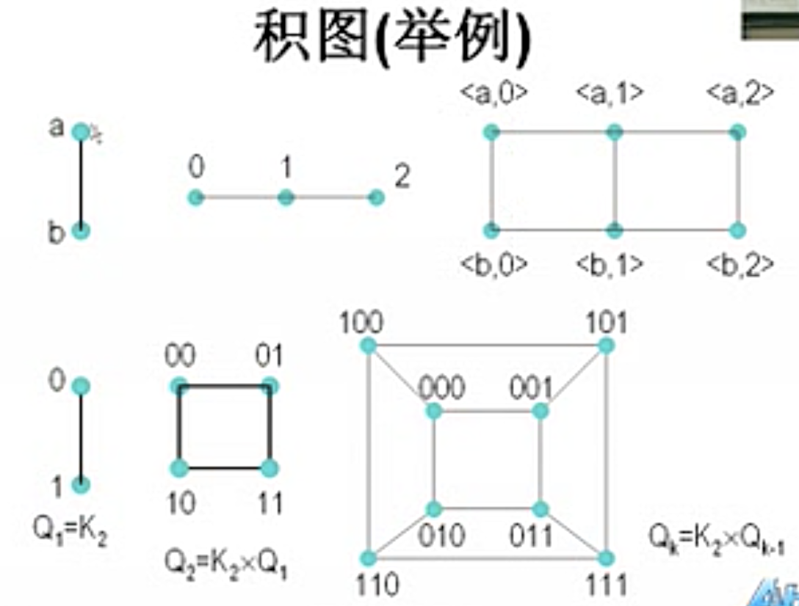
  + $n=n_1n_2,m=n_1m_2+n_2m_1$

