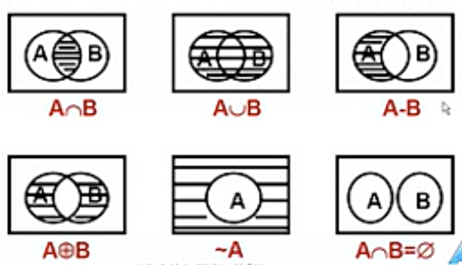

## 集合的概念与运算
### 集合的概念
+ 一些对象的整体就构成了集合,用$A,B,C,...$表示
+ 这些对象被称为元素或成员,用$a,b,c,...$表示
+ $a\in A$表示$a$是$A$的元素
+ $a\notin A$表示$a$不是$A$的元素

#### 罗素悖论
+ 所有这200个豆子,组成一个集合,元素是其中的200个豆子
+ 这200个豆子,可以每10个一组,形成20个集合,那么所有元素个数大于5的集合的集合,既包括了20个豆子集合,也包括该集合是本身
+ 对于集合$S=\{X|X\notin X\}$请问$S\in S$吗?

#### 集合论公理
+ 外延公理:所含元素相同的两个集合是相等的
+ 空集存在公理:空集合存在
+ 无序对公理:对任意的集合$A和B,那么\{A,B\}$也是一个集合
+ 并集公理:对任意的集合$A$,其中的元素也是集合,那么$\cup A$也是一个集合
+ 幂集公理:对任意的集合$A$,其所有子集合构成的$P(A)$也是一个集合
+ 联集公理
+ 选择公理

#### 集合的表示
+ 列举法
  + $A=\{a,b,c,d,...,x,y,z\}$
  + $B=\{0,1,2,3,4,5,6,7,8,9\}$
+ 描述法
  + $A=\{x|P(x)\}=\{x|x是英文字母\}$
  + $B=\{2k+1|k是非负整数\}$
+ 特征函数法
  + $集合A的特征函数为\chi_{A}(x)=\begin{cases}1&若x\in A\\0&若x\notin A\end{cases}\\表示x在集合中出现的次数\\如果是多重集,那么特征函数的值可以大于1$
+ 文氏图
+ 常用的数集合
  + $N:自然数的集合\{0,1,2,3,...\}$
  + $Z:整数的集合\{0, \pm{1},\pm{2},\pm{3},...\}$
  + $Q:有理数的集合$
  + $R:实数的集合$
  + $C:复数的集合$

### 集合之间的关系
#### 子集
$B\subseteq A\Leftrightarrow\forall{x}(x\in{B}\rightarrow x\in{A})\\B\subsetneq A\Leftrightarrow\exist{x}(x\in{B}\wedge x\notin{A})$
> 证明
> 
> $\begin{aligned}B\subsetneq{A}&\Leftrightarrow\neg(B\subseteq A)\\&\Leftrightarrow\neg\forall{x}(x\in B\rightarrow x\in A)\\&\Leftrightarrow\exist{x}{\neg(\neg{x}\in B\vee x\in A)}\\&\Leftrightarrow\exist{x}(\neg\neg x\in B\wedge\neg x\in A)\\&\Leftrightarrow\exist{x}(x\in B\wedge x\notin A)\end{aligned}$

#### 相等
$\begin{aligned}A=B&\Leftrightarrow{A\subseteq B \wedge B\subseteq A}\\&\Leftrightarrow\forall{x}(x\in A\leftrightarrow x\in B)\end{aligned}$

#### 真子集
$A\subset B\Leftrightarrow A\subseteq B\wedge A\not ={B}$
#### 空集
$没有任何元素的集合是空集,记作\emptyset$

#### 定理1
$对任意集合A,\emptyset\subseteq A$
> 证明如下
> 
> $\begin{aligned}\emptyset\subseteq{A}&\Leftrightarrow\forall{x}(x\in\emptyset\rightarrow x\in A)\\&\Leftrightarrow\forall{x}(0\rightarrow x\in A)\\&\Leftrightarrow 1\end{aligned}$

#### 全集
$如果限定所讨论的集合都是某个集合的子集,则称这个集合是全集,记作E$

#### 幂集
$A的全体子集组成的集合,称为A的幂集,记作P(A)$
$$P(A)=\{x|x\subseteq A\}$$
$x\in{P(A)}\Leftrightarrow x\subseteq A$
> $A=\{a,b\}\\P(A)=\{\emptyset, \{a\},\{b\},\{a,b\}\}$

#### $n元集$
+ $含有n个元素的集合,称为n元集$
+ $0元集:\emptyset$
+ $1元集(或单元集):如\{a\},\{b\},\{\emptyset\},\{\{\emptyset\}\}$

$$A是n元集\Leftrightarrow |A|=n$$
+ $有限集(或有穷集):|A|<\infty$

#### 定理2
$|A|=n \Rightarrow |P(A)|=2^n$

#### 集族
$由集合构成的集合$

#### 指标集
$设A是集族,若$
$$A=\{A_{\alpha}|\alpha\in{S}\}$$
$则称S是A的指标集$

$S中的元素与A中的集合是一一对应的,也记作A=\{A_{\alpha}|\alpha\in{S}\}=\{A_{\alpha}\}_{\alpha\in{S}}\\\{A_1,A_2\}=\{A_{\alpha}|\alpha\in\{1,2\}\}=\{A_{\alpha}\}_{\alpha\in\{1,2\}}$

### 集合的运算
#### 并集
$A\cup B=\{x|(x\in A)\vee(x\in B)\}\\x\in{A\cup B}\Leftrightarrow(x\in A)\vee(x\in B)$
#### 交集
$A\cap B=\{x|(x\in A)\wedge(x\in B)\}\\x\in{A\cap B}\Leftrightarrow(x\in A)\wedge(x\in B)$
#### 不相交
$A\cap B=\emptyset$
#### 相对补集
$A-B=\{x|(x\in A)\wedge(x\notin B)\}$
#### 对称差
$\begin{aligned}A\oplus B&=\{x|(x\in A \wedge x\notin B)\vee(x\notin A\wedge x\in B)\}\\&=(A-B)\cup(B-A)\\&=(A\cup B)-(A\cap B)\end{aligned}$
#### 绝对补
$\sim A=E-A$
#### 广义并集
$设A是集族,A中所有集合的元素的全体称为A的广义并,记作\cup{A}$
$$\cup{A}=\{x|\exist{Z}(x\in Z\wedge Z\in A)\}$$
$当A是以S为指标集的集族时$
$$\cup{A}=\cup\{A_{\alpha}|\alpha\in S\}=\cup_{\alpha\in S}A_{\alpha}$$
$设A=\{\{a,b\},\{c,d\},\{d,e,f\}\},则$
$$\cup{A}=\{a,b,c,d,e,f\}$$
#### 广义交集
$设A是集族,A中所有集合的公共元素的全体称为A的广义交,记作\cap{A}$
$$\cap{A}=\{x|\forall{Z}(Z\in A\rightarrow x\in Z)\}$$
$当A是以S为指标集的集族时$
$$\cap{A}=\cap\{A_{\alpha}|\alpha\in S\}=\cap_{\alpha\in S}A_{\alpha}$$
$设A=\{\{1,2,3\},\{1,a,b\},\{1,6,7\}\},则$
$$\cap{A}=\{1\}$$
### 文氏图
$平面上n个圆(或椭圆),使得任何可能的相交部分,都是非空的或连通的$

不过四个圆相交,就已经不好画了

### 容斥原理
$$|\cup_{i=1}^nA_{i}|=\sum_{i=1}^n|A_i|-\sum_{i<j}|A_i\cap A_j|+\sum_{i<j<k}|A_i\cap A_j\cap A_k|-...+(-1)^{n-1}|A_1\cap A_2\cap...\cap A_n|$$

#### 例题1
$在1到10000之间,既不是某个整数的平方,也不是某个整数的立方,这样的数有多少个$
> $\begin{aligned}解:设&E=\{x\in{N}|1\le x\le 10000\}&|E|=10000\\&A=\{x\in{E}|x=k^2\wedge k\in{Z}\}&|A|=100\\&B=\{x\in{E}|x=k^3\wedge k\in{Z}\}&|B|=21\\&A\cap{B}=\{x\in{E}|x=k^6\wedge k\in{Z}\}&|A\cap{B}|=4\end{aligned}\\\begin{aligned}则|\sim(A\cup{B})|&=|E|-|A\cup{B}|\\&=|E|-(|A|+|B|-|A\cap{B}|)\\&=10000-(100+21-4)\\&=9883\end{aligned}$

## 集合恒等式及其证明
### 集合恒等式
+ 幂等律
$$A\cup A=A\\A\cap A=A$$
+ 交换律
$$A\cup B = B\cup A\\A\cap B=B\cap A$$
+ 结合律
$$(A\cup B)\cup C=A\cup(B\cup C)\\(A\cap B)\cap C=A\cap(B\cap C)$$
+ 分配律
$$A\cup(B\cap C)=(A\cup B)\cap(A\cup C)\\A\cap(B\cup C)=(A\cap B)\cup(A\cap C)$$
+ 吸收律
$$A\cup(A\cap B)=A\\A\cap(A\cup B)=A$$
+ 双重否定律
$$\sim\sim A=A$$
+ 德$\cdot$摩根律
$$\sim(A\cup B)=\sim{A}\cap\sim{B}\\\sim(A\cap B)=\sim{A}\cup\sim{B}$$
+ 零律
$$A\cup E=E\\A\cap\emptyset=\emptyset$$
+ 同一律
$$A\cap E=A\\A\cup\emptyset=A$$
+ 排中律
$$A\cup\sim{A}=E$$
+ 矛盾律
$$A\cap\sim{A}=\emptyset$$
+ 全补律
$$\sim\emptyset=E\\\sim{E}=\emptyset$$
+ 补交转换律
$$A-B=A\cap\sim{B}$$

### 推广到集族
+ 分配律
$$B\cup(\cap\{A_{\alpha}\}_{\alpha\in{S}})=\cap_{\alpha\in{S}}(B\cup{A_{\alpha}})\\B\cap(\cup\{A_{\alpha}\}_{\alpha\in{S}})=\cup_{\alpha\in{S}}(B\cap{A_{\alpha}})$$
+ 德$\cdot$摩根律
$$\sim(\cup\{A_{\alpha}\}_{\alpha\in{S}})=\cap_{\alpha\in{S}}(\sim{A_{\alpha}})\\\sim(\cap\{A_{\alpha}\}_{\alpha\in{S}})=\cup_{\alpha\in{S}}(\sim{A_{\alpha}})\\B-(\cup\{A_{\alpha}\}_{\alpha\in{S}})=\cap_{\alpha\in{S}}(B-{A_{\alpha}})\\B-(\cap\{A_{\alpha}\}_{\alpha\in{S}})=\cup_{\alpha\in{S}}(B-{A_{\alpha}})$$

### 对称差$\oplus$的性质
$交换律:A\oplus{B}=B\oplus{A}\\结合律:A\oplus(B\oplus{C})=(A\oplus{B})\oplus{C}\\分配律:A\cap(B\oplus{C})=(A\cap{B})\oplus(A\cap{C})\\A\oplus\emptyset=A,A\oplus{E}=\sim{A}\\A\oplus{A}=\emptyset,A\oplus\sim{A}=E\\\begin{aligned}消去律:&A\oplus{B}=A\oplus{C}\Leftrightarrow{B=C}\\&A=B\oplus{C}\Leftrightarrow{B=A\oplus{C}}\Leftrightarrow{C=A\oplus{B}}\end{aligned}\\\begin{aligned}对称差与补:&\sim(A\oplus{B})=\sim{A}\oplus{B}=A\oplus\sim{B}\\&A\oplus{B}=\sim{A}\oplus\sim{B}\end{aligned}$
### 集族$\{A_{\alpha}\}_{\alpha\in{S}}$的性质
$设A,B是集族$
+ $A\subseteq B\Rightarrow\cup{A}\subseteq\cup{B}$
+ $A\in B\Rightarrow A\subseteq\cup{B}$
+ $(A\not ={\emptyset})\wedge A\subseteq{B}\Rightarrow\cap{B}\subseteq\cap{A}$
+ $A\in{B}\Rightarrow\cap{B}\subseteq{A}$
+ $A\not ={\emptyset}\Rightarrow\cap{A}\subseteq\cup{A}$
### 幂集$P()$的性质
+ $A\subseteq{B}\Leftrightarrow{P(A)\subseteq{P(B)}}$
+ $P(A)\cup{P(B)}\subseteq{P(A\cup{B})}$
+ $P(A)\cap{P(B)}=P(A\cap{B})$
+ $P(A-B)\subseteq(P(A)-P(B))\cup\{\emptyset\}$

### 特征函数与集合运算
$\chi_{A\cap{B}}(x)=\chi_A(x)\cdot\chi_B(x)\\\chi_{\sim{A}}(x)=1-\chi_A(x)\\\chi_{A-B}(x)=\chi_{A\cap\sim{B}}(x)=\chi_{A}(x)\cdot(1-\chi_{B}(x))\\\begin{aligned}\chi_{A\cup{B}}(x)&=\chi_{(A-B)\cup{B}}(x)\quad//不相交的两个集合求并的特征函数=各自的特征函数相加\\&=\chi_{A}(x)+\chi_{B}(x)-\chi_{A}(x)\cdot\chi_{B}(x)\end{aligned}\\\begin{aligned}\chi_{A\oplus{B}}(x)&=\chi_{A}(x)+\chi_{B}(x)\pmod{2}\\&=\chi_{A}(x)\oplus\chi_{B}(x)\quad//此处的\oplus是同余运算符\end{aligned}$

