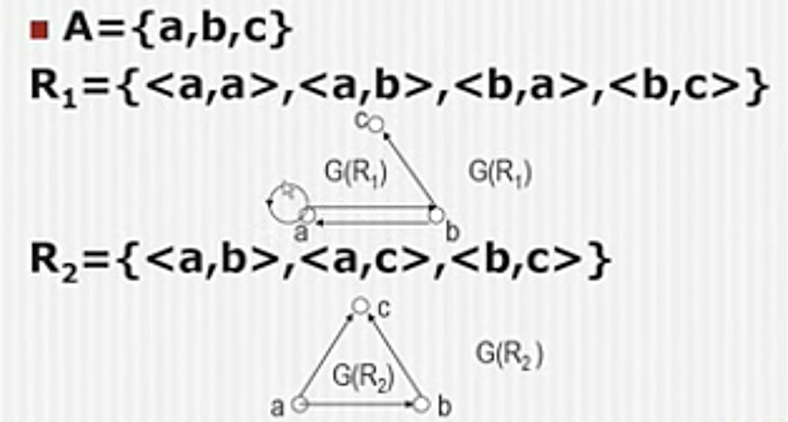

## 二元关系的基本概念
### 有序对（有序二元组）
$$\langle a,b\rangle=\{\{a\},\{a,b\}\}$$
$a是第一元素,b是第二元素$
#### 定理1
$$\langle a,b\rangle=\langle c,d\rangle\Leftrightarrow a=c \wedge b=d$$
#### 推论
$$a\not ={b}\Rightarrow\langle a,b\rangle\not =\langle b,a\rangle$$
### 有序三元组,有序n元组
$$\langle a,b,c\rangle=\langle\langle a,b\rangle,c\rangle\\\langle{a_1,a_2,...,a_n}\rangle=\langle\langle{a_1,a_2,...,a_{n-1}}\rangle,a_n\rangle$$
### 卡氏积
$假设A,B是两个集合,则这两个集合的卡氏积$
$$A\times{B}=\{\langle{x,y}\rangle\mid x\in{A}\wedge y\in{B}\}$$
### 卡氏积性质
+ $非交换：A\times B\not ={B\times{A}}\quad(除非A=B\vee{A=\empty}\vee{B=\empty})$
+ $非结合：(A\times{B})\times{C}\not ={A\times(B\times{C})}\quad(除非{A=\empty}\vee{B=\empty}\vee{C=\empty})$
+ 分配律：$\begin{aligned}&A\times(B\cup{C})=(A\times{B})\cup(A\times{C})\\&A\times(B\cap{C})=(A\cap{B})\cap(A\cap{C})\\&(B\cup{C})\times{A}=(B\cup{A})\cup(C\cup{A})\\&(B\cap{C})\times{A}=(B\cap{A})\cup(C\cap{A})\end{aligned}$
+ 其他：$A\times{B}=\empty\Leftrightarrow{A=\empty}\vee{B=\empty}$
### 二元关系
#### n元关系
$$其元素都是有序n元组的集合$$
> $F_1=\{\langle{a,b,c,d}\rangle\,\langle{1,2,3,4}\rangle\,\langle{物理,化学,数学,英语}\rangle\}\\F_1是4元关系$
#### 二元关系
$$元素都是有序对的集合$$
> $R_1=\{\langle{1,2}\rangle\,\langle{\alpha,\beta}\rangle\,\langle{a,b}\rangle\}\\R_1是2元关系$

$设F是二元关系,则\\\langle{x,y}\rangle\in{F}\Leftrightarrow x与y具有F关系\Leftrightarrow xFy\Leftrightarrow F(x,y), Fxy$
> $2<15\Leftrightarrow{<(2,15)}\Leftrightarrow\langle2,15\rangle\in{<}$
#### A到B的二元关系
$$A到B的二元关系：是A\times{B}的任意子集.$$
> $R是A到B的二元关系\Leftrightarrow{R\subseteq{A\times{B}}}\Leftrightarrow{R\in{P(A\times{B})}}\\设A=\{a_1,a_2\},B=\{b\},则\\A到B的二元关系一共有4个\\R_1=\empty\\R_2=\{\langle{a_1,b}\rangle\}\\R_2=\{\langle{a_2,b}\rangle\}\\R_3=\{\langle{a_1,b}\rangle\,\langle{a_2,b}\rangle\}\\B到A的二元关系也有4个\\R_5=\empty\\R_6=\{\langle{b,a_1}\rangle\}\\R_7=\{\langle{b,a_2}\rangle\}\\R_8=\{\langle{b,a_1}\rangle\,\langle{b,a_2}\rangle\}$
#### A上的二元关系
$$A上的二元关系：是A\times{A}的任意子集.$$
#### 一些特殊关系
$A是任意集合,则可以定义A上的$
+ 空关系:$\empty$
+ 恒等关系:$I_A=\{\langle{x,x}\rangle\mid x\in{A}\}$
+ 全域关系:$E_A=A\times{A}=\{\langle{x,y}\rangle\mid x\in{A}\wedge{y\in{A}}\}$

$设A\subseteq{Z},则可以定义A上的$
+ 整除关系:$D_A=\{\langle{x,y}\rangle\mid x\in{A}\wedge y\in{A}\wedge x\mid y\}$
> $设A=\{1,2,3,4,5,6\},则\\D_A=\{\langle{1,1}\rangle,\langle{1,2}\rangle,\langle{1,3}\rangle,\langle{1,4}\rangle,\langle{1,5}\rangle,\langle{1,6}\rangle,\langle{2,2}\rangle,\langle{2,4}\rangle,\langle{2,6}\rangle,\langle{3,3}\rangle,\langle{3,6}\rangle,\langle{4,4}\rangle,\langle{5,5}\rangle,\langle{6,6}\rangle\}$

$设A\subseteq{R},则可以定义A上的$
+ 小于等于关系:$LE_A=\{\langle{x,y}\rangle\mid x\in{A}\wedge y\in{B}\wedge{x\le{y}}\}$
+ 小于关系:...
+ 大于等于关系:...
+ 大于关系:...

$设A是任意集合,则可以定义P(A)上的$
+ 包含关系:$\subseteq_A=\{\langle{x,y}\rangle\mid x\subseteq{A}\wedge y\subseteq{A}\wedge x\subseteq{y}\}$
+ 真包含关系:$\subset_A=\{\langle{x,y}\rangle\mid x\subseteq{A}\wedge y\subseteq{A}\wedge x\subset{y}\}$

#### 与二元关系相关的概念
+ 定义域(domain):$dom\quad R=\{x\mid\exist{y}(xRy)\}$
+ 值域(range):$ran\quad R=\{y\mid\exist{x}(xRy)\}$
+ 域(field):$fld\quad R=dom\quad R \cup ran\quad R$

$对任意集合F,G可以定义$
+ 逆(inverse):$F^{-1}=\{\langle{x,y}\rangle\mid yFx\}$
+ 合成(compose):$F\circ{G}=\{\langle{x,y}\rangle\mid\exist{z}(xGz\wedge zFy)\}$

$对任意集合F,A可以定义$
+ 限制(restriction):$F\uparrow{A}=\{\langle{x,y}\rangle\mid{xFy\wedge{x\in{A}}}\}$
+ 象(image):$F[A]=ran(F\uparrow{A})\Leftrightarrow F[A]=\{y\mid\exist{x}(x\in{A}\wedge{xFy})\}$

$对任意集合F,可以定义$
+ 单根(single rooted):$\begin{aligned}F是单根的&\Leftrightarrow\forall{y}(y\in{ran(F)}\rightarrow\exist!{x}(x\in{dom(F)}\wedge xFy))\\&\Leftrightarrow(\forall{y\in{ran(F)}})(\exist!{x\in{dom(F)}})(xFy)\end{aligned}$
  + $\exist!表示存在唯一$
  + $\forall{x}(x\in{A}\rightarrow B(x))可以缩写为(\forall{x\in{A}})B(x)$
  + $\exist{x}(x\in{A}\rightarrow B(x))可以缩写为(\exist{x\in{A}})B(x)$
+ 单值(single valued):$\begin{aligned}F是单值的&\Leftrightarrow\forall{x}(x\in{dom(F)}\rightarrow\exist!{y}(x\in{ran(F)}\wedge xFy))\\&\Leftrightarrow(\forall{x\in{dom(F)}})(\exist!{y\in{ran(F)}})(xFy)\end{aligned}$

### 关系的表示、性质、闭包
#### 关系的表示
+ 集合
+ 关系矩阵
  
$设A=\{a_1,a_2,...,a_n\},R\subseteq{A\times{A}},则\\R的关系矩阵$
$$M(R)=(r_{ij})_{n\times{n}}\\M(R)(i,j)=r_{i,j}=\begin{cases}1&a_iRa_j\\0&否则\end{cases}$$
> $A=\{a,b,c\}\\R_1=\{\langle{a,a}\rangle,\langle{a,b}\rangle,\langle{b,a}\rangle,\langle{b,c}\rangle\}\\R_2=\{\langle{a,b}\rangle,\langle{a,c}\rangle,\langle{b,c}\rangle\}\\M(R_1)=\begin{bmatrix}1&1&0\\1&0&1\\0 & 0 & 0\end{bmatrix}M(R_2)=\begin{bmatrix}0&1&1\\0&0&1\\0&0&0\end{bmatrix}$
+ 关系图

$设A=\{a_1,a_2,...,a_n\},R\subseteq{A\times A},则\\R的关系图G(R)$
+ $以\circ表示A中的元素（称为顶点），以\rightarrow 表示R中的元素（称为有向边）$
+ $若a_iRa_j,则从顶点a_i到顶点a_j引有向边\langle{a_i,a_j}\rangle$

#### 关系的性质
+ 自反
+ 反自反
+ 对称
+ 反对称
+ 传递

#### 闭包
包含一些给定对象，具有指定性质的最小集合
+ 最小：任何包含这些给定对象，具有同样指定性质的集合，都包含这个闭包集合

### 二元关系之等价关系和序关系
#### 等价关系
$设A\not ={\empty},R\subseteq{A\times A}$
$$R是等价关系\Leftrightarrow R是自反的,对称的,传递的$$

##### Stirling子集数
$把n元集分成k个非空子集的分法总数,记作$
$$\begin{Bmatrix}n\\k\end{Bmatrix}$$
$\begin{Bmatrix}n\\0\end{Bmatrix}=0\quad\begin{Bmatrix}n\\1\end{Bmatrix}=1\quad\begin{Bmatrix}n\\2\end{Bmatrix}=2^{n-1}-1\quad\begin{Bmatrix}n\\n-1\end{Bmatrix}=\dbinom{n}{2}\quad\begin{Bmatrix}n\\n\end{Bmatrix}=1$
$$\begin{Bmatrix}n\\k\end{Bmatrix}=k\begin{Bmatrix}n-1\\k\end{Bmatrix} + \begin{Bmatrix}n-1\\k-1\end{Bmatrix}\\\quad\\先把n-1个元素分成k个集合,再加入第n个元素到其中之一\\先把n-1个元素分成k-1个集合,再让第n个元素自成一子集$$

#### 偏序关系
$设A\not ={\empty},R\subseteq{A\times A}$
$$R是偏序关系\Leftrightarrow R是自反的,反对称的,传递的$$
$用\preccurlyeq表示偏序关系,读作"小于等于"$
$$\langle{x,y}\rangle\in{R}\Leftrightarrow{xRy}\Leftrightarrow{x\preccurlyeq{y}}$$

#### 拟序关系
$设A\not ={\empty},R\subseteq{A\times A}$
$$R是拟序关系\Leftrightarrow R是反自反的,传递的$$
$用\prec表示拟序关系,读作"小于"$

