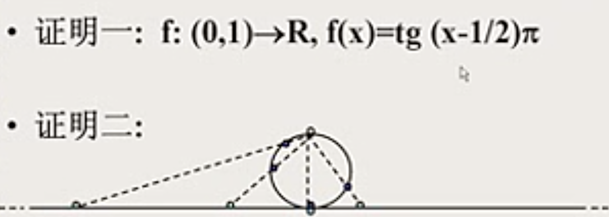
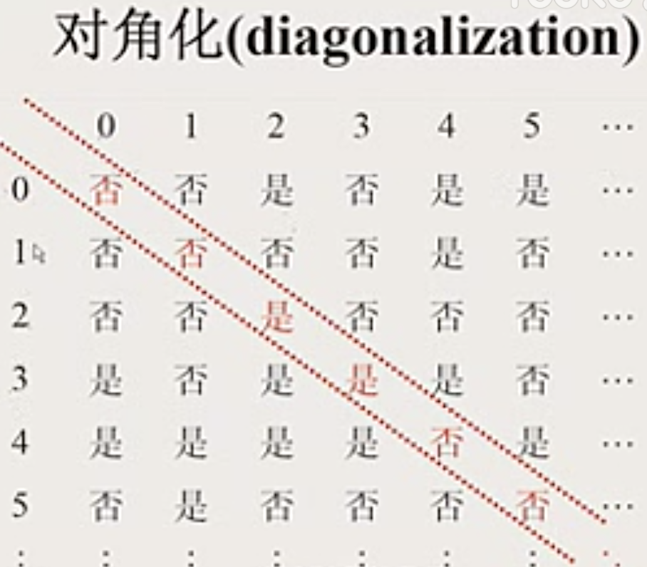

## 函数
单值的二元关系

单值：$\forall{x}\in domF,\forall{y,z}\in ranF, xFy\wedge xFz\rightarrow y=z$

$设F:A\rightarrow B$
+ $单射:F是单根的$
+ $满射:ranF = B$
+ $双射,一一对应:F既是单射又是满射$

## 等势,有穷集,无穷集
### 等势
$集合A与B等势\Leftrightarrow$
$$\exist双射f:A\rightarrow{B}$$
$记作A\approx{B}$

1. $Z\approx{N}$
2. $N\times N\approx{N}$
3. $N\approx{Q}$
4. $(0,1)\approx{R}$

> 证明如下
> 
> 
5. $[0,1]\approx(0,1)$

> 证明如下
> 
> $f(x)=\begin{cases}1/2&x=0\\1/(n+2)&x=1/n,n\in{N-\{0\}}\\x&其它\end{cases}\\可以证明f是双射\\\therefore[0,1]\approx(0,1)$

#### 康托定理
+ $N\not\approx{R}$
> 证明如下
> 
> $假设N\approx{R}\approx[0,1]\\则存在f:N\rightarrow[0,1]双射\\\forall{n}\in{N},令f(n)=x_{n+1}\\于是ran(f)=[0,1]=\{x_1,x_2,...,x_n,...\}\\则x_i可以表示成\\x_1=0.a_1^{(1)}a_2^{(1)}a_3^{(1)}......\\x_2=0.a_1^{(2)}a_2^{(2)}a_3^{(2)}......\\x_3=0.a_1^{(3)}a_2^{(3)}a_3^{(3)}......\\......\\x_n=0.a_1^{(n)}a_2^{(n)}a_3^{(n)}......\\......\\其中0\le a_i^{(j)}\le 9,i,j=1,2,3,...\\那么可以按照对角线构建一个新的x,使x的第a_i位与x_i不同\\那么x\in[0,1]但x\not\in\{x_1,x_2,...,x_n,...\},矛盾\\\therefore N\not\approx[0,1]$

+ $对任意集合A, A\not\approx{P(A)}$
> 证明如下
> 
> $假设存在在双射f:A\rightarrow P(A)\\令B=\{x\in{A}|x\not\in{f(A)}\}\in{P(A)}\\由于f是双射,存在x_0使得f(x_0)=B,则\\x_0\in{B}\Leftrightarrow x_0\not\in{f(x_0)}\Leftrightarrow x_0\not\in{B}矛盾\\\therefore A\not\approx P(A)$

##### 停机问题无法判定
首先,不是所有问题都能用计算机程序计算

> 证明如下
> 
> 任何计算机程序都是有穷字符串,可以转换成二进制串,所以,所有有穷字符串的基数与自然数是相同的,可以建立双射,所以计算机程序不会比自然数多
> 
> 同时,实数要比自然数多,假设每个计算机程序只计算1个实数,仍然有实数无法被计算
> 
> 所以,计算机程序不能计算所有问题

停机问题是其中一个无法判定的程序,我们无法写一个通用的程序判定一个程序是不是会有死循环

> 证明如下
> 
> 
> 纵向数字表示计算机程序编号,横向数字表示所有输入,【是】【否】就是停机与否的判定
> 
> 如果存在一个通用程序能够对任意程序做停机判定,那么肯定也能写一个新的程序,使得每个值的结果反过来
> 
> 这个新的程序与原来每一个程序的行为都不一样,矛盾

通用机的存在性,存在一个固定的程序,起到解释器的作用,把别的程序的编码传给它,它可以模拟别的程序的运转

## 基数
+ $card(A)=card(B)\Leftrightarrow A\approx B$
+ $对有穷集A,card(A)=n\Leftrightarrow A\approx n$
+ $对自然数集N,card(N)=\alef_0$
+ $对实数集R,card(R)=\alef_1=\alef$
+ $0,1,2,...,\alef_0,\alef都是基数$

说明
+ $0,1,2,...称作有穷基数$
+ $\alef_0,\alef称作无穷基数$
+ $若card(A)=\alef_i,则card(P(A))=\alef_{i+1}$

定理
+ $R\approx(N\rightarrow 2)= 2^N$
> 证明如下
> 
> $\forall{z}\in(0,1)可以展开,与$

+ $2^{card(A)}=card(P(A))$
  + $card(P(N))=2^{\alef_0}$
  + $card(P(R))=2^{\alef}$
  + $\alef=2^{\alef_0}$

## Collatz猜想
$\forall{m}\in{N_+},\exist{k}\in{N_+},f^k(m)=1\\其中f^k是f的k次复合,f:N_+\rightarrow N_+\\f(n)=\begin{cases}\dfrac{n}{2}&n是偶数\\3n+1&n是奇数\end{cases}$