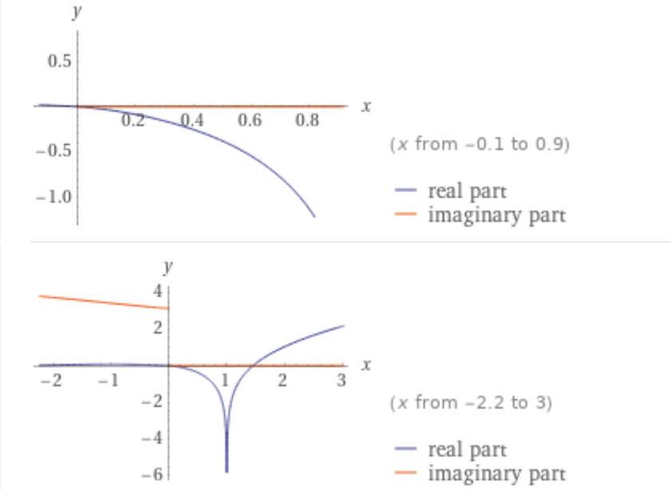
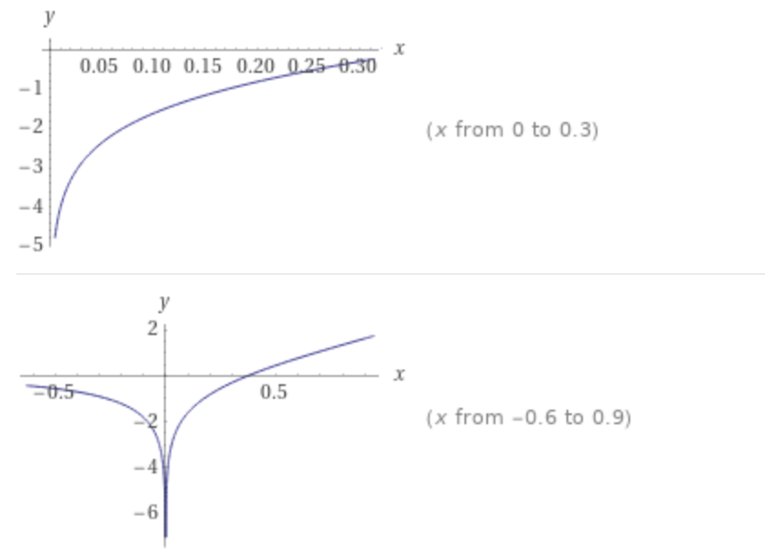

## 黎曼函数
$$\zeta(s)=\sum_{n}n^{-s}(Re(s)>1)$$

## 黎曼猜想
黎曼$\zeta$函数的所有非平凡零点都位于复平面$Re(s)=\dfrac{1}{2}$的直线上

## 素数的分布
### 欧拉乘积公式
$$\sum_{n}n^{-s}=\prod_{p}(1-p^{-s})^{-1}$$
其中n为自然数，p为素数

> 实例解释
> 
> 如果$s=2$
> 
> 原等式就是
> $$\dfrac{1}{1^2}+\dfrac{1}{2^2}+\dfrac{1}{3^2}+...+\dfrac{1}{n^2}=\dfrac{1}{1-\dfrac{1}{2^2}}\times\dfrac{1}{1-\dfrac{1}{3^2}}\times\dfrac{1}{1-\dfrac{1}{5^2}}\times...\times\dfrac{1}{1-\dfrac{1}{p^2}}$$
> 
> 如果$s=3$
> 
> 原等式就是
> $$\dfrac{1}{1^3}+\dfrac{1}{2^3}+\dfrac{1}{3^3}+...+\dfrac{1}{n^3}=\dfrac{1}{1-\dfrac{1}{2^3}}\times\dfrac{1}{1-\dfrac{1}{3^3}}\times\dfrac{1}{1-\dfrac{1}{5^3}}\times...\times\dfrac{1}{1-\dfrac{1}{p^3}}$$

> 证明如下
> 
> $\zeta(s)=1+\dfrac{1}{2^s}+\dfrac{1}{3^s}+\dfrac{1}{4^s}+\dfrac{1}{5^s}+...$ 式(1)
> 
> 式(1)乘以$\dfrac{1}{2^s}$
> 
> $\dfrac{1}{2^s}\zeta(s)=\dfrac{1}{2^s}+\dfrac{1}{4^s}+\dfrac{1}{6^s}+\dfrac{1}{8^s}+\dfrac{1}{10^s}+...$ 式(2)
> 
> 式(1)减式(2)$
> 
> $(1-\dfrac{1}{2^s})\zeta(s)=1+\dfrac{1}{3^s}+\dfrac{1}{5^s}+\dfrac{1}{7^s}+\dfrac{1}{9^s}+\dfrac{1}{11^s}+\dfrac{1}{13^s}+...$ 式(3)
> 
> 式(3)乘以$\dfrac{1}{3^s}$
> 
> $\dfrac{1}{3^s}(1-\dfrac{1}{2^s})\zeta(s)=\dfrac{1}{3^s}+\dfrac{1}{9^s}+\dfrac{1}{15^s}+\dfrac{1}{21^s}+\dfrac{1}{27^s}+\dfrac{1}{33^s}+\dfrac{1}{39^s}+...$ 式(4)
> 
> 式(3)减式(4)$
> 
> $(1-\dfrac{1}{3^s})(1-\dfrac{1}{2^s})\zeta(s)=1+\dfrac{1}{5^s}+\dfrac{1}{7^s}+\dfrac{1}{11^s}+\dfrac{1}{13^s}+\dfrac{1}{17^s}+...$ 式(5)
> 
> 如此重复，可以把右边除1以外的各项都筛去，最终可以得到
> 
> $...(1-\dfrac{1}{13^s})(1-\dfrac{1}{11^s})(1-\dfrac{1}{7^s})(1-\dfrac{1}{5^s})(1-\dfrac{1}{3^s})(1-\dfrac{1}{2^s})\zeta(s)=1$
> 
> $\therefore\zeta(s)=\dfrac{1}{...(1-\dfrac{1}{13^s})(1-\dfrac{1}{11^s})(1-\dfrac{1}{7^s})(1-\dfrac{1}{5^s})(1-\dfrac{1}{3^s})(1-\dfrac{1}{2^s})}$
> 
> $=\dfrac{1}{(1-\dfrac{1}{2^s})(1-\dfrac{1}{3^s})(1-\dfrac{1}{5^s})(1-\dfrac{1}{7^s})(1-\dfrac{1}{11^s})(1-\dfrac{1}{13^s})...}$
> 
> $=\dfrac{1}{(1-2^{-s})(1-3^{-s})(1-5^{-s})(1-7^{-s})(1-11^{-s})(1-13^{-s})...}$
> 
> $$=\prod_{p}\dfrac{1}{1-p^{-s}}$$

### 巴塞尔问题
计算所有平方数的倒数之和
$$\sum_{n=1}^{\infty}\dfrac{1}{n^2}=\lim_{n\rightarrow+\infin}(\dfrac{1}{1^2}+\dfrac{1}{2^2}+\dfrac{1}{3^2}+...+\dfrac{1}{n^2})$$

https://www.cnblogs.com/misaka01034/p/BaselProof.html

> 计算如下
> 
> 有两个正弦函数相关的泰勒展开式
> $$\sin{x}=x-\dfrac{x^3}{3!}+\dfrac{x^5}{5!}-\dfrac{x^7}{7!}+...$$
> 左右同除$x$，得到
> $$\dfrac{\sin{x}}{x}=1-\dfrac{x^2}{3!}+\dfrac{x^4}{5!}-\dfrac{x^6}{7!}+...$$
> $$构造函数f(x)=\dfrac{\sin{x}}{x}，其全部零点为x=\pm{n\pi},其中n=1,2,3,...$$
> $$因此f(x)=\dfrac{\sin{x}}{x}=(1-\dfrac{x}{\pi})(1+\dfrac{x}{\pi})(1-\dfrac{x}{2\pi})(1+\dfrac{x}{2\pi})(1-\dfrac{x}{3\pi})(1+\dfrac{x}{3\pi})...\\\quad\\=(1-\dfrac{x^2}{\pi^2})(1-\dfrac{x^2}{4\pi^2})(1-\dfrac{x^2}{9\pi^2})...$$
> $$因此(1-\dfrac{x^2}{\pi^2})(1-\dfrac{x^2}{4\pi^2})(1-\dfrac{x^2}{9\pi^2})...=1-\dfrac{x^2}{3!}+\dfrac{x^4}{5!}-\dfrac{x^6}{7!}+...\quad式(1)$$
> $$比较式(1)两边x^2项的系数，可以得到$$
> $$-(\dfrac{1}{\pi^2}+\dfrac{1}{4\pi^2}+\dfrac{1}{9\pi^2}+\dfrac{1}{16\pi^2}+...)=\dfrac{1}{3!}=-\dfrac{1}{6}$$
> $$\therefore\dfrac{1}{1^2}+\dfrac{1}{2^2}+\dfrac{1}{3^2}+...=\dfrac{\pi^2}{6}$$

### 全体自然数之和
$由【如何理解泰勒展开】【练习题3】得到\dfrac{x}{(1-x)^2}=x+2x^2+3x^3+4x^4+...\\令x=-1\\-\dfrac{1}{4}=-1+2-3+4-5+6-...\\-\dfrac{1}{4}=-(1+3+5+7+...)+(2+4+6+8+...)\\\because所有奇数=所有自然数-所有偶数\\\therefore-\dfrac{1}{4}=-[(1+2+3+4+...)-(2+4+6+8+...)]+(2+4+6+8+...)\\\therefore-\dfrac{1}{4}=-(1+2+3+4+...)+2\times(2+4+6+8+...)\\\therefore-\dfrac{1}{4}=-(1+2+3+4+...)+4\times(1+2+3+4+...)\\\therefore-\dfrac{1}{4}=3\times(1+2+3+4+...)\\\therefore 1+2+3+4+...=-\dfrac{1}{12}$

### $\zeta(s)的延拓$
首先有欧拉级数，其中s必须大于1才收敛，才有意义，s小于1时发散，没有意义
$$\epsilon(s)=1+\dfrac{1}{2^s}+\dfrac{1}{3^s}+\dfrac{1}{4^s}+...$$
解析延拓到复平面后
$$\zeta(s)=\dfrac{\Gamma(1-s)}{2\pi{i}}\oint_{r}\dfrac{z^{s-1}e^{-z}}{1-e^z}dz$$
推导可得，也叫亚纯函数
$$\zeta(s)=2\Gamma(1-s)(2\pi)^{s-1}\sin(\dfrac{\pi{s}}{2})\zeta(s-1)$$
肉眼可见，上面的式子中$\sin{\dfrac{\pi{s}}{2}}=0$时$\zeta(s)$为零，也就是$s=-2,-4,-6,-8,...$

### $\Gamma(x)作为阶乘的延拓，是定义在复数范围内的亚纯函数$
背景：1728年，哥德巴赫在考虑数列插值的问题，通俗的说就是把数列的通项公式定义从整数集合延拓到实数集合，例如数列1,4,9,16.....可以用通项公式n²自然的表达，即便 n 为实数的时候，这个通项公式也是良好定义的。直观的说也就是可以找到一条平滑的曲线y=x²通过所有的整数点(n,n²),从而可以把定义在整数集上的公式延拓到实数集合。一天哥德巴赫开始处理阶乘序列1,2,6,24,120,720,...,我们可以计算2!,3!,是否可以计算2.5!呢？我们把最初的一些(n,n!)的点画在坐标轴上，确实可以看到，容易画出一条通过这些点的平滑曲线。

在实数域上伽玛函数的定义
$$\Gamma(x)=\int_{0}^{+\infin}t^{x-1}e^{-t}dt(x>0)$$
在复数域上伽玛函数的定义
$$\Gamma(z)=\int_{0}^{+\infin}t^{z-1}e^{-t}dt,其中Re(z)>0$$

$2!=\Gamma(3)=\int_{0}^{+\infin}t^{3-1}e^{-t}dt=\int_{0}^{+\infty}t^2e^{-t}dt$

### $li(x)$
$$li(x)=\int_{0}^{x}\dfrac{dt}{\ln(t)}$$

### $Ei(x)$
$$\int\dfrac{e^x}{x}dx=Ei(x)+C$$

### 欧拉乘积公式，当$s=1$时
$$\sum_{n}n^{-1}=\prod_{p}(1-p^{-1})^{-1}$$

$$\ln(\sum_{n}n^{-1})=\sum_{p}\ln(1-p^{-1})^{-1}\\=\sum_{p}-\ln(1-p^{-1})$$
由泰勒展开式$$\ln(1-x)=-\sum_{n=1}^{\infin}\dfrac{1}{n}x^{n},x\in(-1,1)$$
得到$$\ln(\sum_{n}n^{-1})=\sum_{p}\sum_{n=1}^{\infin}\dfrac{1}{n}(p^{-1})^{n}\\\ln(\sum_{n}n^{-1})=\sum_{p}(p^{-1}+\dfrac{p^{-2}}{2}+\dfrac{p^{-3}}{3}+...)\\\because右边的式子除第一项外，所有各项求和都收敛，而且求和结果累加也收敛（可以尝试证明一下）\\\therefore\sum_{p}p^{-1}\sim\ln(\sum_{n}n^{-1})\sim\ln\ln{\infty}\\更确切地说\\\sum_{p<N}p^{-1}\sim\ln\ln(N)\\也就是\sum_{p<N}p^{-1}是以\ln\ln(N)的方式发散的$$

### 黎曼的论文 - 基本思路
$$\zeta(s)\equiv\sum_{n}n^{-s}=\prod_{p}(1-p^{-s})^{-1}$$
$$\ln\zeta(s)=-\sum_{p}\ln(1-p^{-s})=\sum_{p}\sum_{n}\dfrac{p^{-ns}}{n}$$
